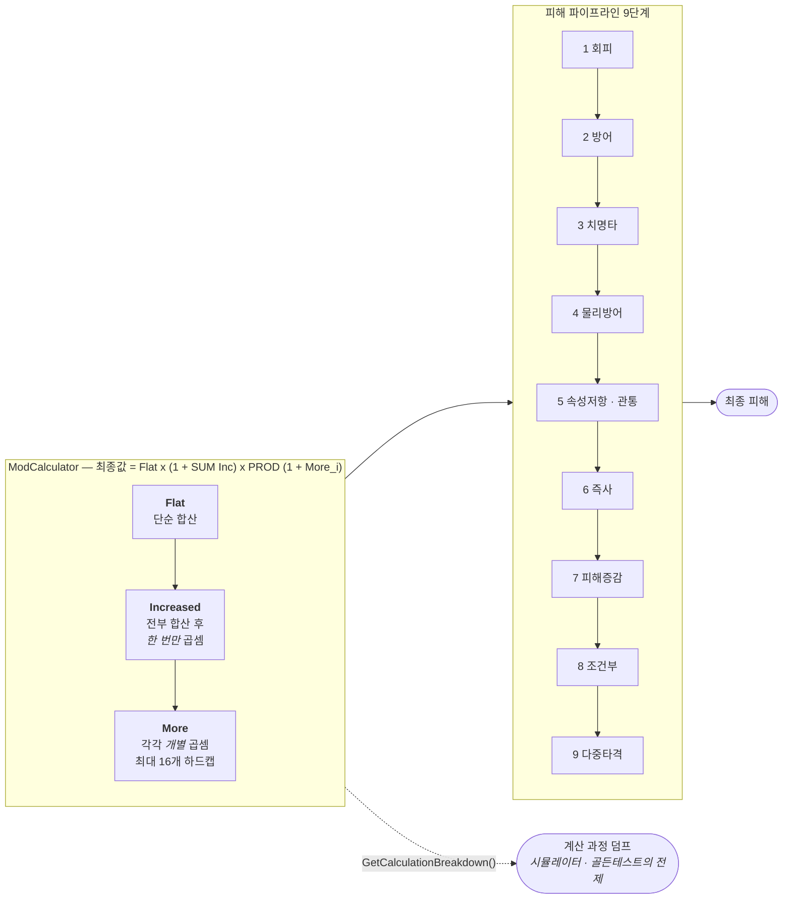
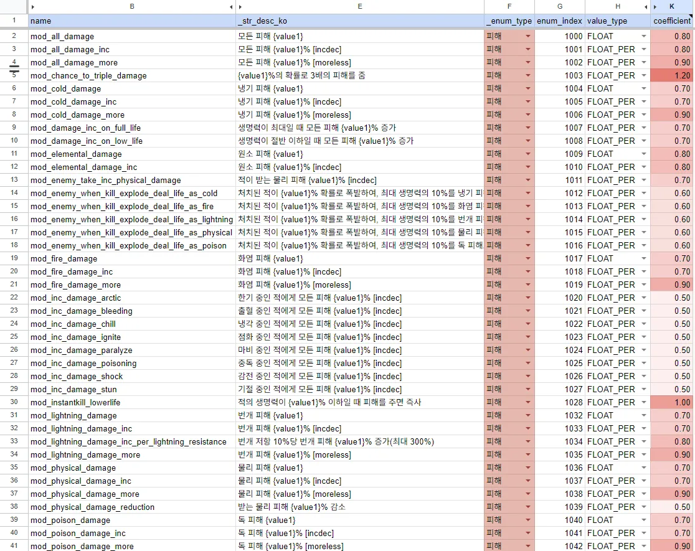

# F-02. PoE식 MOD 전투 수식 엔진

> 소스 발췌: `src/` — 3개 파일

**구간** Phase 0 (수작업기) | **포지션** 클라·TD | **AI** 미사용

### 구조 — Flat / Increased / More 3단 연산과 9단계 피해 파이프라인

- **문제**: 방치형 RPG는 장비·스킬·룬·성좌·각성 등 수십 개 출처에서 스탯 보정이 쏟아진다. 이를 단순 합산으로 처리하면 (1) 보정이 늘수록 수치가 선형 폭발하고, (2) "공격력 +30%"가 출처마다 다른 의미를 갖게 되어 밸런싱이 불가능해진다.
- **해결**: Path of Exile의 검증된 수식 체계를 도입해 **모든 보정을 3종 연산자로 정규화**했다.
  - `Flat` — 합산 (additive)
  - `Increased` — 합산 후 **한 번만** 곱셈 (additive)
  - `More` — 각각 **개별** 곱셈 (multiplicative)
  - 최종 공식: `Flat × (1 + ΣIncreased) × ∏(1 + More_i)`
  - `More`는 개별 곱이라 남발하면 곧바로 폭발하므로, **최대 16개로 하드 캡**을 두고 초과 시 에러 로그를 남긴다. 밸런스 붕괴를 코드 레벨에서 감지한다.
  - 피해 산출은 **9단계 파이프라인**으로 고정했다: 회피 → 방어 → 치명타 → 물리방어 → 속성저항/관통 → 즉사 → 피해증감 → 조건부 → 다중타격. 각 단계가 독립적이라 새 MOD를 추가할 때 "어느 단계에 끼울 것인가"만 결정하면 된다.
  - **계산 브레이크다운 덤프 API**를 엔진에 내장했다. `Flat` 값, `More Count`, 각 `More` 승수를 문자열로 출력한다. 이것이 Phase 2의 배틀 시뮬레이터(F-13)와 Phase 3의 동등성 골든 테스트(F-35)가 성립하는 전제다.
- **기술**: 연산자 분리 설계, `double` 누산, 개별 승수 배열 보관, 디버그 덤프 API 내장
- **정량**: MOD 열거형 `EMod` **271종** / `More` 승수 최대 16개 / 피해 파이프라인 9단계
- **근거**:
  - `Assets/Source/Logic/Battle/ModCalculator/ModCalculator.cs` (186줄) — 3종 연산자, 16개 캡, 덤프 API
  - `Assets/Source/Logic/Data/Status/BattleStatus/BattleStatus.cs` (1,224줄) — 스탯 집계
  - `Assets/Source/Logic/Battle/BattleMode/BattleModeBase.cs` (2,452줄) — 피해 파이프라인
  - `Assets/Source/Repository/generated/CommonEnum.cs` — `EMod` 271종
  - `Docs/배틀/_기획/POE/25.11.16_POE_피해계산공식.md`, `Docs/배틀/_참고/25.11.16_클라_최종데미지계산.md` — 공식 문서화 (Phase 2)
- **면접 포인트**: **"검증된 수식 체계를 차용하되, 그 체계의 위험 지점을 코드로 방어했다."** More 16개 캡과 브레이크다운 덤프 API가 그 증거다. 특히 덤프 API를 처음부터 넣어둔 것이 이후 시뮬레이터·골든 테스트·인게임 실측 대조를 전부 가능하게 했다 — **검증 가능성을 설계에 미리 넣은 사례**.
- **슬라이드 자료**: 3종 연산자 수식 + 9단계 파이프라인 다이어그램 — **다이어그램 필요** / 브레이크다운 덤프 출력 예시 — **캡처 필요**

<!-- IMAGES:START -->
## 화면

<b>MOD 271종의 원본 정의 시트다.</b> 여기서 볼 것은 데이터가 아니라 <b>이름 규칙</b>이다 —
같은 "모든 피해"가 세 줄로 나뉘어 있고, 그 셋이 정확히 위의 3종 연산자다. 
<code>mod_all_damage</code>(<code>FLOAT</code>) = <b>Flat</b> ·
<code>mod_all_damage_inc</code>(<code>FLOAT_PER</code>) = <b>Increased</b> ·
<code>mod_all_damage_more</code>(<code>FLOAT_PER</code>) = <b>More</b>.
<b>접미사가 곧 연산자</b>라서 MOD를 추가할 때 "이건 합산인가 곱셈인가"를 별도 컬럼으로 관리할 필요가 없고,
이름만 보고 <code>ModCalculator</code>의 어느 누산기로 갈지 정해진다. 
설명 문자열의 <code>[incdec]</code> / <code>[moreless]</code> 도 장식이 아니다. 부호에 따라 런타임에 치환된다 —
<code>[incdec]</code>는 <b>증가/감소</b>, <code>[moreless]</code>는 <b>증폭/감폭</b>
(<code>GameUtility.cs</code> 1670~1683행). 한 MOD당 문자열을 <b>하나만</b> 두고 +10%와 −10%를 같은 템플릿으로 처리한다.
<code>{value1}</code> 자리표시자까지 합쳐, 시트 한 줄이 <b>연산 방식·표시 문구·부호 처리</b>를 동시에 정의한다. 
<code>enum_index</code>는 1000번대 블록을 카테고리 단위로 쓰고, 중간에 빈 번호가 그대로 남아 있다
(1028 다음이 1032 — <code>CommonEnum.cs</code> 96~105행에서도 동일). <b>번호를 다시 채우지 않는 것</b>이 규칙이다.
열거값은 유저 데이터에 그대로 저장되므로, 빈자리를 메우려고 재번호를 매기는 순간 저장된 값의 의미가 뒤바뀐다.

<!-- IMAGES:END -->

## 수록 파일

- `Assets/Source/Logic/Battle/BattleMode/BattleModeBase.cs`
- `Assets/Source/Logic/Battle/ModCalculator/ModCalculator.cs`
- `Assets/Source/Logic/Data/Status/BattleStatus/BattleStatus.cs`
