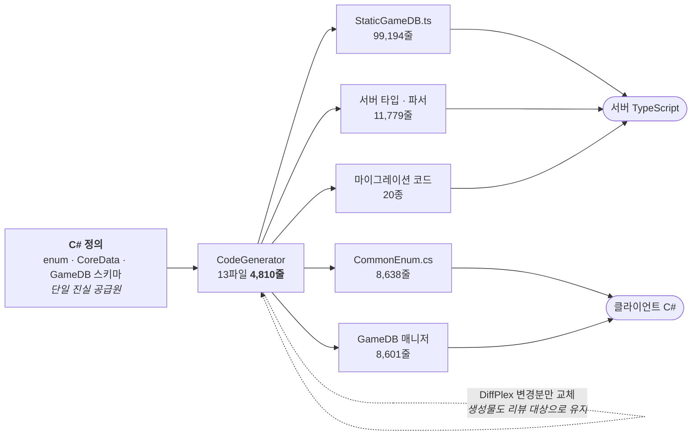

# F-04. 코드 생성 파이프라인 (CodeGen)

> 소스 발췌: `src/` — 13개 파일

**구간** Phase 0 (수작업기) | **포지션** TD·툴 | **AI** 미사용

### 구조 — C#을 SSOT로 삼는 코드 생성 — 생성기 4,810줄이 134,348줄을 만든다

- **문제**: 클라는 C#, 서버는 TypeScript다. 동일한 게임 데이터 스키마(enum, CoreData, GameDB 테이블)가 양쪽에 이중으로 존재하고, 한쪽만 고치면 **조용히 드리프트**한다. 컴파일도 통과하고 테스트도 통과하는데 런타임에 값이 어긋난다.
- **해결**: **C#을 단일 진실 공급원(SSOT)으로 고정**하고, 거기서 TS 서버 타입 / JSON 파서 / 마이그레이션 코드를 자동 생성하는 파이프라인을 만들었다. 타입 드리프트를 사람의 규율이 아니라 **생성으로** 막는다.
  - 생성물을 통째로 덮어쓰면 diff가 폭발해 리뷰가 불가능해지므로, **DiffPlex로 변경분만 교체**한다. 생성 결과가 커밋에서 읽히는 상태를 유지한다.
- **기술**: 리플렉션 기반 C# 스키마 추출, 템플릿 코드 생성, DiffPlex 텍스트 diff, Unity 에디터 통합
- **정량**:
  - 생성기 **13파일 4,810줄** → 산출물 **134,348줄** (생성기 1줄이 약 28줄을 생산)
  - 서버 생성물 **110,973줄** (그중 `StaticGameDB.ts` 단일 파일이 **99,194줄**)
  - 클라 생성물 **23,375줄** (`CommonEnum.cs` 8,638 / GameDB 매니저 8,601 / Data 6,136)
  - 자동생성 enum **107종 / 멤버 5,572개**
- **근거**:
  - `Assets/Editor/Script/CodeGenerator/` — 생성기 13파일 4,810줄
  - `FirebaseCLI/functions/src/Data/Generated/` — 서버 산출물 4파일 110,390줄
  - `FirebaseCLI/functions/src/API/Migration/Generated/` — 마이그레이션 산출물 20파일
  - `Assets/Source/Repository/generated/CommonEnum.cs` (8,638줄)
- **면접 포인트**: **"이중 구현이 불가피한 구조에서 타입 드리프트를 어떻게 막는가"**에 대한 1차 방어선. 2차 방어선은 Phase 3의 동등성 골든 테스트(F-35)로, **타입 드리프트는 코드 생성으로 / 동작 드리프트는 골든 테스트로** 막는 2중 방어 구조를 설계했다는 것이 핵심 서사다. DiffPlex 부분 교체는 "자동 생성물도 리뷰 대상"이라는 판단.
- **슬라이드 자료**: C# SSOT → 생성 → TS/JSON/마이그레이션 팬아웃 다이어그램 + 4,810줄 → 134,348줄 대비 — **다이어그램 필요**

## 수록 파일

- `Assets/Editor/Script/CodeGenerator/CodeGenerateEditor.cs`
- `Assets/Editor/Script/CodeGenerator/CodeGeneratorBase.cs`
- `Assets/Editor/Script/CodeGenerator/CodeGenerator_CommonEnum.cs`
- `Assets/Editor/Script/CodeGenerator/CodeGenerator_CoreData.cs`
- `Assets/Editor/Script/CodeGenerator/CodeGenerator_CoreDataMigration.cs`
- `Assets/Editor/Script/CodeGenerator/CodeGenerator_CoreData_ParseJsonNode.cs`
- `Assets/Editor/Script/CodeGenerator/CodeGenerator_GameDBData.cs`
- `Assets/Editor/Script/CodeGenerator/CodeGenerator_GameDB_Client.cs`
- `Assets/Editor/Script/CodeGenerator/CodeGenerator_GameDB_Client_ParseJsonNode.cs`
- `Assets/Editor/Script/CodeGenerator/CoreDataMigrationTemplates.cs`
- `Assets/Editor/Script/CodeGenerator/CoreDataMigrationWindow.cs`
- `Assets/Editor/Script/CodeGenerator/CoreDataSchemaComparer.cs`
- `Assets/Editor/Script/CodeGenerator/CoreDataSchemaExtractor.cs`
