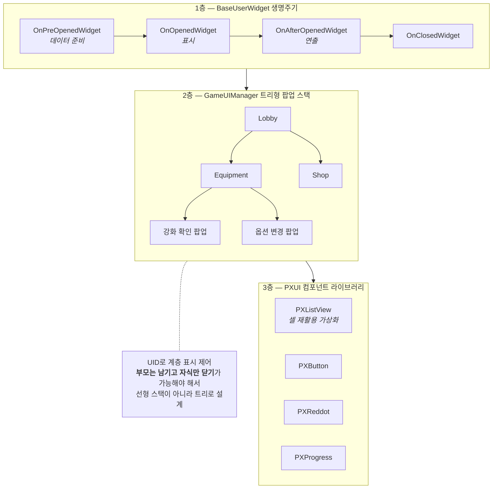
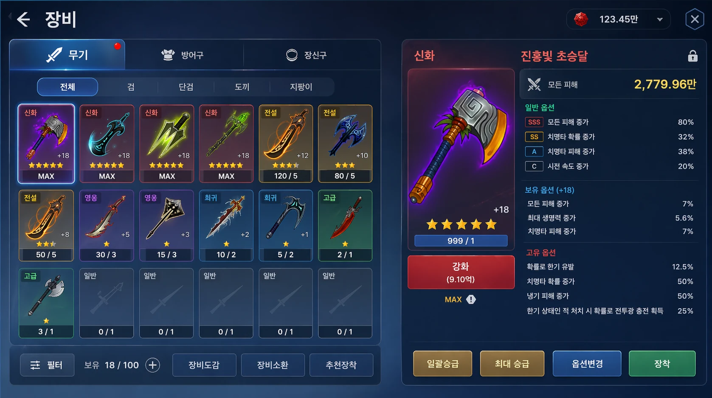
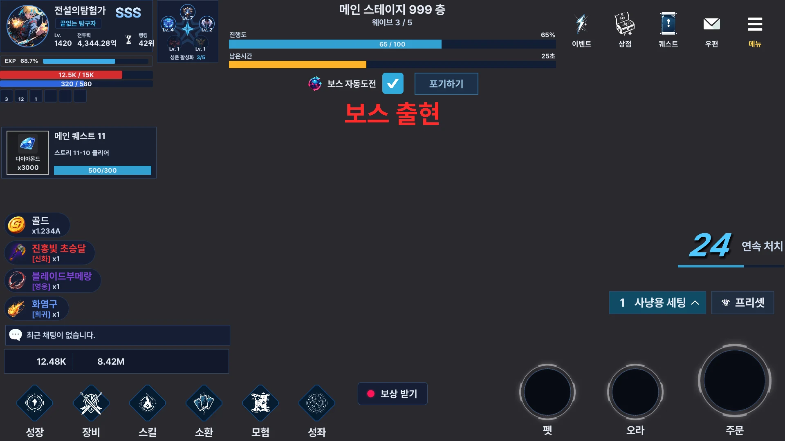
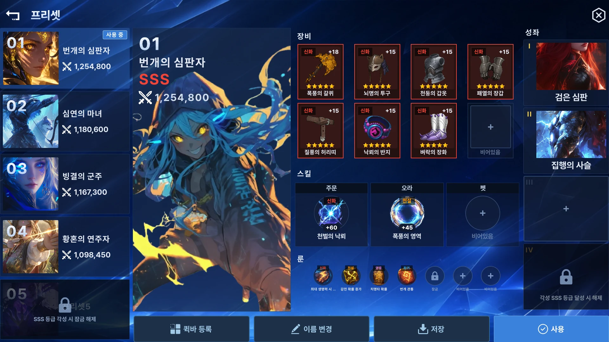

# F-05. 자체 UI 프레임워크 3층 구조

> 소스 발췌: `src/` — 33개 파일

**구간** Phase 0 (수작업기) | **포지션** 클라 | **AI** 미사용

### 구조 — 트리형 팝업 스택 — 선형 스택으로는 표현할 수 없는 요구

- **문제**: 팝업이 팝업을 열고 그 위에 또 팝업이 열리는 구조에서 (1) 어느 팝업이 최상위인지, (2) 뒤로가기를 누르면 무엇이 닫혀야 하는지, (3) 아래 팝업을 가릴지 남길지를 매번 개별 처리하면 UI가 곧 통제 불능이 된다. 또한 Unity 기본 UI 컴포넌트만으로는 리스트 수백 항목에서 프레임이 무너진다.
- **해결**: UI를 **3층으로 분리**했다.
  1. **위젯 생명주기** — `BaseUserWidget`이 오픈/클로즈 시퀀스를 단계로 고정한다. `OnPreOpenedWidget`(데이터 준비) → `OnOpenedWidget`(표시) → `OnAfterOpenedWidget`(연출) → `OnClosedWidget` → `OnShowEvent`/`OnHideEvent`. 각 화면은 필요한 단계만 오버라이드한다.
  2. **팝업 스택** — `GameUIManager`가 **트리형 스택**으로 팝업을 관리한다. UID 기반으로 계층 표시 여부를 제어해, 부모 팝업을 가릴지 남길지를 스택이 판정한다.
  3. **PXUI 컴포넌트 라이브러리** — 자체 제작 UI 컴포넌트군. 핵심은 **가상화 리스트뷰**(717줄)로, 화면에 보이는 만큼만 셀을 생성·재활용해 항목 수와 무관한 프레임을 유지한다. 그 외 `PXButton`, `PXReddot`, `PXProgress` 등.
- **기술**: 템플릿 메서드 패턴 생명주기, 트리형 스택 + UID 계층 제어, 셀 재활용 가상화 스크롤, 컴포넌트 라이브러리화
- **정량**: PXUI **31파일 3,960줄** / `GameUIManager` 528줄 / `BaseUserWidget` 248줄
- **근거**:
  - `Assets/Source/Hud/Base/BaseUserWidget.cs` (248줄) — 오픈/클로즈 시퀀스
  - `Assets/Source/Logic/Manager/GameManager/GameUIManager.cs` (528줄) — 트리형 팝업 스택
  - `Assets/Source/Hud/PXUI/` — 31파일 3,960줄
- **면접 포인트**: **"UI 프레임워크를 직접 만들어봤다"**는 것 자체보다, 팝업 스택을 **트리**로 설계한 판단이 핵심이다. 선형 스택으로는 "부모는 남기고 자식만 닫기" 같은 요구를 표현할 수 없다. 또한 이 프레임워크가 있었기 때문에 Phase 3의 UI Toolkit 전면 전환(F-29)에서 **어댑터 하나로 두 UI 시스템을 같은 스택에 공존**시킬 수 있었다 — 추상화가 나중에 이자를 낸 사례.
- **슬라이드 자료**: 3층 구조 + 트리형 팝업 스택 다이어그램 — **다이어그램 필요** / 가상화 리스트뷰 동작 — **캡처 필요**

<!-- IMAGES:START -->
## 화면

### 시안 → 구현

UI 작업은 **GPT Image로 시안을 먼저 뽑고, 그 시안을 UXML로 구현하는** 순서로 진행했다.
시안이 있으면 "이게 맞나"를 매번 물을 필요가 없고, 구현이 끝난 뒤 **맞췄는지 아닌지가 눈으로 판정**된다.

**시안** — GPT Image 생성

**구현** — `TK_Screen_Equipment.uxml` + USS

<b>패널 비율·정보 계층·요소 배치는 시안 그대로</b> 두고, 세부는 구현하면서 조정했다.
좌하단 <code>필터</code> 버튼은 <code>희귀도</code> 정렬 드롭다운으로 바뀌었고 옆의 <code>+</code> 버튼은 뺐다.
탭은 아이콘·라벨을 가로에서 세로로 돌리고 선택 강조를 흰색 솔리드로 바꿨으며 알림 뱃지는 제거했다.
하단 액션 4개는 순서와 라벨이 같고 색만 다르다 — 시안의 버튼별 그라디언트를 재현하는 대신
테마 USS 토큰의 플랫 컬러로 통일했다. 시안은 <b>지켜야 할 구조</b>이지 픽셀 명세가 아니라는 전제로 쓴다.
렌더는 게임 실행 캡처가 아니라, UXML을 headless로 직접 렌더하는 자체 캡처 도구의 출력이다.

### 그 외 화면

렌더는 모두 같은 headless 캡처 도구로 뽑았다 — UI Builder도 플레이 모드도 거치지 않는다.

로비 HUD — 상시 표시 오버레이 레이어. 배경이 비어 있는 것은 그 자리에 3D 씬이 들어가기 때문

프리셋 화면 — 장비·스킬·룬·성좌를 한 화면에서 세트로 관리

<!-- IMAGES:END -->

## 수록 파일

- `Assets/Source/Hud/Base/BaseUserWidget.cs`
- `Assets/Source/Hud/PXUI/Base/Component/PXHorizontalLayoutGroup.cs`
- `Assets/Source/Hud/PXUI/Base/Component/PXVerticalLayoutGroup.cs`
- `Assets/Source/Hud/PXUI/Base/Core/PXListViewCore.cs`
- `Assets/Source/Hud/PXUI/Base/Core/PXListViewItemCore.cs`
- `Assets/Source/Hud/PXUI/Base/PXPropertyChanged.cs`
- `Assets/Source/Hud/PXUI/Base/Template/PXUITemplate.cs`
- `Assets/Source/Hud/PXUI/Base/Template/Sample/PXListViewItem_Sample.cs`
- `Assets/Source/Hud/PXUI/Editor/PXUITemplateEditor.cs`
- `Assets/Source/Hud/PXUI/PXButton.cs`
- `Assets/Source/Hud/PXUI/PXCheckBox.cs`
- `Assets/Source/Hud/PXUI/PXDropdown.cs`
- `Assets/Source/Hud/PXUI/PXGradient.cs`
- `Assets/Source/Hud/PXUI/PXImage.cs`
- `Assets/Source/Hud/PXUI/PXListView.cs`
- `Assets/Source/Hud/PXUI/PXListViewItem.cs`
- `Assets/Source/Hud/PXUI/PXProgress.cs`
- `Assets/Source/Hud/PXUI/PXRadioGroup.cs`
- `Assets/Source/Hud/PXUI/PXReddot.cs`
- `Assets/Source/Hud/PXUI/PXScrollView.cs`
- `Assets/Source/Hud/PXUI/PXScrollViewItem.cs`
- `Assets/Source/Hud/PXUI/PXTabButton.cs`
- `Assets/Source/Hud/PXUI/PXTabGroup.cs`
- `Assets/Source/Hud/PXUI/PXText.cs`
- `Assets/Source/Hud/PXUI/UIToolkit/TKBoxShadow.cs`
- `Assets/Source/Hud/PXUI/UIToolkit/TKGradient.cs`
- `Assets/Source/Hud/PXUI/UIToolkit/TKGradientLabel.cs`
- `Assets/Source/Hud/PXUI/UIToolkit/TKHoldButton.cs`
- `Assets/Source/Hud/PXUI/UIToolkit/TKProgress.cs`
- `Assets/Source/Hud/PXUI/UIToolkit/TKReddot.cs`
- `Assets/Source/Hud/PXUI/UIToolkit/TKTweenExtensions.cs`
- `Assets/Source/Hud/PXUI/UIToolkit/UIToolkitExtensions.cs`
- `Assets/Source/Logic/Manager/GameManager/GameUIManager.cs`
