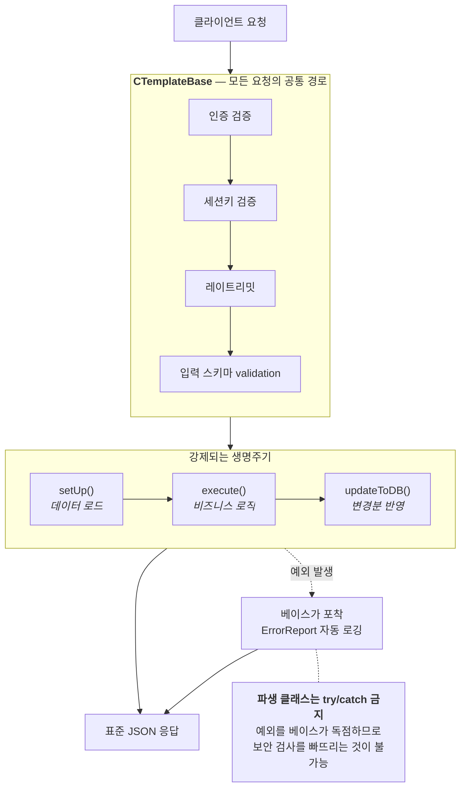

# F-06. Firebase 서버 3계층 요청 템플릿

> 소스 발췌: `src/` — 2개 파일

**구간** Phase 0 (수작업기) | **포지션** 서버·TD | **AI** 미사용

### 구조 — 베이스가 예외를 독점해 보안 검사 누락을 구조적으로 차단

- **문제**: Cloud Functions 엔드포인트가 100개를 넘어가면 (1) 인증 검사·세션 확인·레이트리밋·에러 응답 포맷을 매 함수가 개별 구현하게 되고, (2) 그중 하나라도 빠뜨리면 곧바로 보안 구멍이며, (3) 함수별 메모리·타임아웃 설정을 개별 관리하면 콜드스타트와 비용이 통제되지 않는다.
- **해결**: **3계층 상속 템플릿**으로 고정했다.
  - `CTemplateBase` → `C[Feature]Base` → `C[Feature]_[Action]`
  - 최상위 베이스가 `setUp → execute → updateToDB` **생명주기를 강제**하고, 인증·세션·레이트리밋·에러핸들링을 일괄 처리한다. 파생 클래스는 **try/catch를 쓰지 않는다** — 예외는 베이스가 잡아 규격화된 응답으로 변환한다. 즉 **보안 검사를 빠뜨리는 것이 구조적으로 불가능**하다.
  - 함수 설정은 **Function Preset 4단계**(`LITE` / `STANDARD` / `HEAVY` / `SCHEDULE`)로 표준화했다. 엔드포인트마다 메모리·동시성·타임아웃을 개별 지정하는 대신 프리셋을 선택한다. 콜드스타트와 비용이 프리셋 단위로 통제된다.
- **기술**: TypeScript 추상 클래스 상속 체인, 템플릿 메서드 패턴, Firebase Functions v2 `GlobalOptions` 프리셋, `onCall`/`onRequest`/`onSchedule` 분리
- **정량**:
  - 엔드포인트 **153개** — `onCall` 127 / `onRequest` 11 / `onSchedule` 15
  - `RequestBase.ts` 465줄이 전체 요청의 공통 경로
  - 클라 대응 열거형 `ERequestHttpsCallType` 95종
- **근거**:
  - `FirebaseCLI/functions/src/API/Base/RequestBase.ts` (465줄) — 3계층 베이스, 생명주기 강제
  - `FirebaseCLI/functions/src/index.ts` (508줄) — 엔드포인트 등록 + `FUNCTION_PRESET` 4단계 정의
  - `Assets/Source/Logic/Manager/GameManager/GameNetworkManager.cs` (976줄) — 클라 측 `ERequestHttpsCallType`
  - `FirebaseCLI/functions/Docs/인프라/완료플랜/26.01.09_Firebase_Functions_프레임워크_아키텍처_분석.md`, `FirebaseCLI/functions/Docs/인프라/완료플랜/26.01.09_Firebase_Functions_HEAVY_Preset_최적화_완료.md`
- **면접 포인트**: **"파생 클래스에서 try/catch를 금지했다"**가 이 설계의 요약이다. 규칙을 문서로 알리는 대신 **베이스가 예외를 독점**해 구조적으로 강제했다. 서버리스 비용 통제를 프리셋 4단계로 추상화한 것도 같은 사고방식 — 개별 튜닝 여지를 줄여서 전체를 관리 가능하게 만든다.
- **슬라이드 자료**: 3계층 상속 + `setUp→execute→updateToDB` 생명주기 다이어그램 / Preset 4단계 표 — **다이어그램 필요**

## 수록 파일

- `FirebaseCLI/functions/src/API/Base/RequestBase.ts`
- `FirebaseCLI/functions/src/index.ts`
