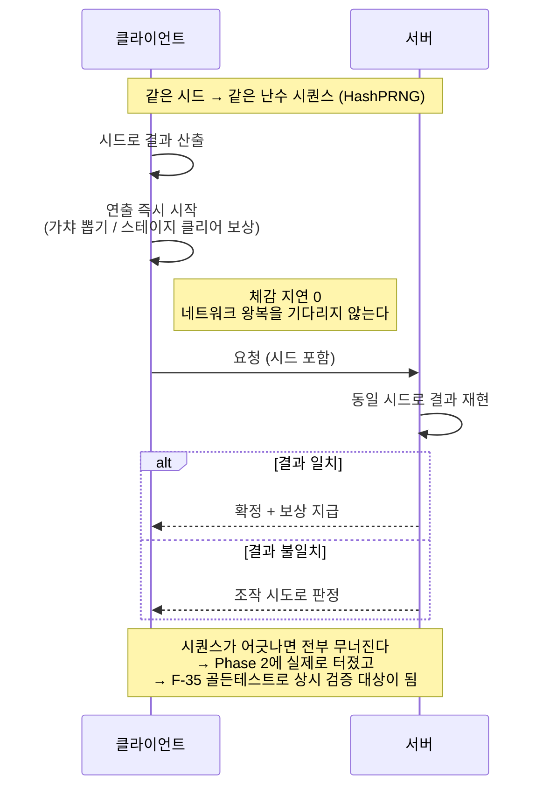

# F-07. HashPRNG 결정론 난수 최적화 — 가챠 · 스테이지 클리어 보상

> 소스 발췌: `src/` — 7개 파일

**구간** Phase 0 (수작업기) | **포지션** 클라·서버 | **AI** 미사용

### 구조 — 클라가 결과를 먼저 알고 연출 — 권위는 서버가 유지



- **문제**: 서버 권위 구조에서 **확률이 걸린 것은 전부 서버가 굴려야 한다.** 그런데 서버 응답을 기다린 뒤 연출을 시작하면 **매번 네트워크 왕복이 그대로 체감 지연**이 된다. 그렇다고 클라가 굴리면 조작 가능하다. 그리고 이건 가챠만의 문제가 아니다 — **스테이지를 클리어할 때마다 드랍 보상도 굴려야 하고**, 방치형이라 그 빈도가 가챠보다 훨씬 높다.
- **해결**: **클라가 서버와 동일한 난수 시퀀스를 재현**하도록 했다. 해시 기반 PRNG로 시드가 같으면 결과가 같으므로, 클라는 결과를 즉시 알고 연출을 시작하고 서버는 동일한 시드로 같은 결과를 산출해 검증한다. 불일치는 곧바로 조작 시도로 판정된다. **체감 지연 0, 권위는 서버 유지.**

| 사용처 | 클라 | 서버 검증 | 성격 |
|---|---|---|---|
| **가챠 뽑기** | `ClientGacha` (1,290줄) | `ClientGachaValidate` | 유저가 명시적으로 누르는 저빈도 이벤트, 연출이 길다 |
| **스테이지 클리어 보상** | `ClientStageReward` (773줄) | `ClientStageRewardValidate` | 전투 중 상시 발생하는 고빈도 이벤트, 연출이 짧고 끊기면 안 된다 |

  - 두 사용처는 **입력·키·저장 데이터가 전부 다르므로** `GachaRoller<TInput, TKey, TCoreData>` 제네릭으로 굴리는 절차만 추상화하고 콘텐츠별 구현을 갈아끼운다.
  - x10 / x30 / x300 처럼 **여러 번 굴리는 것도 서버 왕복 1회**다 — `Roll(prng, count)` 가 결과를 키 단위로 묶어(`Dictionary<TKey, int>`) 한 번에 보낸다.

### 부수 효과 — 응답 JSON에서 가장 큰 블록을 통째로 뺄 수 있게 됐다

결정론을 도입한 이유는 체감 지연이었지만, **실효가 더 컸던 쪽은 응답 크기**였다.

이 서버의 응답 본문은 원래도 통짜가 아니라 **CoreData의 diff**다 — 요청 처리 전후 스냅샷을 비교해
바뀐 블록만 직렬화한다(`CoreDataFactory.diffToJson`). 문제는 스테이지 보상이 **거의 항상 장비를 바꾼다**는 것이다.
방치형 RPG의 드랍은 대부분 장비이고, 장비 한 개는 단순 카운터가 아니라 **롤된 MOD 목록을 통째로 들고 다니는 객체**라
diff에 걸리는 순간 응답에서 제일 무거운 블록이 된다.

그런데 클라가 **이미 같은 시드로 같은 장비를 만들어 놨다.**
`ClientStageReward.CreateRewardToCoreData()` 가 `StageEquipmentRewardRoller.Roll(PRNG, count)` 로
서버와 동일한 장비 인스턴스를 로컬에 생성한다. 서버가 그걸 다시 내려보내는 건 **검산이 아니라 중복**이다.

그래서 두 API의 `setUp()` 에서 장비 블록을 응답에서 아예 제외했다.

```ts
// CacheData 를 사용할 것이므로 JsonResultData 에서는 제외
this.excludeJson(ExcludeCoreDataKey.EQUIPMENT);
```

<sub><code>Stage.ts</code> 920행 (<code>CStage_EndLoop</code>) · 1000행 (<code>CStage_Clear</code>)</sub>

**이 두 API가 하필 최고빈도라는 게 요점이다.** 방치형에서 `Stage_Clear` 와 `Stage_EndLoop` 는
유저가 아무것도 안 눌러도 초 단위로 반복된다. 가챠처럼 하루 몇 번 누르는 API에서 응답을 줄이는 것과
상시 왕복하는 경로에서 줄이는 것은 누적량이 다르다. 왕복 **횟수**는 서버 권위를 유지하는 한 못 줄이므로,
줄일 수 있는 건 **한 번의 왕복이 나르는 양**뿐이었다.

결정론이 없었으면 이 최적화는 불가능하다. 클라가 서버 결과를 재현하지 못하면 서버는 무엇을 줬는지
반드시 말해줘야 하기 때문이다. **"클라가 답을 이미 안다"는 성질이 곧 "안 보내도 된다"가 된다.**

- **기술**: 해시 기반 결정론 PRNG, 제네릭 롤러 추상화, 클라 예측 + 서버 검증(client prediction / server reconciliation), CoreData diff 응답 + 재현 가능한 블록 응답 제외
- **정량**: 4파일 **2,214줄** (`ClientGacha` 1,290 / `ClientStageReward` 773 / 검증 2종 449)
- **근거**:
  - `Assets/Source/Logic/ClientGacha/ClientGacha.cs` (1,290줄)
  - `Assets/Source/Logic/ClientGacha/ClientGachaValidate.cs` (173줄)
  - `Assets/Source/Logic/ClientGacha/ClientStageReward.cs` (773줄)
  - `Assets/Source/Logic/ClientGacha/ClientStageRewardValidate.cs` (276줄)
  - `FirebaseCLI/functions/src/API/CoreData/Stage.ts` 920 / 1000행 — 고빈도 API 두 곳의 장비 블록 응답 제외 ([F-51](../F-51_서버권위아키텍처/) 에 전문 수록)
  - `FirebaseCLI/functions/src/API/Factory/CoreDataFactory.ts` 429~458행 — CoreData diff 직렬화, `excludeJsonCoreData` 처리
- **면접 포인트**: **"보안과 반응성은 트레이드오프가 아니다"**를 보여주는 카드. 결정론을 이용하면 둘 다 얻을 수 있다. 다만 이 구조는 **양쪽 구현이 비트 단위로 일치해야만** 성립한다 — Phase 2에서 실제로 **가챠 연속 클릭 시 해시가 어긋나는 동시성 버그**를 겪었고, Phase 3에서 `gachahash`/`randomhash` 도메인 골든 테스트([F-35](../F-35_동등성골든테스트/))로 상시 검증 대상이 되었다. **설계 → 사고 → 항구적 방어**의 전형적 3단계.

  같은 메커니즘을 **가챠와 스테이지 보상에 함께** 쓴 것도 이 카드의 요점이다. 방치형은 스테이지 클리어가 초 단위로 반복되므로, 여기서 왕복을 없애지 못하면 **"서버 권위"가 그대로 체감 렉**이 된다. 가챠 하나만 보면 "연출 좀 빨라지는" 최적화지만, 고빈도 경로에 같이 얹으면 **플레이 흐름 자체가 끊기지 않게 하는** 구조가 된다.

  그리고 **의도하지 않았던 쪽에서 실효가 더 컸다.** 원래 목적은 대기 시간 제거였는데, 결정론이 성립하고 나니
  최고빈도 API 두 개의 응답에서 **가장 무거운 블록(장비)을 통째로 뺄 수 있게** 됐다. 설계 하나가 지연과 대역폭을
  동시에 해결한 사례이고, "클라가 답을 이미 안다"는 성질을 **연출 즉시 시작**과 **전송 생략** 두 군데에 쓴 것이
  이 카드에서 가장 설명할 만한 부분이다.
- **슬라이드 자료**: 클라 예측 + 서버 검증 시퀀스 다이어그램 — **다이어그램 필요**


<!-- IMAGES:START -->
## 화면


<sub>뽑기 화면 — x10 / x30 / x300 이 서버 1회 왕복으로 처리된다</sub>

<!-- IMAGES:END -->

## 수록 파일

- `Assets/Source/Logic/ClientGacha/ClientGacha.cs`
- `Assets/Source/Logic/ClientGacha/ClientGachaValidate.cs`
- `Assets/Source/Logic/ClientGacha/ClientStageReward.cs`
- `Assets/Source/Logic/ClientGacha/ClientStageRewardValidate.cs`
- `FirebaseCLI/functions/src/Data/Shared/Types/PRNGTypes.ts`
- `FirebaseCLI/functions/src/Data/Types/PRNGServer.ts`
- `FirebaseCLI/functions/src/Utility/UtilityGacha.ts`
