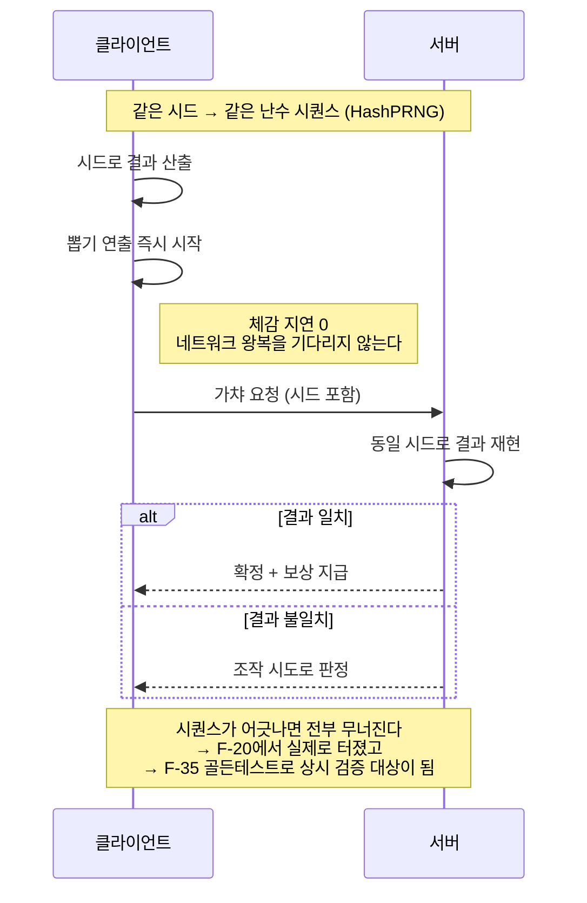

# F-07. HashPRNG 결정론적 클라 가챠 + 서버 검증

> 소스 발췌: `src/` — 7개 파일

**구간** Phase 0 (수작업기) | **포지션** 클라·서버 | **AI** 미사용

### 구조 — 클라가 결과를 먼저 알고 연출 — 권위는 서버가 유지

- **문제**: 서버 권위 구조에서 가챠는 서버가 굴려야 한다. 그런데 서버 응답을 기다린 뒤 연출을 시작하면 **매 뽑기마다 네트워크 왕복이 그대로 체감 지연**이 된다. 그렇다고 클라가 굴리면 조작 가능하다.
- **해결**: **클라가 서버와 동일한 난수 시퀀스를 재현**하도록 했다. 해시 기반 PRNG로 시드가 같으면 결과가 같으므로, 클라는 결과를 즉시 알고 연출을 시작하고 서버는 동일한 시드로 같은 결과를 산출해 검증한다. 불일치는 곧바로 조작 시도로 판정된다. **체감 지연 0, 권위는 서버 유지.**
  - 가챠는 콘텐츠마다 입력·키·저장 데이터가 다르므로 `GachaRoller<TInput, TKey, TCoreData>` 제네릭으로 추상화해 콘텐츠별 구현을 갈아끼운다.
  - 스테이지 보상도 같은 구조로 처리한다 (`ClientStageReward` / `ClientStageRewardValidate`).
- **기술**: 해시 기반 결정론 PRNG, 제네릭 롤러 추상화, 클라 예측 + 서버 검증(client prediction / server reconciliation)
- **정량**: 4파일 **2,214줄** (`ClientGacha` 1,290 / `ClientStageReward` 773 / 검증 2종 449)
- **근거**:
  - `Assets/Source/Logic/ClientGacha/ClientGacha.cs` (1,290줄)
  - `Assets/Source/Logic/ClientGacha/ClientGachaValidate.cs` (173줄)
  - `Assets/Source/Logic/ClientGacha/ClientStageReward.cs` (773줄)
  - `Assets/Source/Logic/ClientGacha/ClientStageRewardValidate.cs` (276줄)
- **면접 포인트**: **"보안과 반응성은 트레이드오프가 아니다"**를 보여주는 카드. 결정론을 이용하면 둘 다 얻을 수 있다. 다만 이 구조는 **양쪽 구현이 비트 단위로 일치해야만** 성립하므로, Phase 2에서 실제로 동시성 버그(F-20: 가챠 연속 클릭 해시 불일치)를 겪었고, Phase 3에서 `gachahash`/`randomhash` 도메인 골든 테스트(F-35)로 상시 검증 대상이 되었다. **설계 → 사고 → 항구적 방어**의 전형적 3단계.
- **슬라이드 자료**: 클라 예측 + 서버 검증 시퀀스 다이어그램 — **다이어그램 필요**

<!-- IMAGES:START -->
## 화면

뽑기 화면 — x10 / x30 / x300 이 서버 1회 왕복으로 처리된다

<!-- IMAGES:END -->

## 수록 파일

- `Assets/Source/Logic/ClientGacha/ClientGacha.cs`
- `Assets/Source/Logic/ClientGacha/ClientGachaValidate.cs`
- `Assets/Source/Logic/ClientGacha/ClientStageReward.cs`
- `Assets/Source/Logic/ClientGacha/ClientStageRewardValidate.cs`
- `FirebaseCLI/functions/src/Data/Shared/Types/PRNGTypes.ts`
- `FirebaseCLI/functions/src/Data/Types/PRNGServer.ts`
- `FirebaseCLI/functions/src/Utility/UtilityGacha.ts`
