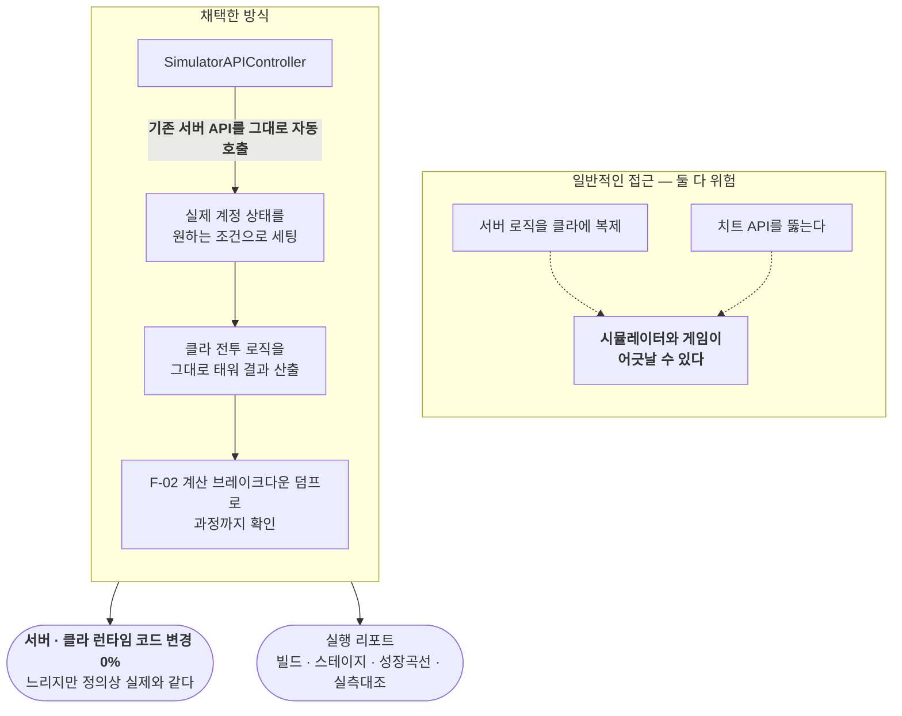

# F-13. 배틀 시뮬레이터

> 소스 발췌: `src/` — 15개 파일
>
> 전체 54파일 44,782줄 중 **설계 핵심 12파일 + 실행 리포트 3종**을 발췌했다. 밸런스 데이터 JSON(32,842줄)과 보조 툴 윈도우는 제외. `SimulatorAPIController.cs`가 이 툴의 핵심 — 기존 서버 API를 자동 호출해 계정 상태를 세팅한다.

**구간** Phase 2 (2025.11~) | **포지션** 툴·TD | **AI** 협업

### 구조 — 게임 코드를 바꾸지 않고 밸런싱을 가능하게 한 경로



- **문제**: **서버 권위 구조에서는 밸런싱을 할 수가 없다.** 데미지 계산에 필요한 스탯·MOD·성장 수치가 전부 서버에 있고, 클라는 결과만 받는다. "각성 3단계를 올리면 DPS가 몇 % 오르는가"를 알려면 실제로 계정을 만들어 각성 3단계까지 플레이해야 한다. 밸런스 수치 하나 바꿀 때마다 이걸 반복하는 것은 불가능하다.
- **해결**: **게임 코드를 한 줄도 바꾸지 않고** 밸런싱을 가능하게 했다. 시뮬레이터가 에디터에서 **기존 서버 API를 그대로 자동 호출**해 실제 계정 상태를 원하는 조건으로 세팅하고, 클라 전투 로직을 그대로 태워 결과를 산출한다. 별도의 시뮬레이션 모델을 만들지 않았으므로 **시뮬레이터와 게임이 어긋날 수 없다.**
  - 규모가 커지면서 Odin 기반 에디터 창을 **partial class 9개 모듈로 분할**해 관리한다.
- **기술**: Unity Editor 확장(Odin Inspector), 기존 API 자동 호출 오케스트레이션, partial class 모듈 분할, F-02의 계산 브레이크다운 덤프 API 활용
- **정량**: **54파일 44,782줄** (프로젝트 전체 수기 코드의 약 15%) / **서버·클라 런타임 코드 변경 0%**
- **근거**:
  - `Assets/Editor/BattleSimulator/` — 54파일 44,782줄
  - `Docs/배틀/시뮬레이터/25.11.25_시뮬레이터_개발_명세서.md`
  - `Docs/배틀/시뮬레이터/완료/mod 최초 정리/25.11.16_UNITY_SIMULATOR_PRD.md`
  - `Docs/배틀/시뮬레이터/25.11.16_작업_진행_TODO.md`
- **면접 포인트**: **"제약을 우회하지 않고 제약 안에서 푼다."** 밸런싱을 위해 서버 로직을 클라에 복제하거나 치트 API를 뚫는 선택지도 있었지만, 둘 다 "시뮬레이터와 실제 게임이 다를 수 있다"는 근본 위험을 만든다. 기존 API를 자동 호출하는 방식은 느리지만 **정의상 실제와 같다.** 게임 코드 변경 0%는 이 판단의 결과다. 44,782줄짜리 툴을 위해 런타임 코드를 한 줄도 오염시키지 않았다는 점이 핵심.
- **슬라이드 자료**: 시뮬레이터 에디터 창 — **캡처 필요** / "일반 방식 vs 기존 API 호출 방식" 대비 다이어그램 — **다이어그램 필요**


<!-- EVIDENCE:START -->
## 실행 결과

> 아래는 이 도구가 실제로 출력한 리포트의 **발췌**입니다. 원본 전체는 `src/` 에 그대로 들어 있습니다.

<details>
<summary>빌드 간 DPS 밸런스 판정 — 10개 빌드 자동 순회 후 아웃라이어 지목 &nbsp;·&nbsp; <code>src/P1Balance_Build_20260110_013000.txt</code></summary>

```text
【분석 1: 빌드 간 DPS 밸런스】
━━━━━━━━━━━━━━━━━━━━━━━━━━━━━━━━━━━━━━━━━━━━━━━━━━━━━━━━━━━━━━━━━━━━━━━━━━━━━━━

목적: 모든 빌드의 총 DPS가 균등하게 분포하는지 확인

평균 DPS: 245.78B

┌──────┬───────────────────────────────┬─────────────────┬────────────┬──────────┐
│ 순위 │ 빌드명                          │ DPS             │ 평균대비   │ 판정     │
├──────┼───────────────────────────────┼─────────────────┼────────────┼──────────┤
│   1  │ 번개 타격                       │ 283.50B         │    +15.3%  │ ⚠️ 주의  │
│   2  │ 번개 상태이상 (감전/마비)        │ 272.04B         │    +10.7%  │ ✅ 정상  │
│   3  │ 독 상태이상 (중독)              │ 269.85B         │     +9.8%  │ ✅ 정상  │
│   4  │ 화염 상태이상 (점화)            │ 269.27B         │     +9.6%  │ ✅ 정상  │
│   5  │ 물리 상태이상 (출혈)            │ 264.03B         │     +7.4%  │ ✅ 정상  │
│   6  │ 물리 타격                       │ 238.05B         │     -3.1%  │ ✅ 정상  │
│   7  │ 화염 타격                       │ 236.00B         │     -4.0%  │ ✅ 정상  │
│   8  │ 냉기 상태이상 (동상/한기)        │ 235.45B         │     -4.2%  │ ✅ 정상  │
│   9  │ 냉기 타격                       │ 200.78B         │    -18.3%  │ ⚠️ 주의  │
│  10  │ 독 타격                         │ 188.86B         │    -23.2%  │ ❌ 위반  │
└──────┴───────────────────────────────┴─────────────────┴────────────┴──────────┘

【밸런스 판정 기준】
| 상태 | 평균 대비 편차 | 판정 |
|------|---------------|------|
| ✅ 정상 | ±10% 이내 | 조정 불필요 |
| ⚠️ 주의 | ±15% 이상 | 조정 검토 |
| ❌ 위반 | ±25% 이상 | 즉시 조정 필요 |

【아웃라이어 분석】
  ▲ 번개 타격: +15.3% (주의 - 조정 검토 필요)
  ▼ 냉기 타격: -18.3% (주의 - 조정 검토 필요)
  ▼ 독 타격: -23.2% (위반 - 즉시 조정 필요!)
```

</details>

<details>
<summary>단일 빌드 DPS 단계별 분해 — 방어 → 저항 → 받는 피해 → 즉사 판정 순으로 감쇠 추적 &nbsp;·&nbsp; <code>src/CurrentBuildReport_2025-12-21_00-29-49.txt</code></summary>

```text
━━━━━━━━━━━━━━━━━━━━━━━━━━━━━━━━━━━━━━━━━━━━━━━━━━━━━━━
8. 최종 DPS (단계별)
━━━━━━━━━━━━━━━━━━━━━━━━━━━━━━━━━━━━━━━━━━━━━━━━━━━━━━━

💡 몬스터 방어력, 저항, 받는 피해 증가, 즉사 판정을 단계별로 적용

【8-1. 적용 전 DPS】
  시전 속도: 2.377 회/초
  스킬 명중 DPS: 116,733,127 (물리)
  상태이상 DPS: 0
  Aura DPS: 527,262,544 (물리)
  DoT DPS: 0
  📊 총 DPS: 643,995,671

【8-2. 물리 방어 (Armor) 적용 후】
  물리 저항: 9.930%
  스킬 명중 DPS: 105,059,814 (물리)
  상태이상 DPS: 0
  Aura DPS: 474,536,290 (물리)
  DoT DPS: 0
  📊 총 DPS: 579,596,104

【8-3. 원소 저항 (Resistance) 적용 후】
  화염 저항: 9.850%
  냉기 저항: 9.850%
  번개 저항: 9.850%
  독 저항: 9.850%
  스킬 명중 DPS: 105,059,814 (물리)
  상태이상 DPS: 0
  Aura DPS: 474,536,290 (물리)
  DoT DPS: 0
  📊 총 DPS: 579,596,104

【8-4. 받는 피해 증가 (Damage Taken) 적용 후】
  받는 피해 증가: 0.000%
  받는 피해 감소: 0%
  스킬 명중 DPS: 105,059,814 (물리)
  상태이상 DPS: 0
  Aura DPS: 474,536,290 (물리)
  DoT DPS: 0
  📊 총 DPS: 579,596,104

【8-5. 즉사 판정 (Instant Kill) 적용 후 - 최종】
  즉사 임계값: 0.10%
  즉사 피해 배율: 1.00x (+0.10%)
  스킬 명중 DPS: 105,164,979  (물리)
  상태이상 DPS: 0
  Aura DPS: 475,011,301  (물리)
  DoT DPS: 0
  🎯 최종 총 DPS: 580,176,280
```

</details>

<details>
<summary>스테이지 밸런스의 설계 목표값 — 리포트가 이 기준에 대고 판정한다 &nbsp;·&nbsp; <code>src/P1Balance_Stage_20260110_020000.txt</code></summary>

```text
┌─────────────────────────────────────────────────────────────────────────────────────────┐
│ 목표 시간                                                                               │
├─────────────────────────────────────────────────────────────────────────────────────────┤
│ 처치 시간 목표: 55~60초 (보수적 설정)                                                    │
│ 생존 시간 목표: 65~80초 (타임오버 중심 설계)                                             │
│                                                                                          │
│ 설계 의도: 생존은 여유있게 → 타임오버가 주요 실패 유형이 되도록                         │
└─────────────────────────────────────────────────────────────────────────────────────────┘

┌─────────────────────────────────────────────────────────────────────────────────────────┐
│ 보스 타입별 배율                                                                         │
├─────────────────────────────────────────────────────────────────────────────────────────┤
│ 일반 보스 (Boss)     : 500% (5.0배)                                                      │
│ 계층 보스 (FloorBoss): 1000% (10.0배)                                                    │
│ 일반 몬스터 (Normal) : 100% (1.0배)                                                      │
└─────────────────────────────────────────────────────────────────────────────────────────┘
```

</details>

<!-- EVIDENCE:END -->

## 수록 파일

- `Assets/Editor/BattleSimulator/Reports/CurrentBuildReport/CurrentBuildReport_2025-12-21_00-29-49.txt`
- `Assets/Editor/BattleSimulator/Reports/P1Balance/Build/P1Balance_Build_20260110_013000.txt`
- `Assets/Editor/BattleSimulator/Reports/P1Balance/Stage/P1Balance_Stage_20260110_020000.txt`
- `Assets/Editor/BattleSimulator/Scripts/BattleSimulatorWindow.ActionButtons.cs`
- `Assets/Editor/BattleSimulator/Scripts/BattleSimulatorWindow.BuildPresets.cs`
- `Assets/Editor/BattleSimulator/Scripts/BattleSimulatorWindow.Calculation.cs`
- `Assets/Editor/BattleSimulator/Scripts/BattleSimulatorWindow.DropdownProviders.cs`
- `Assets/Editor/BattleSimulator/Scripts/FormulaCollector.cs`
- `Assets/Editor/BattleSimulator/Scripts/SimulatorAPIController.cs`
- `Assets/Editor/BattleSimulator/Scripts/SimulatorCalculator.cs`
- `Assets/Editor/BattleSimulator/Scripts/SimulatorDefender.cs`
- `Assets/Editor/BattleSimulator/Scripts/SimulatorMath.cs`
- `Assets/Editor/BattleSimulator/Scripts/SimulatorModSource.cs`
- `Assets/Editor/BattleSimulator/Scripts/SimulatorPresetData.cs`
- `Assets/Editor/BattleSimulator/Scripts/SnapshotRegression.cs`
