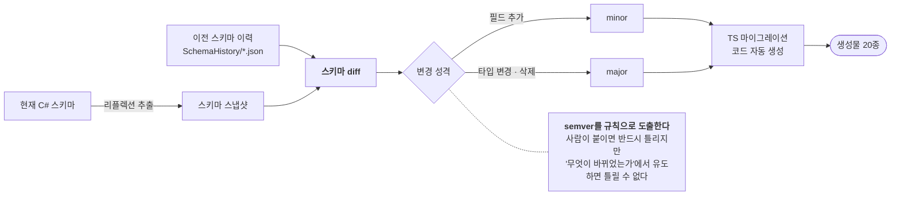

# F-19. CoreData 마이그레이션 자동화

> 소스 발췌: `src/` — 23개 파일
>
> 생성기 3파일 + **자동 생성된 마이그레이션 코드 20종**. 생성기와 산출물을 나란히 볼 수 있다.

**구간** Phase 2 (2026.01.10) | **포지션** TD·툴 | **AI** 협업

### 구조 — 버전 번호를 사람이 붙이지 않는다

- **문제**: 유저 데이터 스키마(CoreData)가 바뀌면 이미 저장된 유저 문서를 마이그레이션해야 한다. 이 작업은 (1) 무엇이 바뀌었는지 사람이 찾아야 하고, (2) 버전을 수동으로 올려야 하고, (3) TS 마이그레이션 코드를 손으로 써야 한다. **셋 다 빠뜨리기 쉽고, 빠뜨리면 유저 데이터가 깨진다.**
- **해결**: Unity 에디터 **원클릭**으로 전 과정을 자동화했다.
  1. **리플렉션으로 현재 C# 스키마 추출**
  2. 저장된 이전 스키마와 **diff**
  3. 변경 성격에 따라 **semver 자동 결정** (필드 추가는 minor, 타입 변경은 major 등)
  4. TS **마이그레이션 코드 자동 생성**
- **기술**: C# 리플렉션 스키마 추출, 스키마 diff, semver 자동 판정, TS 코드 생성, Unity 에디터 통합
- **정량**: 생성물 **20종** (`FirebaseCLI/functions/src/API/Migration/Generated/` 20파일) / 원클릭 실행
- **근거**:
  - `Docs/인프라/CoreData마이그레이션/26.01.10_CoreData 마이그레이션 자동화 시스템.md`
  - `Docs/인프라/CoreData마이그레이션/26.01.10_사용설명서.md`
  - `FirebaseCLI/functions/src/API/Migration/Generated/` — 생성물 20파일
- **면접 포인트**: F-04(CodeGen)의 사고방식을 **데이터 마이그레이션**으로 확장한 사례. 특히 **semver 자동 결정**이 핵심 — 버전 번호를 사람이 붙이면 반드시 실수하지만, "무엇이 바뀌었는가"에서 규칙으로 도출하면 틀릴 수 없다. 사용설명서를 같은 날 함께 쓴 것도 특징(도구를 만들고 쓰는 법을 남긴다).
- **슬라이드 자료**: 스키마 diff → semver 판정 → 코드 생성 파이프라인 다이어그램 — **다이어그램 필요**

## 수록 파일

- `Assets/Editor/Script/CodeGenerator/CodeGenerator_CoreDataMigration.cs`
- `Assets/Editor/Script/CodeGenerator/CoreDataMigrationTemplates.cs`
- `Assets/Editor/Script/CodeGenerator/CoreDataMigrationWindow.cs`
- `FirebaseCLI/functions/src/API/Migration/Generated/Account_migrations.generated.ts`
- `FirebaseCLI/functions/src/API/Migration/Generated/Achievements_migrations.generated.ts`
- `FirebaseCLI/functions/src/API/Migration/Generated/Collections_migrations.generated.ts`
- `FirebaseCLI/functions/src/API/Migration/Generated/Constellations_migrations.generated.ts`
- `FirebaseCLI/functions/src/API/Migration/Generated/Contents_migrations.generated.ts`
- `FirebaseCLI/functions/src/API/Migration/Generated/CoreDataVersions.generated.ts`
- `FirebaseCLI/functions/src/API/Migration/Generated/Currencies_migrations.generated.ts`
- `FirebaseCLI/functions/src/API/Migration/Generated/Equipments_migrations.generated.ts`
- `FirebaseCLI/functions/src/API/Migration/Generated/Gachas_migrations.generated.ts`
- `FirebaseCLI/functions/src/API/Migration/Generated/Mailboxes_migrations.generated.ts`
- `FirebaseCLI/functions/src/API/Migration/Generated/Nebulas_migrations.generated.ts`
- `FirebaseCLI/functions/src/API/Migration/Generated/Pets_migrations.generated.ts`
- `FirebaseCLI/functions/src/API/Migration/Generated/Player_migrations.generated.ts`
- `FirebaseCLI/functions/src/API/Migration/Generated/Presets_migrations.generated.ts`
- `FirebaseCLI/functions/src/API/Migration/Generated/Products_migrations.generated.ts`
- `FirebaseCLI/functions/src/API/Migration/Generated/Quests_migrations.generated.ts`
- `FirebaseCLI/functions/src/API/Migration/Generated/Skills_migrations.generated.ts`
- `FirebaseCLI/functions/src/API/Migration/Generated/Stages_migrations.generated.ts`
- `FirebaseCLI/functions/src/API/Migration/Generated/Statistics_migrations.generated.ts`
- `FirebaseCLI/functions/src/API/Migration/Generated/Titles_migrations.generated.ts`
