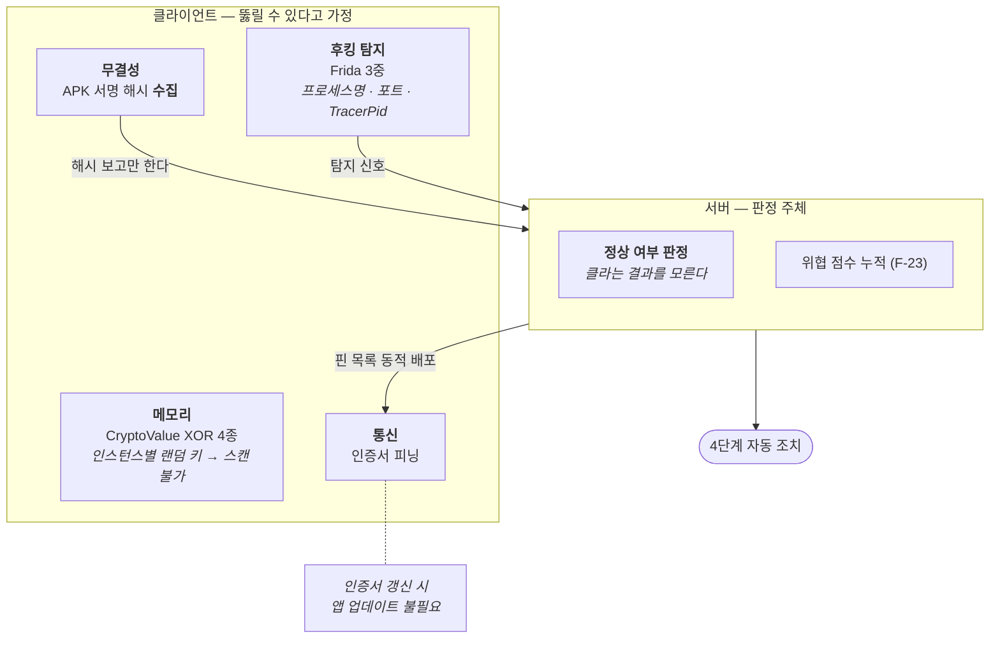

# F-22. Unity Android 다층 보안 시스템

> 소스 발췌: `src/` — 9개 파일

**구간** Phase 2 (2026.01.31 ~ 02.04) | **포지션** 클라·TD | **AI** 협업

### 구조 — 최종 판정을 서버로 올려 클라 우회를 원천 차단

- **문제**: 모바일 게임 클라이언트는 **적대적 환경**에서 실행된다. 메모리 조작(치트 엔진), 후킹 프레임워크(Frida), APK 변조, 중간자 공격이 모두 실제 위협이다. 그런데 클라이언트가 스스로를 검사하는 방식은 **클라이언트를 뚫으면 검사도 함께 뚫린다**는 근본 한계가 있다.
- **해결**: 방어를 **층으로 나누고, 최종 판정은 서버로 올렸다.**

| 층 | 방어 | 설계 요점 |
|---|---|---|
| **메모리** | `CryptoValue` XOR 암호화 타입 4종 (`Int`/`Float`/`Double`/`Bool`) 자체 설계 | **인스턴스별 랜덤 키** — 같은 값이라도 메모리 패턴이 달라 스캔으로 찾을 수 없다. `[ThreadStatic]` 사용으로 스레드 안전 |
| **후킹 탐지** | Frida **3중 탐지** | 프로세스명 / 포트 / `TracerPid` — 한 가지 탐지는 우회되므로 서로 다른 계층에서 3중으로 본다 |
| **무결성** | APK 서명 해시 검증 | **판정을 서버가 한다.** 클라는 해시를 보고할 뿐, 정상 여부는 서버가 결정 → **클라 우회 불가** |
| **통신** | 동적 인증서 피닝 | 핀 목록을 서버에서 받는다 → **인증서 갱신 시 앱 업데이트 불필요** |

- **기술**: XOR 메모리 암호화 + 인스턴스별 키, `[ThreadStatic]`, Frida 탐지(프로세스/포트/TracerPid), APK 서명 해시 서버 검증, 동적 인증서 피닝
- **정량**: 암호화 타입 **4종** / Frida 탐지 **3중** / 조사·적용·정책 문서 4종
- **근거**:
  - `Assets/Source/System/CryptoValue/CryptoValueInt.cs`, `CryptoValueFloat.cs`, `CryptoValueDouble.cs`, `CryptoValueBool.cs`
  - `Assets/Source/System/Security/AppIntegrityChecker.cs` — APK 무결성
  - `Assets/Source/System/Security/DeviceSecurityChecker.cs` — 루팅·후킹 탐지
  - `Assets/Source/System/Security/CertificatePinning.cs` — 동적 피닝
  - `Assets/Source/Logic/Manager/GameManager/GameCryptoManager.cs`
  - `Docs/인프라/모바일게임보안/26.01.31_Unity-Android-모바일-게임-보안-기술-조사-보고서.md`, `26.02.01_모바일_게임_보안_시스템_적용_가이드.md`, `26.02.02_추가 보안적용.md`, `26.02.04_보안정책.md`
  - `Docs/인프라/완료플랜/26.01.31_Unity-Android-모바일-게임-보안-적용-작업-계획서.md`
- **면접 포인트**: **"클라이언트 보안의 한계를 인정하고 설계했다."** 클라가 판정하면 클라를 뚫은 순간 무의미하므로, **APK 서명 해시의 판정 주체를 서버로 올린 것**이 이 시스템의 핵심 결정이다. 동적 인증서 피닝도 같은 사고 — 핀을 하드코딩하면 갱신 때마다 앱 업데이트가 필요하니, 서버에서 받게 해서 **운영 비용을 설계 단계에서 제거**했다. 조사 보고서 → 적용 가이드 → 정책 문서 순으로 4일간 진행된 기록이 남아 있다.
- **슬라이드 자료**: 4층 방어 구조 다이어그램 (클라 검사 vs 서버 판정 대비 강조) — **다이어그램 필요**

## 수록 파일

- `Assets/Source/Logic/Manager/GameManager/GameCryptoManager.cs`
- `Assets/Source/System/CryptoValue/CryptoValueBool.cs`
- `Assets/Source/System/CryptoValue/CryptoValueDouble.cs`
- `Assets/Source/System/CryptoValue/CryptoValueFloat.cs`
- `Assets/Source/System/CryptoValue/CryptoValueInt.cs`
- `Assets/Source/System/Security/AppIntegrityChecker.cs`
- `Assets/Source/System/Security/CertificatePinning.cs`
- `Assets/Source/System/Security/DeviceSecurityChecker.cs`
- `Assets/Source/System/Security/SecureDebug.cs`
