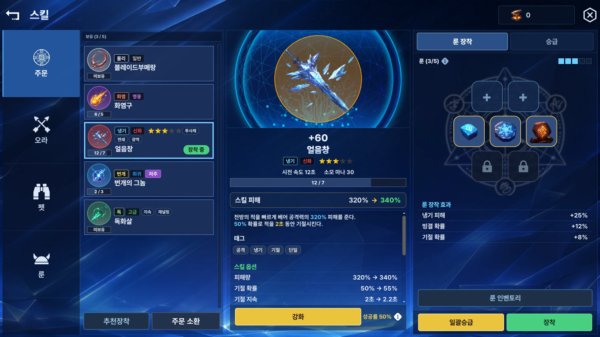
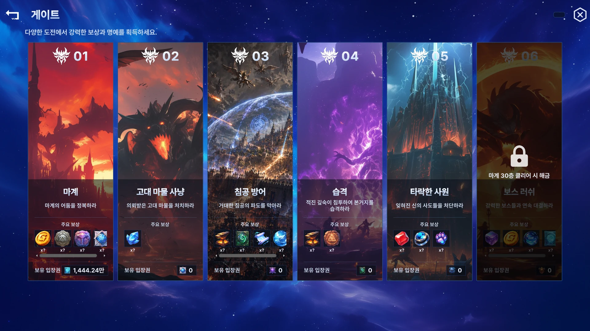
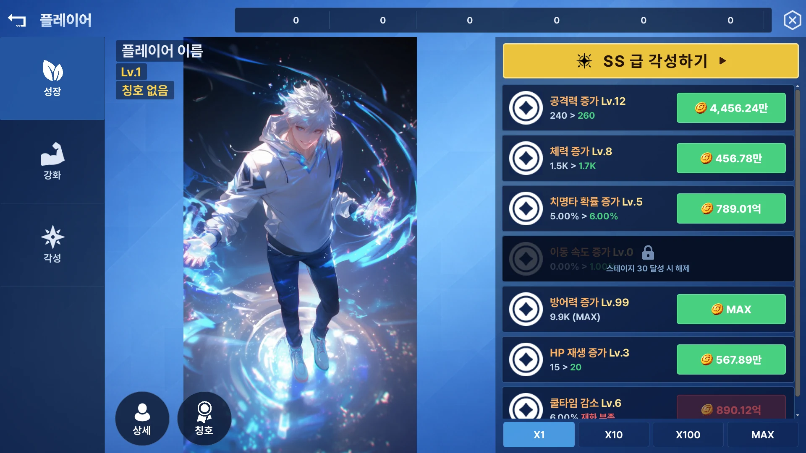
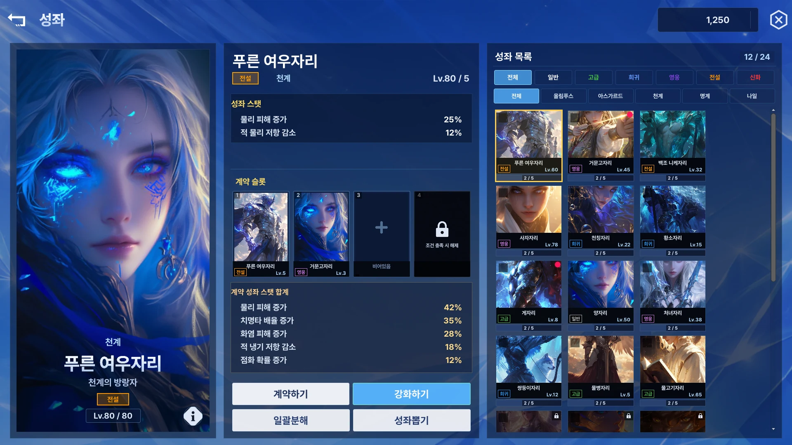

# F-29. UGUI → UI Toolkit 전면 전환

> 소스 발췌: `src/` — 9개 파일

**구간** Phase 3 (2026.03.11 ~ 2026.06) | **포지션** 클라 | **AI** 협업

- **문제**: UGUI로 만든 UI가 이미 수십 화면이다. UI Toolkit으로 갈아타고 싶지만 (1) 전부 한 번에 옮기는 것은 불가능하고, (2) 전환 기간 동안 두 UI 시스템이 공존해야 하는데 **팝업 스택은 하나여야 한다.** UGUI 팝업 위에 UI Toolkit 팝업이 뜨면 z-order와 뒤로가기 처리가 무너진다.
- **해결**: **`UIToolkitBridge` 어댑터**를 만들어 두 UI 시스템을 F-05의 **하나의 팝업 스택에서 공존**시켰다. 스택 입장에서는 UGUI 화면인지 UXML 화면인지 구분하지 않는다. 그래서 화면 단위로 하나씩 점진 이식이 가능해졌다.
  - UI Toolkit이 제공하지 않는 기능은 **자체 구현**했다 — `TKGradientLabel`(그라데이션 텍스트), `TKBoxShadow`(그림자) 등. 그라데이션은 블렌딩 품질 문제까지 별도로 다뤘다(`26.04.21_TKGradientLabel-그라데이션-부드럽게-블렌딩하기.md`).
  - 도입 전 **모바일 성능을 먼저 조사**했다(`Unity-6-UI-Toolkit-모바일-성능-조사-보고서`, `성능-관련-공식-문서-조사-결과`). 성능 리스크를 확인하고 착수했다.
- **기술**: 어댑터 패턴, UXML/USS, UI Toolkit 커스텀 VisualElement, 런타임 UI Toolkit 성능 튜닝
- **정량**: UXML **82개** / USS **80개** / 전환 기간 약 3개월 (2026.03 ~ 06)
- **근거**:
  - `Docs/콘텐츠/UIToolkit/26.03.11_UI-Toolkit-도입-계획.md`, `Docs/콘텐츠/UIToolkit/26.03.13_UI-Toolkit-작업기록.md`
  - `Docs/콘텐츠/UI/완료플랜/26.04.02_Unity-6-UI-Toolkit-모바일-성능-조사-보고서.md`, `Docs/콘텐츠/UI/완료플랜/26.04.02_Unity-6-UI-Toolkit-성능-관련-공식-문서-조사-결과.md`
  - `Docs/콘텐츠/UI/완료플랜/26.04.21_TKGradientLabel-그라데이션-부드럽게-블렌딩하기.md`
  - `Docs/콘텐츠/UI/완료플랜/26.04.15_Player-HUD-→-TKScreen_Player-변환-플랜.md`, `Docs/plans/완료/26.05.20_(완)PXPopup_LobbyHud-→-TKLobby_Hud-(UI-Toolkit)-전환-계획.md`, `Docs/plans/완료/26.06.01_LobbyHud-UGUI-to-UXML-전환계획.md`
  - `Docs/콘텐츠/UIToolkit/26.03.17_UI-컬러-시스템.md` — 전환과 함께 컬러 시스템 정립
- **면접 포인트**: **"대규모 UI 프레임워크 교체를 무중단으로 진행한 경험."** 핵심은 F-05에서 팝업 스택을 추상화해 둔 덕분에 어댑터 하나로 공존이 가능했다는 것 — **Phase 0의 설계 결정이 3년 뒤 이자를 냈다.** 또한 도입 전 성능 조사, 미제공 기능 자체 구현, 화면 단위 점진 이식이라는 3단 접근이 "새 기술 도입"을 리스크 관리 문제로 다뤘음을 보여준다.
- **슬라이드 자료**: UGUI/UXML 공존 팝업 스택 다이어그램 — **다이어그램 필요** / 전환 전후 화면 비교 — **전환 후만 확보** (아래 `## 화면`), UGUI 시절 화면 캡처 필요

<!-- IMAGES:START -->
## 화면

UXML로 이식이 끝난 화면들. 게임 실행 캡처가 아니라 UXML을 headless로 직접 렌더한 출력이다 —
UI Builder를 열지도, 플레이 모드에 들어가지도 않고 스크립트 호출 한 번으로 뽑는다.

스킬 — 목록 / 상세 / 룬 소켓 3분할

게이트 — 가로 스크롤 카드 레이아웃

플레이어 성장 — 스탯 항목별 증가 버튼 리스트

성좌 — 좌 일러스트 / 중 상세 / 우 스크롤 목록의 3열 분할

<!-- IMAGES:END -->

## 수록 파일

- `Assets/Source/Hud/Base/UIToolkit/UIToolkitBridge.cs`
- `Assets/Source/Hud/PXUI/UIToolkit/TKBoxShadow.cs`
- `Assets/Source/Hud/PXUI/UIToolkit/TKGradient.cs`
- `Assets/Source/Hud/PXUI/UIToolkit/TKGradientLabel.cs`
- `Assets/Source/Hud/PXUI/UIToolkit/TKHoldButton.cs`
- `Assets/Source/Hud/PXUI/UIToolkit/TKProgress.cs`
- `Assets/Source/Hud/PXUI/UIToolkit/TKReddot.cs`
- `Assets/Source/Hud/PXUI/UIToolkit/TKTweenExtensions.cs`
- `Assets/Source/Hud/PXUI/UIToolkit/UIToolkitExtensions.cs`
