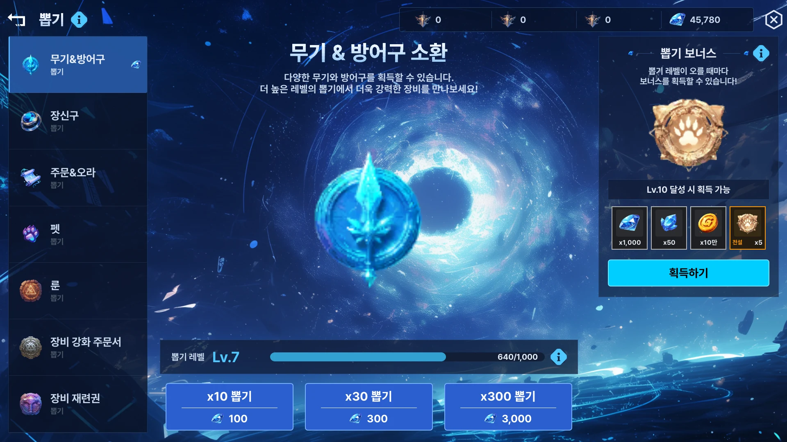

# F-31. Headless UXML 렌더 캡처 인프라

> 소스 발췌: `src/` — 2개 파일

**구간** Phase 3 (2026.06.04) | **포지션** 툴 | **AI** 협업

- **문제**: AI에게 UXML 시안을 평가시키려면 **렌더된 이미지**가 필요하다. 그런데 UXML을 보려면 Unity의 UI Builder를 열어 수동으로 스크린샷을 찍어야 한다. 자동화 루프에 사람이 끼어드는 순간 루프가 아니다.
- **해결**: **UI Builder 없이 UXML을 1920×1080 PNG로 headless 렌더**하는 인프라를 만들었다. 임시 `EditorWindow`에 `EditorPanel`을 붙이고 RenderTexture에 직접 `Render()`를 호출한다.
  - **시행착오 3건을 규명해 문서화한 것이 이 카드의 핵심이다.**
    - `themeStyleSheet` 미적용이 **레이아웃 붕괴의 근본 원인** — 스타일이 없으면 요소 크기가 결정되지 않아 배치가 통째로 무너진다. "렌더가 안 된다"가 아니라 "테마가 없다"가 진짜 원인이었다.
    - **Linear RenderTexture 미사용 시 감마 이중 변환** — 색이 실제와 다르게 나온다. 색 비교를 하려는 도구에서 치명적.
    - 그 외 렌더 타이밍 관련 1건
- **기술**: Unity `EditorWindow` + `EditorPanel` 동적 생성, `RenderTexture` 직접 `Render()`, Linear 색공간 처리, headless 실행
- **정량**: 1920×1080 PNG 자동 캡처 / 시행착오 3건 원인 규명 문서화
- **근거**:
  - `Docs/plans/완료/26.06.04_(완)R5b_Headless_DesignPreview_캡처_인프라.md`
  - `Docs/plans/완료/26.05.08_Screenshot-Overlay-—-UI-Builder-지원-추가.md` — 선행 작업
- **면접 포인트**: **"Unity 에디터 내부 API를 문서화되지 않은 방식으로 조합해 필요한 도구를 만들었다."** 그리고 실패 3건을 **버리지 않고 원인까지 규명해 문서로 남겼다.** 특히 `themeStyleSheet` 건은 증상(레이아웃 붕괴)과 원인(스타일 미적용)의 거리가 멀어서, 원인을 규명하지 않았다면 "headless 렌더는 안 되는 것"으로 결론 났을 사안이다. F-32 자동화 루프의 마지막 퍼즐 조각.
- **슬라이드 자료**: headless 캡처 결과 PNG — **확보** (아래 `## 화면`) / 시행착오 3건 표 — 표로 작성 필요

<!-- IMAGES:START -->
## 화면

아래 세 장은 **UI Builder를 한 번도 열지 않고**, 플레이 모드에도 들어가지 않고 이 도구가 스크립트 호출 한 번으로 뽑은 것이다. 레이아웃 성격이 서로 다른 화면 세 종을 골랐다 — 격자, 3열 분할, 전면 일러스트.

> 도구의 출력은 1920×1080 PNG다. 이 리포에 올린 파일은 용량 때문에 동일 해상도 WebP(q88)로 변환한 것이고, 그 외 후처리는 없다.

격자 + 상세 패널 — 가장 요소가 많은 화면

3열 분할 — 좌 일러스트 / 중 상세 / 우 스크롤 목록

전면 배경 일러스트 위 오버레이 — 감마 이중 변환이 드러나는 케이스

<!-- IMAGES:END -->

## 수록 파일

- `Assets/Editor/Script/UIBuilderDesignPreviewToggle.cs`
- `Assets/Editor/UIAutomation/UxmlDesignPreviewCapture.cs`
