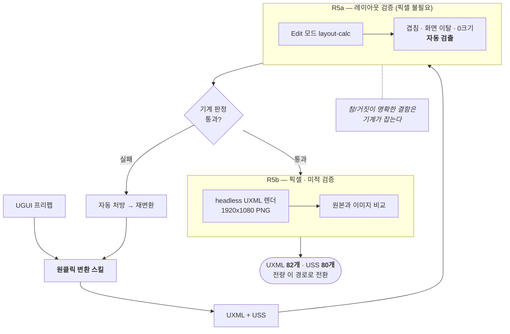

# F-32. UGUI→UXML 원클릭 변환 스킬 + 자동 검증 루프

> 소스 발췌: `src/` — 3개 파일

**구간** Phase 3 (2026.04.02 ~ 2026.05.13) | **포지션** 툴·TD | **AI** 협업

### 구조 — 변환을 도구로 만들고, 검증을 성격에 따라 2단계로 분리



- **문제**: F-29의 UI 전환을 화면마다 수동으로 하면 82개 UXML을 손으로 써야 한다. UGUI 프리팹은 YAML + GUID 참조라 사람이 읽고 옮기는 작업 자체가 느리고, 옮긴 결과가 원본과 같은지 확인하는 데 또 시간이 든다.
- **해결**: **UGUI 프리팹을 넣으면 UXML/USS가 나오는 원클릭 변환 스킬**을 만들고, **이것으로 기존 UI를 전부 변환했다.** 변환이 수작업에서 도구 실행으로 바뀌면서 82개 UXML 전환이 현실적인 작업이 되었다.
  - 변환 결과를 사람이 눈으로 검수하면 결국 사람 시간이 병목이므로, **검증도 함께 자동화**했다. 성격이 다른 두 단계로 나눴다.
    - **R5a — 레이아웃 검증**: Edit 모드의 layout-calc 결과만으로 **겹침 / 화면 이탈 / 0크기**를 자동 검출한다. **픽셀 렌더가 필요 없다** — 참/거짓이 명확한 결함이므로 기계가 판정한다.
    - **R5b — 픽셀/미적 검증**: UXML을 headless로 렌더한 이미지를 비교한다. 주관적 판단이 필요한 것만 여기로 온다.
  - 변환 → 자동 검증 → 처방이 하나의 루프로 돌아, 화면 하나를 옮기는 데 드는 사람 개입이 최소화된다.
- **기술**: UGUI 계층 → UXML/USS 변환 규칙 자동화, Unity Edit 모드 layout 계산 API, 자동 결함 검출(겹침/이탈/0크기), 렌더 이미지 비교, 자동 추출 기반 처방, Claude Code 커스텀 커맨드화
- **정량**: **UXML 82개 / USS 80개 전량 이 도구로 변환** / 검증 2단계 자동화 / 원클릭 실행
- **근거**:
  - `Docs/콘텐츠/UI/완료플랜/26.04.02_UGUItoUXML-자동화-스킬-설계-+-Equipment-Screen-전환.md`
  - `Docs/콘텐츠/UI/완료플랜/26.04.09_UGUI-UI-Toolkit-변환-TODO-관리-플랜.md`
  - `Docs/콘텐츠/UI/완료플랜/26.04.16_UI-Toolkit-작업-품질-개선-—-초안-재작업-최소화.md`
  - `Docs/plans/완료/26.05.13_시안-→-UXML-워크플로우-개선-자동-추출-기반-처방.md`
  - `Docs/plans/완료/26.04.07_ui-evaluate-lite-시니어-디자이너-피드백-반영-2차-3차-개선.md`
  - `.claude/commands/ui-ugui-to-uxml.md`, `.claude/commands/ui-evaluate-lite.md`, `.claude/commands/ui-evaluate-runtime.md` — 변환·평가 커맨드
- **면접 포인트**: **"UI 프레임워크 전면 교체를 손이 아니라 도구로 했다."** UGUI → UI Toolkit 전환은 보통 화면 수만큼의 수작업이 드는 일인데, 변환 자체를 원클릭 도구로 만들어 **82개 UXML 전량을 이 도구로 처리**했다. 도구를 만드는 비용이 화면 수를 넘는 순간부터 남는 장사가 되고, 여기서는 명백히 남았다. 검증까지 자동화하면서 **기계가 판정 가능한 것(겹침·이탈·0크기)과 사람/이미지 비교가 필요한 것을 분리**한 것이 도구를 실용 수준으로 만든 결정이다.
- **슬라이드 자료**: 변환 스킬 실행 → UGUI/UXML 결과 비교 화면 — **UXML 결과만 확보** (아래 `## 화면`), UGUI 원본 캡처 필요 / 변환→검증 루프 다이어그램 — **다이어그램 필요** (이 프로젝트 대표 슬라이드 후보)


<!-- IMAGES:START -->
## 화면

이 스킬로 변환한 결과물. UXML 82개 / USS 80개 전량이 같은 경로를 거쳤다.


<sub>장비 화면 — 변환 후 손질 없이 이 상태</sub>

<!-- IMAGES:END -->


<!-- EVIDENCE:START -->
## 실행 결과

R5b(픽셀·미적 검증)가 실제로 뽑은 리포트다. 대상 화면은 `TK_Screen_Player` — 그 화면의 headless 렌더는 [F-29](../F-29_UIToolkit전면전환/) 에 있다.

> 이 루프는 **드래프트 → 시니어 리뷰 → 최종**의 3단이다. 세 파일 전부 `src/EvaluationReports/` 에 있다.

<details>
<summary>가중 채점 결과 — 총점 2.05 / 5.0, <b>FAIL</b>. 항목별 점수에 그치지 않고 <b>각 항목을 5점으로 만드는 방법</b>까지 파일·라인 단위로 적힌다 &nbsp;·&nbsp; <code>src/EvaluationReports/TK_Screen_Player_20260415_lite.md</code></summary>

```markdown
## 점수 요약 (시니어 최종)

| 항목 | 점수 | 가중 | 가중점수 | 10/10 가이드 |
|------|:---:|:---:|:---:|---|
| 1. 정보 계층 | **2** | ×3 | 6 | 좌측 420px 빈 공간을 CP+스탯 요약+추천 강화로 재구성 |
| 2. 터치 적합성 | **3** | ×3 | 9 | `.ps-mod-slot` margin `4px→8px` (uss:176) + 프로필 버튼 gap `4→6px` (uss:78-79) |
| 3. 시각 일관성 | **3** | ×2 | 6 | 인라인 `<color>` 4종을 USS 토큰 4개(`--color-text-increase/locked/level/stat`)로 승격 |
| 4. 인지 부하 | **2** | ×3 | 6 | 카드 5개 중 1개만 `--recommended` 강조, 나머지 secondary로 dim |
| 5. 피드백 명확성 | **2** | ×2 | 4 | 비활성 상태 카드에 `.ps-mod-slot--locked` + 구매버튼 `disabled` |
| 6. 재화 식별성 ★ | **1** | ×3 | 3 | 6슬롯 wealth-icon에 실제 재화 아이콘 에셋 주입 + 비용 라벨에 재화 아이콘 병기 |
| 7. 확률·수치 신뢰성 ★ | **2** | ×3 | 6 | `N.000%`→`N.0%` 통일 + `0.000% 잠금 해제`는 `Lv.30 필요`로 대체 + "7 재화 부족"→"필요:350 / 보유:120" |
| AI 슬롭 감점 | -1.2 | — | -1.2 | — |
| **합계** | | /19 | **40-1.2 = 38.8/95 → 평균 2.05** | |

> AI 슬롭: 더미 반복(-0.2) + 소수점 의미없음(-0.3) + 재화값 전부 "0"(-0.3) + 주석 반복(-0.1) + 인라인 `background-image:none` 중복(-0.1) + 스탯 아이콘 15개 전부 동일 검정박스(-0.2, 시니어 추가) = **-1.2** (허용선 -1.5 이내)
```

</details>

<details>
<summary>처방을 <b>소요 시간으로 계층화</b> — 5분 / 30분 / 별도 작업. 지금 당장 고칠 것과 설계가 필요한 것을 섞지 않는다 &nbsp;·&nbsp; <code>src/EvaluationReports/TK_Screen_Player_20260415_lite.md</code></summary>

```markdown
## ⚡ TL;DR

> **총점**: **2.05 / 5.0** — **FAIL**
> **자동 FAIL 사유**: 5개 항목이 ≤2 (1·4·5=2, 6=1, 7=2) + 경제 화면 6·7 ≤ 3 + 합격선 4.0 대비 심각 미달
> 현재 상태로 매출 집행 불가. UXML/USS만으로 2.6까지는 끌어올릴 수 있으나 4.0은 **재화 아이콘 에셋 + 좌측 패널 재설계 + 추천 강조 시스템** 3대 작업이 선행되어야 달성.

### 🔴 지금 5분 안에 고칠 1개 (시니어 채택)
**소수점 일괄 `N.000%` → `N.0%` + 잠금/부족/MAX 카드에 `.ps-mod-slot--locked` 클래스 부여(opacity 0.55 + 구매버튼 숨김)**
- 대상: `uxml:84,94,119,129,139` (소수점) / `uxml:94,106,139,149,184` (상태 카드)
- 효과: 항목 4·5·7이 동시에 2→3으로 회복 (+0.47), "잠겼는데 버튼 활성" 오결제 리스크 즉시 제거
- *드래프트의 "6슬롯 색 주입"은 아이콘 에셋이 없어 반쪽 개선이 되므로 채택 안 함*

### 🟡 다음 30분 안에 고칠 3개
1. **인라인 리치텍스트 컬러 → USS 토큰화**: `uxml:63,64,73,74,...,193,194`의 `<color=#FFB060/#FFE08C/#48D080/#FF6060>` → `.ps-mod-delta-up/down/locked/stat-name` 클래스로 분리
2. **추천 카드 1개 강조**: 5개 구매 카드 중 가성비 1개에 `.ps-mod-slot--recommended` (시안 외곽선 2px + 배지), 나머지 텍스트 dim → CTA 과잉(13액션) 해소
3. **탭 레이아웃 점프 제거**: `TK_Screen_Player.uss:117 vs 130` 폰트 24↔28 변화 제거, `border-bottom-width 2→6px + 배경색`만으로 강조

### 🔵 별도 작업 (리팩토링/디자인 시스템)
- **재화 6슬롯 아이콘 에셋 주입** + 비용 라벨 옆 16x16 재화 아이콘 (uxml:66-68 스키마 변경) — 항목 6 개선의 본체
- **좌측 프로필 패널(420px) 재설계**: CP 위젯 + 주요 스탯 요약 + 추천 강화 힌트로 매출 핵심 공간 재활성화
- `btn-positive` 의미 충돌: `PXButton.uss:2` 주석(그린=적용)과 HonkaiBlue 테마의 시안 컬러 의미 재정렬
```

</details>

<details>
<summary>2단계로 나눈 이유 — 시니어 리뷰가 <b>드래프트가 놓친 치명 이슈</b>를 잡아낸다. 1패스였다면 "카드당 버튼 1개라 문제 없음"으로 통과했을 건이다 &nbsp;·&nbsp; <code>src/EvaluationReports/TK_Screen_Player_20260415_lite_senior.md</code></summary>

```markdown
### 2. 드래프트가 놓친 이슈 (중요도 순)

#### [치명] #1. CTA 과잉 — 화면 내 "초록 느낌 버튼" 5개 + 노랑 primary 3개가 동시 활성 (캡처 우측 카드 스택, 좌측 하단 `btn-profile-*`)
- 파일 위치: `uxml:66,76,86,96,106` + `uxml:45,46,47`
- 시니어 관점: 경제 화면의 황금 규칙은 "1차 CTA 1개, 최대 2개". 캡처를 보면 **구매 5개 + 상세/칭호/각성 3개 + 탭 3개 + 닫기 + 뒤로 = 시각 액션 13개**. 유저 시선이 분산되고 "오늘 뭘 강화해야 하지"에 대한 시스템 힌트가 전혀 없음.
- 드래프트는 "카드당 1개라 문제 없음"으로 처리했는데, 실제 캡처는 "화면 전체가 동일 밝기의 액션 범람" 상태. AFK/Solo Leveling 레퍼런스는 **1개 추천 액션을 배지/링/확장 카드로 강조**한다.
- 조치: 5개 카드 중 1개(추천/가성비 최고)만 `.ps-mod-slot--recommended` 강조(카드 보더 + 시안 외곽선) + 나머지는 secondary 텍스트 컬러로 dim.

#### [치명] #2. 프로필 이미지 영역 320×420px이 좌측 전체를 빈 네이비로 차지 (캡처 좌측 3분의 1)
- 파일 위치: `uss:42-47` `ps-profile-image-area`
- 시니어 관점: 방치형 RPG에서 **좌측 고정 420px을 "빈 박스 + 레벨 1 + 칭호 없음"만으로 채우는 건 용납 불가**. 매출 핵심 화면의 가장 좋은 자리가 placeholder에 점유됨. 이 공간이 `CP(전투력) + 스탯 요약 + 추천 강화`로 채워져야 "재화 쓰는 이유"가 생긴다.
- 드래프트는 "CP 위젯 부재"로만 언급하고 감점 1. 시니어는 **정보 계층(항목 1)을 2점**으로 본다. 빈 공간은 "정보 부재"가 아니라 "매출 기회 손실".
```

</details>

<!-- EVIDENCE:END -->

## 수록 파일

- `.claude/commands/ui-evaluate-lite.md`
- `.claude/commands/ui-evaluate-runtime.md`
- `.claude/commands/ui-ugui-to-uxml.md`
