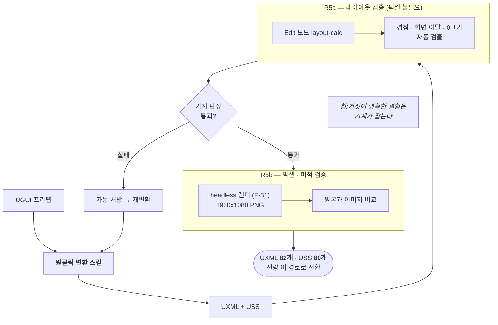

# F-32. UGUI→UXML 원클릭 변환 스킬 + 자동 검증 루프

> 소스 발췌: `src/` — 3개 파일

**구간** Phase 3 (2026.04.02 ~ 2026.05.13) | **포지션** 툴·TD | **AI** 협업

### 구조 — 변환을 도구로 만들고, 검증을 성격에 따라 2단계로 분리

- **문제**: F-29의 UI 전환을 화면마다 수동으로 하면 82개 UXML을 손으로 써야 한다. UGUI 프리팹은 YAML + GUID 참조라 사람이 읽고 옮기는 작업 자체가 느리고, 옮긴 결과가 원본과 같은지 확인하는 데 또 시간이 든다.
- **해결**: **UGUI 프리팹을 넣으면 UXML/USS가 나오는 원클릭 변환 스킬**을 만들고, **이것으로 기존 UI를 전부 변환했다.** 변환이 수작업에서 도구 실행으로 바뀌면서 82개 UXML 전환이 현실적인 작업이 되었다.
  - 변환 결과를 사람이 눈으로 검수하면 결국 사람 시간이 병목이므로, **검증도 함께 자동화**했다. 성격이 다른 두 단계로 나눴다.
    - **R5a — 레이아웃 검증**: Edit 모드의 layout-calc 결과만으로 **겹침 / 화면 이탈 / 0크기**를 자동 검출한다. **픽셀 렌더가 필요 없다** — 참/거짓이 명확한 결함이므로 기계가 판정한다.
    - **R5b — 픽셀/미적 검증**: headless 렌더(F-31)한 이미지를 비교한다. 주관적 판단이 필요한 것만 여기로 온다.
  - 변환 → 자동 검증 → 처방이 하나의 루프로 돌아, 화면 하나를 옮기는 데 드는 사람 개입이 최소화된다.
- **기술**: UGUI 계층 → UXML/USS 변환 규칙 자동화, Unity Edit 모드 layout 계산 API, 자동 결함 검출(겹침/이탈/0크기), 렌더 이미지 비교, 자동 추출 기반 처방, Claude Code 커스텀 커맨드화
- **정량**: **UXML 82개 / USS 80개 전량 이 도구로 변환** / 검증 2단계 자동화 / 원클릭 실행
- **근거**:
  - `Docs/콘텐츠/UI/완료플랜/26.04.02_UGUItoUXML-자동화-스킬-설계-+-Equipment-Screen-전환.md`
  - `Docs/콘텐츠/UI/완료플랜/26.04.09_UGUI-UI-Toolkit-변환-TODO-관리-플랜.md`
  - `Docs/콘텐츠/UI/완료플랜/26.04.16_UI-Toolkit-작업-품질-개선-—-초안-재작업-최소화.md`
  - `Docs/plans/완료/26.05.13_시안-→-UXML-워크플로우-개선-자동-추출-기반-처방.md`
  - `Docs/plans/완료/26.04.07_ui-evaluate-lite-시니어-디자이너-피드백-반영-2차-3차-개선.md`
  - `.claude/commands/ui-ugui-to-uxml.md`, `.claude/commands/ui-evaluate-lite.md`, `.claude/commands/ui-evaluate-runtime.md` — 변환·평가 커맨드
- **면접 포인트**: **"UI 프레임워크 전면 교체를 손이 아니라 도구로 했다."** UGUI → UI Toolkit 전환은 보통 화면 수만큼의 수작업이 드는 일인데, 변환 자체를 원클릭 도구로 만들어 **82개 UXML 전량을 이 도구로 처리**했다. 도구를 만드는 비용이 화면 수를 넘는 순간부터 남는 장사가 되고, 여기서는 명백히 남았다. 검증까지 자동화하면서 **기계가 판정 가능한 것(겹침·이탈·0크기)과 사람/이미지 비교가 필요한 것을 분리**한 것이 도구를 실용 수준으로 만든 결정이다.
- **슬라이드 자료**: 변환 스킬 실행 → UGUI/UXML 결과 비교 화면 — **UXML 결과만 확보** (아래 `## 화면`), UGUI 원본 캡처 필요 / 변환→검증 루프 다이어그램 — **다이어그램 필요** (이 프로젝트 대표 슬라이드 후보)

<!-- IMAGES:START -->
## 화면

이 스킬로 변환한 결과물. UXML 82개 / USS 80개 전량이 같은 경로를 거쳤다.

장비 화면 — 변환 후 손질 없이 이 상태

<!-- IMAGES:END -->

## 수록 파일

- `.claude/commands/ui-evaluate-lite.md`
- `.claude/commands/ui-evaluate-runtime.md`
- `.claude/commands/ui-ugui-to-uxml.md`
