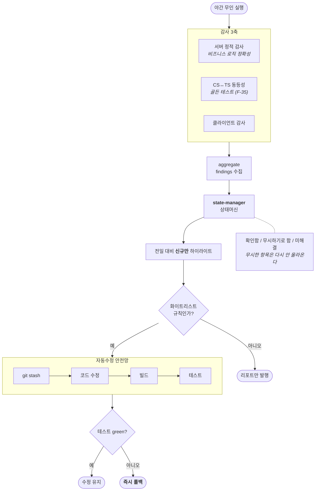

# F-34. 야간 무인 로직/메커니즘 감사 파이프라인

> 소스 발췌: `src/` — 29개 파일

**구간** Phase 3 (2026.04.11 ~) | **포지션** TD·서버 | **AI** 협업 (오케스트레이션)

### 구조 — 로직의 옳음을 감사하고, 자동수정에는 안전망을 건다



- **문제**: 린터와 테스트는 **"코드가 규칙을 지키는가"**를 본다. 하지만 이 프로젝트에서 실제로 위험한 것은 **"로직 자체가 옳은가"**다 — 확률 합이 1.0인가, 가챠 테이블에 dead code가 있는가, 클라와 서버의 계산이 같은가. 이건 문법 검사로도 단위 테스트로도 잡히지 않는다. 그리고 1인 개발에서는 이걸 매일 볼 사람이 없다.
- **해결**: **야간에 무인으로 도는 로직 감사 파이프라인**을 구축했다. 3개 축으로 감사한다.
  - **서버 정적 감사** — 비즈니스 로직 정확성 검증
  - **CS↔TS 동등성 골든 테스트** (F-35)
  - **클라이언트 로직 검증**

  **운영 설계가 이 카드의 핵심이다.**
  - **전일 대비 신규 발견만 하이라이트** — 매일 같은 목록이 나오면 아무도 안 본다. 어제와 달라진 것만 강조한다.
  - **findings 상태머신** — 발견 항목에 상태를 부여해 "확인함 / 무시하기로 함 / 미해결"을 추적한다. 무시한 항목이 매일 다시 올라오지 않는다.
  - **자동수정은 화이트리스트 한정** — 안전하다고 확인된 유형만 자동 수정한다.
  - **자동수정 안전망**: `git stash` → 빌드 → 테스트 green → **실패 시 즉시 롤백**. 자동 수정이 코드를 망가뜨릴 수 없다.
- **기술**: 무인 배치 파이프라인, 정적 로직 감사, 골든 테스트 연동, 상태머신 기반 findings 추적, 화이트리스트 자동수정 + stash/빌드/테스트 게이트 롤백
- **정량**: `healthcheck/` **16파일 2,319줄** / 일일 자동 리포트 생성 / 자동수정 화이트리스트 방식
- **근거**:
  - `FirebaseCLI/functions/healthcheck/` — 16파일 2,319줄
  - `Docs/plans/테스트/26.04.11_Phase-5-야간-무인-로직-메커니즘-감사-시스템-구축.md`
  - `Docs/plans/테스트/healthcheck/reports/2026-04-11_audit-report.md`, `Docs/plans/테스트/healthcheck/reports/2026-04-12_audit-report.md` — 실제 산출 리포트
  - `Docs/리팩토링/완료플랜/26.04.12_서버-비즈니스-로직-정확성-검증.md`, `Docs/리팩토링/완료플랜/26.04.12_Unity-클라이언트-로직-검증-체계-구축.md`
  - `.claude/commands/code-healthcheck.md` — 파이프라인 실행 커맨드
- **면접 포인트**: **이 프로젝트에서 AI 활용의 정점.** 세 가지가 결합되어 있다 — (1) 감사 대상을 문법이 아닌 **로직의 옳음**으로 잡은 문제 정의, (2) 신규 발견 하이라이트와 상태머신이라는 **운영 가능성 설계**(매일 도는 것이 아니라 매일 **읽히는** 것을 만들었다), (3) 화이트리스트 + stash→빌드→테스트→롤백이라는 **자동화 안전망**. AI에게 자동 수정을 맡기면서 동시에 그것이 절대 코드를 망가뜨릴 수 없게 만든 구조가 요점이다. Phase 1의 첫 AI 감사(F-10)가 여기까지 왔다는 서사도 강하다.
- **슬라이드 자료**: 파이프라인 다이어그램(감사 3축 + 자동수정 안전망 게이트) — **다이어그램 필요** / 실제 audit-report — **캡처 필요** (이 프로젝트 대표 슬라이드 후보)


<!-- EVIDENCE:START -->
## 실행 결과

> 아래는 이 도구가 실제로 출력한 리포트의 **발췌**입니다. 원본 전체는 `src/` 에 그대로 들어 있습니다.

<details>
<summary>자동 수정 게이트가 <b>커밋을 거부하고 롤백을 선택한</b> 실행 기록 — 빌드·테스트는 통과했지만 커밋 단계에서 실패하자 전체를 되돌렸다 &nbsp;·&nbsp; <code>src/healthcheck/reports/autofix-2026-04-12.json</code></summary>

```json
{
  "date": "2026-04-12",
  "timestamp": "2026-04-12T06:20:58.278Z",
  "status": "ROLLBACK",
  "steps": [
    {
      "name": "eslint --fix",
      "status": "success",
      "durationMs": 21111,
      "details": "34 파일 수정"
    },
    {
      "name": "codemod: console-to-logdebug",
      "status": "success",
      "durationMs": 37,
      "details": "0 파일 / 0 교체"
    },
    {
      "name": "build gate",
      "status": "success",
      "durationMs": 15478,
      "details": "빌드 성공"
    },
    {
      "name": "test gate",
      "status": "success",
      "durationMs": 632040,
      "details": "1645 passing"
    },
    {
      "name": "git commit",
      "status": "failed",
      "durationMs": 2127,
      "details": "git commit 실패"
    }
  ],
  "stats": {
    "eslintFixedFiles": 34,
    "codemodFiles": 0,
    "codemodReplacements": 0
  },
  "reason": "커밋 단계 실패"
}
```

</details>

<details>
<summary>서버 감사 리포트 요약 — 466건을 심각도 4단계로 자동 분류 &nbsp;·&nbsp; <code>src/healthcheck/reports/server-2026-04-12.md</code></summary>

```markdown
# 서버 감사 리포트 — 2026-04-12

- **스캔 시각**: 2026-04-12T06:32:14.600Z
- **소요 시간**: 170.8s
- **총 발견**: 466건

## Summary
- S1 (데이터 손상/재무): **22** 🚨
- S2 (게임플레이): **45**
- S3 (성능/구조): **121**
- S4 (유지보수): **278**
```

</details>

<details>
<summary>동등성 트랙 — C#/TS 196쌍 대조, 불일치 2건 지목 &nbsp;·&nbsp; <code>src/healthcheck/reports/parity-2026-04-12.md</code></summary>

```markdown
# 동등성 리포트 (Track C) — 2026-04-12

- **총 불일치**: 2건
- **소요**: 0.01s

## Suite별 통계
| Suite | 쌍 | 불일치 | 누락 | TS | CS |
|---|---:|---:|---:|:-:|:-:|
| bigint | 53 | 0 | 0 | ✓ | ✓ |
| formula | 51 | 0 | 0 | ✓ | ✓ |
| modvalue | 52 | 2 | 0 | ✓ | ✓ |
| gachahash | 20 | 0 | 0 | ✓ | ✓ |
| randomhash | 20 | 0 | 0 | ✓ | ✓ |

## 불일치 상세 (최대 200)
| Suite / ID | 필드 | CS | TS |
|---|---|---|---|
| modvalue:seed-1 | result | 0 | ERROR |
```

</details>

<!-- EVIDENCE:END -->

## 수록 파일

- `FirebaseCLI/functions/healthcheck/aggregate.ts`
- `FirebaseCLI/functions/healthcheck/autofix-server.ts`
- `FirebaseCLI/functions/healthcheck/codemods/console-to-logdebug.ts`
- `FirebaseCLI/functions/healthcheck/engines/eslint-engine.ts`
- `FirebaseCLI/functions/healthcheck/engines/ripgrep-engine.ts`
- `FirebaseCLI/functions/healthcheck/engines/tool-engines.ts`
- `FirebaseCLI/functions/healthcheck/patterns/client-patterns.json`
- `FirebaseCLI/functions/healthcheck/patterns/server-patterns.json`
- `FirebaseCLI/functions/healthcheck/reports/autofix-2026-04-11.json`
- `FirebaseCLI/functions/healthcheck/reports/autofix-2026-04-12.json`
- `FirebaseCLI/functions/healthcheck/reports/client-2026-04-11.md`
- `FirebaseCLI/functions/healthcheck/reports/client-2026-04-12.md`
- `FirebaseCLI/functions/healthcheck/reports/new-findings-2026-04-11.md`
- `FirebaseCLI/functions/healthcheck/reports/new-findings-2026-04-12.md`
- `FirebaseCLI/functions/healthcheck/reports/parity-2026-04-11.md`
- `FirebaseCLI/functions/healthcheck/reports/parity-2026-04-12.md`
- `FirebaseCLI/functions/healthcheck/reports/parity-status-2026-04-12.json`
- `FirebaseCLI/functions/healthcheck/reports/server-2026-04-11.md`
- `FirebaseCLI/functions/healthcheck/reports/server-2026-04-12.md`
- `FirebaseCLI/functions/healthcheck/run-all.ts`
- `FirebaseCLI/functions/healthcheck/scan-client.ts`
- `FirebaseCLI/functions/healthcheck/scan-parity.ts`
- `FirebaseCLI/functions/healthcheck/scan-server.ts`
- `FirebaseCLI/functions/healthcheck/scripts/baseline-triage.ts`
- `FirebaseCLI/functions/healthcheck/scripts/check-enum-offsets.ts`
- `FirebaseCLI/functions/healthcheck/scripts/compare-golden.ts`
- `FirebaseCLI/functions/healthcheck/state-manager.ts`
- `FirebaseCLI/functions/healthcheck/tsconfig.json`
- `FirebaseCLI/functions/healthcheck/types.ts`
