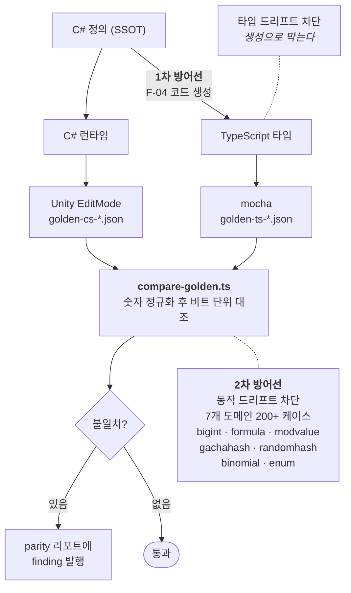

# F-35. 클라-서버 동등성 골든 테스트

> 소스 발췌: `src/` — 3개 파일

**구간** Phase 3 (2026.04.12 ~) | **포지션** 서버·TD | **AI** 협업

### 구조 — 이중 구현의 드리프트를 막는 2중 방어선



- **문제**: 동일한 게임 로직(데미지 계산·가챠·확률·큰수 연산)이 **C#과 TypeScript에 이중으로 존재**한다. F-04의 코드 생성이 타입 드리프트는 막지만, **동작 드리프트**는 막지 못한다. 한쪽 계산 순서만 바꿔도 결과가 갈라지는데, 컴파일도 테스트도 통과한다.
- **해결**: **동일 입력 JSON을 양쪽에 먹이고 결과를 diff하는 골든 테스트 파이프라인**을 만들었다. 7개 도메인을 커버한다.

| 도메인 | 검증 대상 | 케이스 |
|---|---|---:|
| `bigint` | 큰수 연산 (방치형 재화) | 53 |
| `formula` | 성장·전투 공식 | 51 |
| `modvalue` | MOD 값 계산 | 52 |
| `gachahash` | 가챠 해시 (F-07/F-20) | 20 |
| `randomhash` | 스테이지 랜덤 해시 | 20 |
| `binomial` | 이항 분포 | — |
| `enum` | 열거형 값 정합 | — |

  Unity EditMode 테스트와 mocha를 **unicli 헤드리스 실행**으로 각각 돌린 뒤 결과를 자동 diff해 리포트를 낸다. F-34의 야간 파이프라인에 편입되어 **무인으로 매일 돈다.**
- **기술**: 골든 파일 테스트, mocha + Unity EditMode 병행 실행, unicli 헤드리스 Unity 실행, 자동 diff 리포트
- **정량**: **7개 도메인 200+ 케이스** / `HealthCheckGoldenTests.cs` 494줄 / 야간 무인 실행
- **근거**:
  - `Assets/Editor/Tests/HealthCheck/HealthCheckGoldenTests.cs` (494줄)
  - `FirebaseCLI/functions/healthcheck/` — 16파일 2,319줄
  - `Docs/plans/테스트/26.04.11_Phase-5-야간-무인-로직-메커니즘-감사-시스템-구축.md`
  - `Docs/배틀/완료플랜/26.02.26_클라이언트-서버-소수점-반올림-Floor-통일-작업-계획서.md` — 전제 조건(F-26)
- **면접 포인트**: **"이중 구현이 불가피한 구조에서 타입 드리프트는 코드 생성(F-04)으로, 동작 드리프트는 골든 테스트로 막는 2중 방어선을 설계했다."** 이 한 문장이 이 프로젝트 아키텍처 서사의 요약이다. 또한 검증 도메인 선정이 임의적이지 않다는 점 — `gachahash`/`randomhash`는 Phase 2에서 **실제로 터진 버그**(F-20)이고, Floor 통일(F-26)은 이 테스트가 성립하기 위해 6주 전에 미리 해둔 작업이다. **사고 → 원인 문서화 → 항구적 자동 검증**의 완결.
- **슬라이드 자료**: 2중 방어선 다이어그램(CodeGen ↔ 골든 테스트) + 7도메인 표 — **다이어그램 필요** / parity 리포트 — **캡처 필요**


<!-- EVIDENCE:START -->
## 실행 결과

> 아래는 이 도구가 실제로 출력한 리포트의 **발췌**입니다. 원본 전체는 `src/` 에 그대로 들어 있습니다.

<details>
<summary>무인 실행된 동등성 리포트 — 5개 스위트 196쌍 대조, `modvalue` 2건 불일치를 잡아냄 &nbsp;·&nbsp; <code>src/reports/parity-2026-04-12.md</code></summary>

```markdown
# 동등성 리포트 (Track C) — 2026-04-12

- **총 불일치**: 2건
- **소요**: 0.01s

## Suite별 통계
| Suite | 쌍 | 불일치 | 누락 | TS | CS |
|---|---:|---:|---:|:-:|:-:|
| bigint | 53 | 0 | 0 | ✓ | ✓ |
| formula | 51 | 0 | 0 | ✓ | ✓ |
| modvalue | 52 | 2 | 0 | ✓ | ✓ |
| gachahash | 20 | 0 | 0 | ✓ | ✓ |
| randomhash | 20 | 0 | 0 | ✓ | ✓ |

## 불일치 상세 (최대 200)
| Suite / ID | 필드 | CS | TS |
|---|---|---|---|
| modvalue:seed-1 | result | 0 | ERROR |
```

</details>

<details>
<summary>전날 실행분 — 같은 스위트가 매일 같은 형식으로 자동 기록된다 &nbsp;·&nbsp; <code>src/reports/parity-2026-04-11.md</code></summary>

```markdown
# 동등성 리포트 (Track C) — 2026-04-11

- **총 불일치**: 14건
- **소요**: 0.01s

## Suite별 통계
| Suite | 쌍 | 불일치 | 누락 | TS | CS |
|---|---:|---:|---:|:-:|:-:|
| bigint | 53 | 0 | 0 | ✓ | ✓ |
| formula | 51 | 0 | 0 | ✓ | ✓ |
| modvalue | 52 | 14 | 0 | ✓ | ✓ |
| gachahash | 20 | 0 | 0 | ✓ | ✓ |
| randomhash | 20 | 0 | 0 | ✓ | ✓ |

## 불일치 상세 (최대 200)
| Suite / ID | 필드 | CS | TS |
|---|---|---|---|
| modvalue:seed-1 | result | 0 | ERROR |
```

</details>

<!-- EVIDENCE:END -->

## 수록 파일

- `Assets/Editor/Tests/HealthCheck/HealthCheckGoldenTests.cs`
- `FirebaseCLI/functions/healthcheck/scan-parity.ts`
- `FirebaseCLI/functions/healthcheck/scripts/compare-golden.ts`
