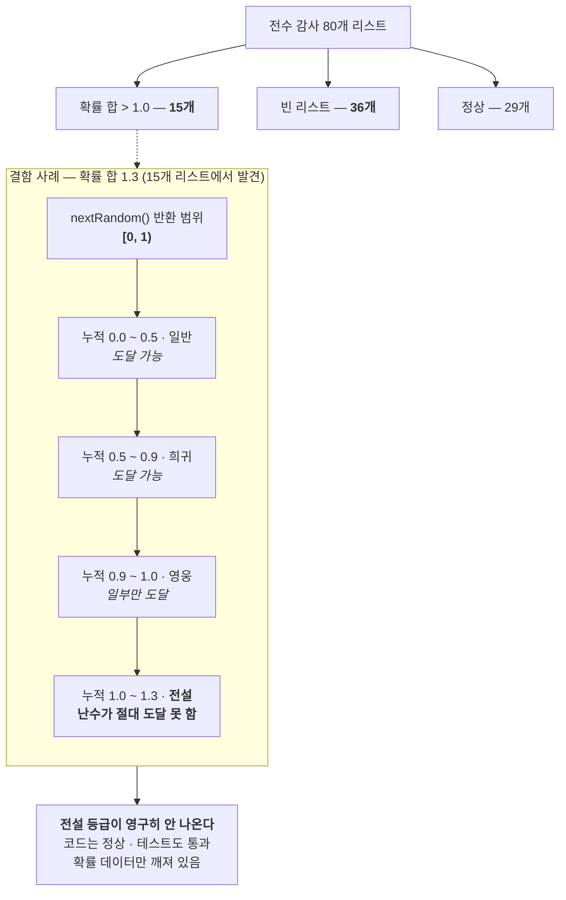

# F-37. 가챠 확률 데이터 전수 감사

> 소스 발췌: `src/` — 3개 파일

**구간** Phase 3 (2026.04.08) | **포지션** 서버 | **AI** 협업

### 구조 — 확률 합이 1.0을 넘으면 상위 티어가 dead code가 된다

- **문제**: F-36에서 확률 **로직**의 결함을 잡았다면, 확률 **데이터**는 어떤가? 가챠 확률 테이블은 스프레드시트에서 들어오는데, 아무도 전수 검사한 적이 없었다.
- **해결**: 가챠 확률 리스트 **80개를 전수 감사**했다. 결과는 **51개 결함**.

| 결함 유형 | 개수 | 실제 영향 |
|---|---:|---|
| 확률 합 > 1.0 | 15개 | **상위 티어가 영구히 뽑히지 않는 dead code** |
| 빈 리스트 | 36개 | 뽑기 자체가 동작하지 않음 |

  - **합 > 1.0이 왜 dead code를 만드는가**를 알고리즘 레벨에서 규명했다. 누적확률 방식으로 순회하면서 `nextRandom()`이 `[0, 1)` 범위를 반환하는데, 누적합이 1.0을 넘어가는 지점 이후의 항목은 **난수가 도달할 수 없는 구간**에 놓인다. 그래서 상위 티어가 존재하지만 절대 나오지 않는다.
  - 검출로 끝내지 않고 **복구 명세서**까지 작성했다.
- **기술**: 데이터 전수 검증, 누적확률 알고리즘 분석, 난수 범위 `[0,1)` 상호작용 규명
- **정량**: **80개 리스트 중 51개 결함** (합>1.0 15개 / 빈 리스트 36개) — **결함률 64%**
- **근거**: `Docs/인프라/완료플랜/26.04.08_가챠-확률-데이터-정합성-검증-및-복구-명세서.md`
- **면접 포인트**: **"아무도 안 본 데이터를 전수 검사하면 64%가 깨져 있다."** 수치 자체도 강하지만, 핵심은 **원인 규명의 깊이**다. "확률 합이 1을 넘는다"는 발견에서 멈추지 않고, **누적확률 순회 + `nextRandom()`의 `[0,1)` 범위**라는 두 요소의 상호작용으로 상위 티어가 dead code가 되는 메커니즘까지 설명했다. 이 규명이 없었다면 "합을 1로 맞추면 된다"는 표면 수정에 그쳤을 것이고, 같은 부류 결함을 다시 만들었을 것이다. 출시 전 발견이라 실제 매출·유저 피해로 이어지지 않았다.
- **슬라이드 자료**: 누적확률 dead-zone 다이어그램 + 80개 중 51개 결함 도넛 차트 — **다이어그램 필요** (수치 임팩트가 커서 슬라이드 후보 상위)

## 수록 파일

- `FirebaseCLI/functions/src/API/CoreData/Gacha.ts`
- `FirebaseCLI/functions/src/Data/Types/GachaServerTypes.ts`
- `FirebaseCLI/functions/src/Utility/UtilityGacha.ts`
