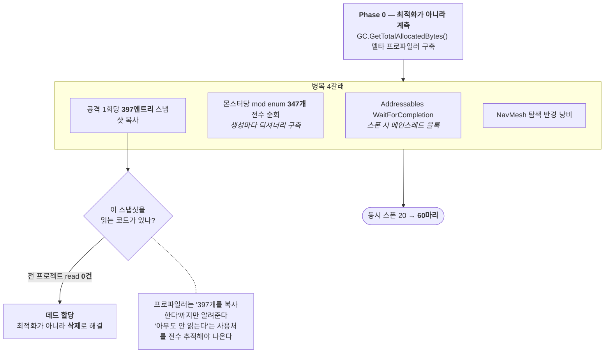

# F-46. 대량 몬스터 스폰 최적화 (20 → 60)

> 소스 발췌: `src/` — 1개 파일

**구간** Phase 3 (2026.07.29) | **포지션** 클라 | **AI** 협업

### 구조 — 계측을 먼저 만들고 병목을 4갈래로 분해

- **문제**: 동시 몬스터 20마리에서 프레임이 무너졌다. 방치형 RPG는 화면을 가득 채우는 다수 적이 핵심 연출인데, 20마리가 한계면 게임 느낌 자체가 안 나온다.
- **해결**: **Phase 0에서 `GC.GetTotalAllocatedBytes()` 델타 프로파일러를 먼저 만들었다.** 그다음 병목을 **4갈래로 분해**했다.

| 병목 | 내용 |
|---|---|
| **Addressables 메인스레드 블록** | `WaitForCompletion` 호출이 스폰 시점에 메인스레드를 정지시킴 |
| **몬스터당 mod enum 347개 전수 순회** | 몬스터 하나 생성할 때마다 mod 열거형 347개를 전부 돌며 딕셔너리를 만듦 |
| **공격당 397엔트리 스냅샷 복사** | 공격 1회마다 397개 엔트리를 복사. **전 프로젝트에서 이 스냅샷을 읽는 코드가 0건** — 순수 데드 할당이었다 |
| **NavMesh 반경 낭비** | 스폰 지점 탐색 반경이 불필요하게 큼 |

  - **데드 할당 발견이 이 카드의 하이라이트다.** "397개를 복사한다"까지는 프로파일러가 알려주지만, "그런데 아무도 안 읽는다"는 **전 프로젝트 read 참조를 전수 확인해야** 나오는 결론이다. 최적화가 아니라 **삭제**로 해결된 항목.
  - 결과: 동시 스폰 **20 → 60마리**.
- **기술**: `GC.GetTotalAllocatedBytes()` 델타 프로파일링, Addressables 비동기 로드 전환, 열거형 순회 제거, 사용처 전수 추적, NavMesh 샘플링 반경 조정
- **정량**: **동시 20 → 60마리 (3배)** / 몬스터당 347개 순회 제거 / 공격당 397엔트리 데드 할당 제거
- **근거**:
  - `Docs/plans/완료/26.07.29_몬스터-대량-스폰-최적화.md`
  - `Docs/plans/완료/26.06.12_전투-대량-몬스터-최적화-잡몹-경량화-명세서.md` — 선행 설계
  - `Docs/배틀/전투폴리싱/몬스터스폰/26.07.27_몬스터스폰_밀집완화_설정값.md`, `Docs/배틀/전투폴리싱/몬스터스폰/26.08.01_스폰지점_랜덤선택.md`, `Docs/배틀/전투폴리싱/몬스터스폰/26.08.01_웨이브_횟수_조절.md` — 후속 튜닝
- **면접 포인트**: **"가장 빠른 코드는 실행되지 않는 코드다."** 397엔트리 스냅샷 복사를 최적화하려다 **read 참조가 0건**임을 확인하고 통째로 삭제한 것이 이 작업의 백미다. 이건 프로파일러만 봐서는 절대 안 나온다 — 할당량은 보이지만 "쓰이는지"는 안 보이기 때문이다. 또한 **Phase 0을 프로파일러 구축에 할당**한 순서(F-41과 동일 패턴)가 이 프로젝트 성능 작업의 표준 절차임을 보여준다. 3배 개선이라는 결과 수치도 명확하다.
- **슬라이드 자료**: 4갈래 병목 분해도 + 20 vs 60 스폰 화면 비교 — **다이어그램 필요** + **캡처 필요**

## 수록 파일

- `Assets/Source/Logic/Data/GameClientPlayConfig/GameClientPlayConfig.Spawn.cs`
