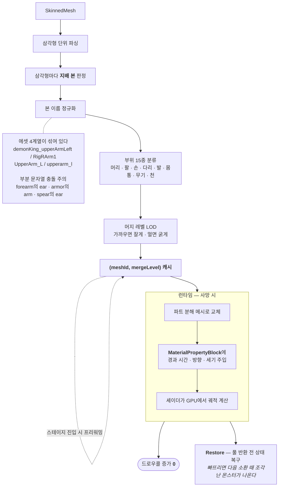
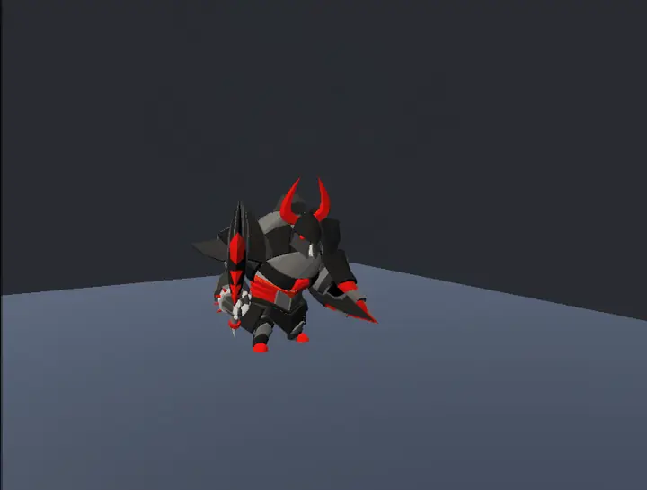
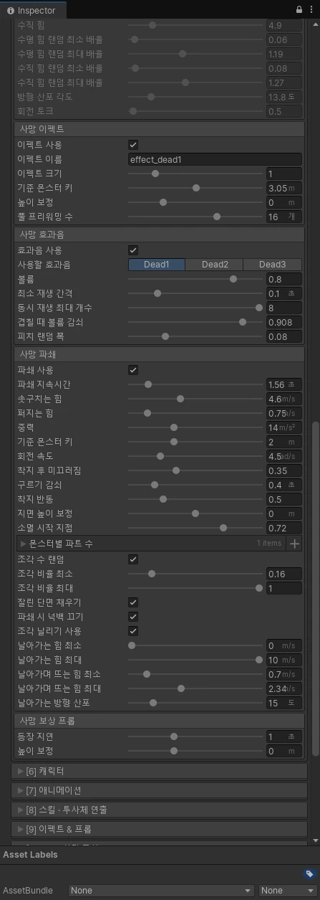

# F-48. 메쉬 파쇄(Shatter) 연출 시스템

> 소스 발췌: `src/` — 5개 파일

**구간** Phase 3 (2026.08.02) | **포지션** 클라·TA | **AI** 협업

### 구조 — 드로우콜을 늘리지 않고 60마리가 동시에 부서진다

- **문제**: 몬스터 사망 연출을 강화하고 싶은데, 일반적인 파쇄 연출은 (1) 메쉬를 조각으로 미리 만들어 두거나(에셋 제작 비용), (2) 런타임에 조각 오브젝트를 대량 생성한다(드로우콜 폭발). 화면에 몬스터 60마리(F-46)가 있는 상황에서 둘 다 쓸 수 없다.
- **해결**: **SkinnedMesh를 런타임에 삼각형 단위로 파싱**해 부위별로 그룹화하고, **드로우콜 증가 없이** GPU에서 파쇄시키는 시스템을 만들었다.

| 요소 | 내용 |
|---|---|
| **부위 그룹화** | 삼각형마다 **지배 본(dominant bone)**을 판정해 부위별로 묶는다 |
| **본 네이밍 정규화** | 본 이름 규칙이 에셋마다 다르므로 정규화해 **신체 부위를 자동 분류**한다 (머리/팔/다리/몸통) |
| **머지 레벨 LOD** | 파쇄 조각 수를 머지 레벨로 조절. 가까우면 잘게, 멀면 굵게 |
| **캐시 + 프리워밍** | `(meshId, mergeLevel)` 키로 캐시하고, **스테이지 진입 시 프리워밍**해 전투 중 스파이크를 제거 |
| **`MaterialPropertyBlock` GPU 파쇄** | 조각을 오브젝트로 만들지 않고 **셰이더 파라미터로 파쇄 애니메이션**을 구동 → **드로우콜 증가 없음** |
| **방향성 파쇄** | 피해 정보(방향·세기)를 연동해 맞은 방향으로 흩어진다 |
| **풀 복구 양립** | 파쇄된 몬스터가 오브젝트 풀(F-08)로 정상 반환되도록 상태 복구 |

- **기술**: SkinnedMesh 런타임 삼각형 파싱, 본 가중치 기반 지배 본 판정, 본 네이밍 정규화, LOD 머지, `MaterialPropertyBlock` + 셰이더 애니메이션, 캐시 프리워밍, 오브젝트 풀 연동
- **정량**: **5파일 3,086줄** / 드로우콜 증가 0 / `(meshId, mergeLevel)` 캐시 + 스테이지 진입 프리워밍
- **근거**:
  - `Assets/Source/Logic/Character/Shatter/MonsterShatterRunner.cs` — 실행 제어
  - `Assets/Source/Logic/Character/Shatter/MonsterShatterPart.cs` — 부위 분할
  - `Assets/Source/Logic/Character/Shatter/MonsterShatterMeshCache.cs` — 캐시·프리워밍
  - `Assets/Source/Logic/Character/Shatter/MonsterShatterState.cs` — 상태·풀 복구
  - `Assets/Source/Logic/Character/Shatter/MonsterShatterDemo.cs` — 데모/검증
  - `Docs/plans/완료/26.08.01_전투-액션감(Juice)-강화-제안서.md` — 연출 강화 맥락
- **면접 포인트**: **연출(TA)과 성능(클라)이 동시에 걸린 문제를 GPU로 넘겨 푼 사례.** `MaterialPropertyBlock`으로 셰이더 파라미터만 바꾸면 드로우콜이 늘지 않는다는 것을 이용해, **60마리가 동시에 파쇄되어도 배치가 유지된다.** 본 네이밍 정규화로 신체 부위를 자동 분류한 것은 에셋별 수작업 세팅을 없앤 부분이고, 스테이지 진입 프리워밍은 **전투 중 스파이크를 로딩 시점으로 옮긴** 전형적 트레이드오프다. 그리고 풀 반환 복구를 챙긴 것은 F-47에서 배운 교훈의 즉시 적용.
- **슬라이드 자료**: 파쇄 연출 영상/연속 캡처 + 부위 그룹화 다이어그램 — **캡처 필요** + **다이어그램 필요** (시각적 임팩트가 커서 슬라이드 후보 상위)

<!-- IMAGES:START -->
## 화면

<b>메쉬가 통째로 사라지는 것이 아니라 부위 단위로 쪼개진다.</b> 뿔·검·상반신·하반신이 각각 다른 방향으로
날아가고, 착지 후 미끄러지다 굴러 멈추고, 소멸 시점에 페이드된다 — 조각 하나하나가 <b>독립 강체</b>다.
잘린 단면이 검게 뚫려 보이지 않는 것은 <code>잘린 단면 채우기</code>가 켜져 있기 때문이고,
이 모든 조각이 <b>드로우콜을 늘리지 않는다</b>(<code>MaterialPropertyBlock</code> + 셰이더 애니메이션).
3.3초 · 15fps · 157KB (원본 24MB GIF 를 애니메이션 WebP 로 재인코딩).

### 튜닝 파라미터

<b>연출을 코드가 아니라 값으로 다룬다.</b> 파쇄 지속시간·솟구치는 힘·퍼지는 힘·중력·회전 속도·착지
미끄러짐·구르기 감쇠·착지 반동·소멸 시작 지점, 그리고 조각 수 랜덤과 날아가는 힘의 최소/최대까지
전부 런타임에 조정된다. 
가장 설명이 필요한 값은 <code>기준 몬스터 키</code>(2m)다 — <b>위의 힘 값들이 "이 키의 몬스터" 기준이라는
뜻</b>이고, 실제 몬스터가 더 크면 <b>힘과 중력이 그 비율만큼 함께 커진다.</b> 둘을 같이 키우기 때문에
도달 높이만 덩치에 비례하고 <b>체공 시간은 그대로 유지</b>된다. 0으로 두면 보정이 꺼져 모든 몬스터가 같은
힘을 받고, 그러면 7m 보스는 조각이 거의 안 날아간다. 
위쪽의 <code>사망 넉백</code> 항목들이 회색인 것은 <code>넉백 사용</code>이 꺼져 있기 때문이다 —
파쇄가 들어오면서 사실상 대체된 연출이라 기본값을 껐다.

<!-- IMAGES:END -->

## 수록 파일

- `Assets/Source/Logic/Character/Shatter/MonsterShatterDemo.cs`
- `Assets/Source/Logic/Character/Shatter/MonsterShatterMeshCache.cs`
- `Assets/Source/Logic/Character/Shatter/MonsterShatterPart.cs`
- `Assets/Source/Logic/Character/Shatter/MonsterShatterRunner.cs`
- `Assets/Source/Logic/Character/Shatter/MonsterShatterState.cs`
