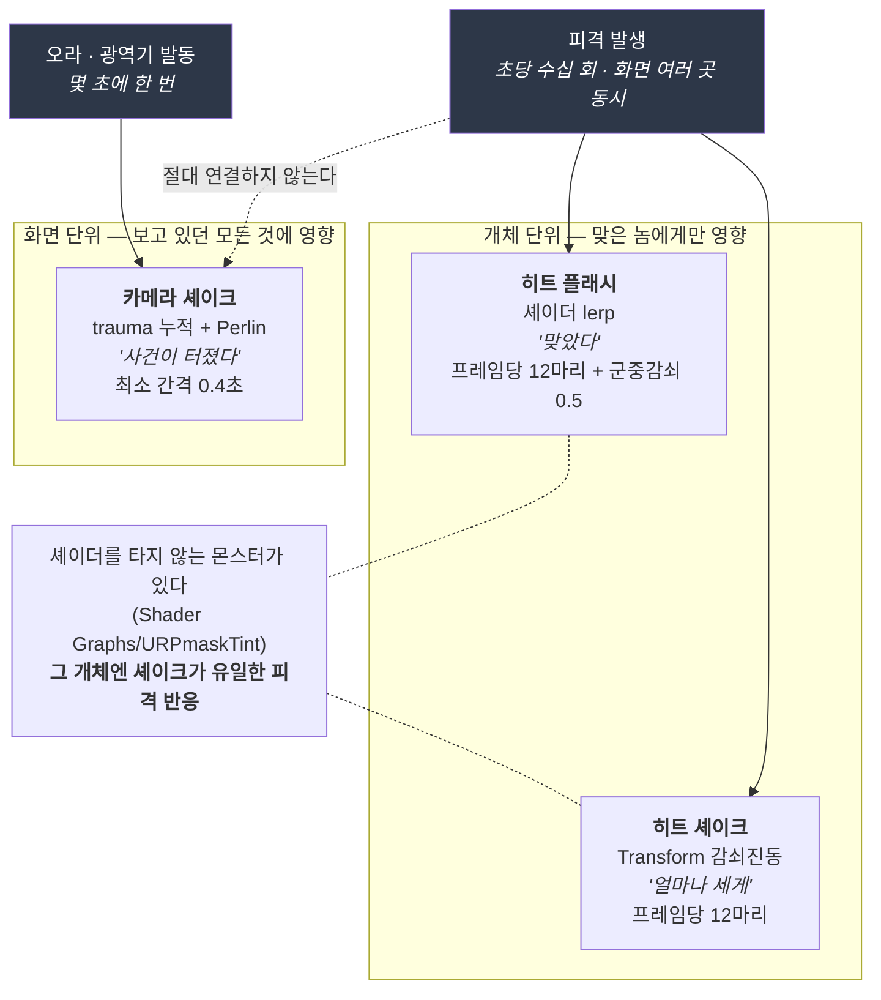

# F-49. 자동전투 타격감 연출 (플래시 · 몸 진동 · 카메라 셰이크)

> 소스 발췌: `src/` — 5개 파일

**구간** Phase 3 (2026.08.11) | **포지션** 클라·TA | **AI** 협업

### 구조 — 영향 범위로 채널을 3층 분리하고, 각 층에 프레임 예산을 건다

- **문제**: 방치형 자동전투에는 **유저가 때리는 순간이 없다.** 타격감을 만드는 통상적 수단 — 입력 진동, 히트스톱, 카메라 흔들기 — 은 전부 "유저 입력 → 즉각 반응" 구조를 전제하는데, 여기엔 입력이 없고 대신 **초당 수십 번의 피격이 화면 여러 곳에서 동시에** 일어난다. 그래서 두 가지가 동시에 문제가 된다.
  1. 화면 전체를 건드리는 연출(카메라 흔들기·시간 정지)을 일반 히트에 걸면 **곧바로 멀미**가 된다.
  2. 개체 단위 연출조차 광역기 한 발에 스무 마리가 동시에 반응하면 개별 피격이 아니라 **화면 백화·지글거림**으로 읽힌다. 60마리 동시 스폰([F-46](../F-46_대량몬스터스폰최적화/))이 기본값인 환경이라 이건 예외가 아니라 상시 상황이다.
- **해결**: 연출을 **영향 범위로 3층 분리**하고, 각 층에 **프레임 예산**을 걸었다.

| 채널 | 구현 | 무엇을 알리나 | 발동 빈도 | 상한 |
|---|---|---|---|---|
| **히트 플래시** | 셰이더 `lerp` + MaterialPropertyBlock | "맞았다" | 초당 수십 회 | 프레임당 **12마리** + 군중 감쇠 **0.5** |
| **히트 셰이크** | `MeshArea.localPosition` 감쇠 사인 진동 | "얼마나 세게" | 초당 수십 회 | 프레임당 **12마리** |
| **카메라 셰이크** | trauma 누적 + Perlin 노이즈 | "사건이 터졌다" | 몇 초에 한 번 | 최소 간격 **0.4초** |

  설계 판단 여섯 가지가 이 카드의 내용이다.

  **① 채널 이중화가 커버리지 갭을 메운다.** 일부 몬스터(beholder / slime 계열)는 `Shader Graphs/URPmaskTint` 를 쓰고 있어 `_HitFlashBlend` 가 아예 무시된다. 셰이크는 셰이더를 타지 않고 Transform 만 건드리므로, **그 개체들에게는 셰이크가 유일한 피격 반응**이 된다. 두 채널을 굳이 다른 층위(셰이더 / 트랜스폼)로 만든 이유가 여기 있다.

  **② 프레임 카운터를 "현재 활성 개체 수"가 아니라 "이번 프레임에 새로 시작한 수"로 셌다.** 누적 카운터는 씬 전환이나 강제 파괴로 **반납이 단 한 번만 누락돼도 영영 높은 값에 묶여** 그 뒤로 아무도 번쩍이지 않는다. 프레임 단위면 다음 프레임에 스스로 회복한다. 그리고 광역기는 어차피 한 프레임에 몰려 들어오므로 백화가 생기는 구간이 정확히 여기다 — 관리 대상과 사고 지점이 일치한다.

  **③ 개체별 머티리얼을 만들지 않는다.** `new Material()` 방식은 **풀에서 몬스터가 회전할 때마다 머티리얼이 새로 생겨 그대로 누수**된다. 대신 **static `MaterialPropertyBlock` 하나를 전 개체가 돌려쓴다** — `SetPropertyBlock` 이 값을 렌더러 쪽으로 복사해 가므로 개체마다 들고 있을 이유가 없다.

  **④ blend 를 16단계로 양자화**해 값이 실제로 바뀔 때만 `SetPropertyBlock` 을 호출한다. 계단이 눈에 띄지 않으면서 렌더러 쓰기는 줄어드는 지점이다. blend 가 0이 되면 MPB 를 **떼서** 머티리얼 기본값으로 되돌린다 — 0을 써 넣는 것보다 렌더링 경로가 짧다.

  **⑤ 셰이더는 키워드로 분기하지 않고 항상 `lerp` 한다.** blend 0이면 결과가 원래 색과 동일하고 픽셀당 `lerp` 1회는 측정에 잡히지 않는 반면, 키워드를 쓰면 **변형(variant)이 2배로 늘고 개체마다 켜짐/꺼짐이 갈려 배치가 쪼개진다.** 그리고 `lerp` 를 **음영·림·이미션이 다 끝난 뒤에** 넣어야 "번쩍했다"가 몬스터 색과 무관하게 같은 세기로 읽힌다 (앞에 넣으면 어두운 몬스터만 티가 난다).

  **⑥ 카메라 셰이크는 trauma 모델이다.** `amplitude = trauma² × distance`, 위상은 `Random` 이 아니라 **Perlin 노이즈** 샘플링(프레임마다 튀지 않고 연속적으로 흔들린다), 시간에 따라 지수 감쇠. 코루틴 슬롯 하나를 `StopCoroutine` 으로 갈아 끼우던 옛 방식은 **마지막 사건만 남아 "여럿이 동시에 터졌다"를 표현할 수 없었다.** 같은 프레임 중복 요청은 누적이 아니라 최댓값만 취하고, 프레임이 다르면 0.4초 최소 간격을 건다 — 오라 중에는 적을 처치할 때마다 발동하는 것들이 있어 그대로 받으면 **누적값이 최대치에 붙어 화면이 상시 떨게 된다.**

- **기술**: MaterialPropertyBlock 기반 per-renderer 셰이더 오버라이드, URP 커스텀 셰이더(SRP Batcher 호환 CBUFFER 패킹), trauma 누적 + Perlin 노이즈 카메라 셰이크, 감쇠 사인 진동, 프레임 예산 기반 연출 스로틀링, Odin Inspector 튜닝 UI
- **정량**: **5파일 1,373줄** / 연출 채널 **3종** / 프레임당 상한 **12마리** + 군중 감쇠 **0.5** / blend **16단계** 양자화 / 카메라 셰이크 최소 간격 **0.4초** · 스킬 **9종**에 개별 trauma 배정 / 개체별 머티리얼 생성 **0**
- **근거**:
  - `Assets/Source/Logic/Character/Component/CharacterActors/Base/UCharacterActor.cs` 1279~1651행 — 플래시·셰이크 구현
  - `Assets/Source/Logic/Data/GameClientPlayConfig/GameClientPlayConfig.Combat.cs` (332줄) — 3채널 튜닝 설정 + 각 값의 판단 근거
  - `Assets/Source/Logic/Camera/CameraComponent.cs` (155줄) — trauma 모델
  - `Assets/Source/Logic/Manager/GameManager/GameCameraManager.cs` (235줄) — 스킬별 trauma 배정
  - `Assets/Resources/Shaders/PX_MonsterShaderURP.shader` (348줄) — `_HitFlashColor` / `_HitFlashBlend`
- **면접 포인트**: **타격감을 "느낌"이 아니라 "예산"으로 다룬 카드.** 이 시스템에서 실제로 어려운 부분은 이펙트를 만드는 게 아니라 **동시에 스무 개가 터졌을 때 정보가 뭉개지지 않게 하는 것**이었고, 그래서 모든 채널에 프레임당 상한과 감쇠가 붙어 있다. `hitFlashMaxPerFrame` 주석의 *"상한에 걸린 개체는 어차피 다른 개체의 번쩍임에 묻히므로 잃는 정보가 없다"* 가 이 카드의 요약이다 — **버리는 게 안전한 이유를 설명할 수 있어야 상한을 걸 수 있다.**

  두 번째 축은 **소유권 분리**다. 파쇄([F-48](../F-48_메쉬파쇄연출/))가 시작되면 `MeshArea` 와 머티리얼의 소유권이 파쇄 쪽으로 넘어간다. 셰이크는 손을 떼고 **되돌리지도 않으며**(되돌리면 조각 전체가 끌려간다), 플래시는 `ClearHitFlash(restoreRenderer: false)` 로 렌더러를 건드리지 않고 끝낸다(되돌리면 파쇄 쪽이 써 놓은 머티리얼 값이 지워진다). 두 연출이 같은 Transform 을 공유하면서 충돌하지 않는 이유가 이 한 줄짜리 플래그다.

  세 번째는 **재작성으로 버그 클래스를 없앤 사례**다. 구 `SetCameraShake` / `ShakeInner` / `ShakeInit` 에는 세 가지 문제가 함께 있었다 — (1) 오프셋을 부모 Transform 에 줬는데 `Update` 가 자식의 `position` 을 월드 좌표로 덮어써서 **흔들어도 아무 일이 일어나지 않았고**, (2) 원위치가 아니라 **직전 위치에 오프셋을 누적**해 카메라가 랜덤 워크로 밀려났으며, (3) `localPosition` 이 아니라 `position` 을 0으로 만들어 **리그가 월드 원점으로 날아갔다**. 새 경로는 매 프레임 "흔들림을 뺀 위치"를 기준으로 오프셋을 다시 계산하므로 셋 다 구조적으로 발생하지 않는다. 원본 코드에 이 세 가지가 **왜 일어났는지 그대로 주석으로 남아 있다.**
- **슬라이드 자료**: 3층 채널 다이어그램 — **위 다이어그램 사용** / 광역기 피격 순간(12마리 상한 동작) — **캡처 필요**

## 수록 파일

- `Assets/Source/Logic/Character/Component/CharacterActors/Base/UCharacterActor.cs` → `src/UCharacterActor.HitFeel.excerpt.cs`
- `Assets/Source/Logic/Data/GameClientPlayConfig/GameClientPlayConfig.Combat.cs`
- `Assets/Source/Logic/Camera/CameraComponent.cs`
- `Assets/Source/Logic/Manager/GameManager/GameCameraManager.cs`
- `Assets/Resources/Shaders/PX_MonsterShaderURP.shader`

<b>발췌 표기</b> — `UCharacterActor.cs` 는 전체 3,182줄의 캐릭터 액터 본체라 타격감과 무관한 코드가 대부분이다.
이 리포에는 해당 구간(1279~1651행)만 잘라 <code>UCharacterActor.HitFeel.excerpt.cs</code> 로 넣었고,
파일 첫머리에 원본 경로·행 범위·호출 지점을 적어 두었다. 나머지 4개 파일은 원본 그대로다.
