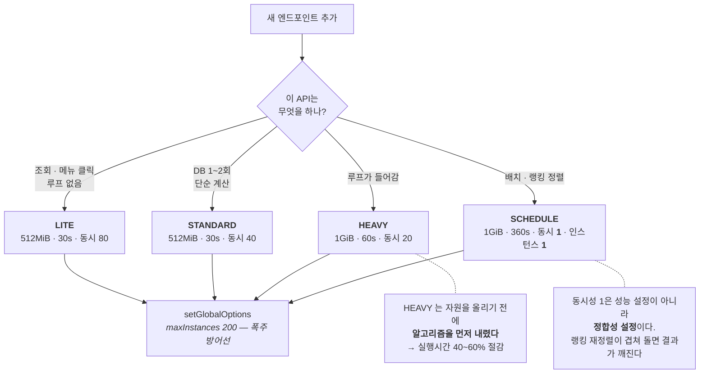

# F-50. Cloud Functions 자원 프리셋 — API 복잡도별 4단 세분화

> 소스 발췌: `src/` — 3개 파일 (`UtilityMath.ts` + 실행 계획·완료 보고서 2건)
> 프리셋 정의 원본인 `index.ts` 는 [F-06](../F-06_서버3계층요청템플릿/src/index.ts) 에 수록되어 있습니다.

**구간** Phase 1~2 (2026.01.09) | **포지션** 서버 | **AI** 협업

### 구조 — 함수마다 튜닝하지 않고, 복잡도 등급에만 튜닝한다



- **문제**: 엔드포인트가 126개다. 함수마다 메모리·타임아웃·동시성을 개별로 정하면 (1) 아무도 근거를 기억 못 하고, (2) 서버리스는 **메모리를 올리면 CPU도 같이 올라가고 단가도 같이 올라가므로** 과다 지정이 곧 비용이며, (3) 반대로 부족하면 Cloud Run이 컨테이너를 죽여 클라에는 `INTERNAL` 만 떨어진다. 1인 개발이라 "이 함수는 왜 1GiB지?"를 물어볼 사람도 없다.
- **해결**: 개별 튜닝을 없애고 **복잡도 4등급**으로만 정하게 했다. `setV2FunctionPreset(V2_Functions_Preset.HEAVY)` 한 줄이 자원 설정 전체를 결정한다.

| 프리셋 | 메모리 | 타임아웃 | 동시성 | 배정 | 기준 |
|---|---|---|---:|---:|---|
| **LITE** | 512MiB | 30s | 80 | **73** | 조회·메뉴 클릭 등 가벼운 처리 |
| **STANDARD** | 512MiB | 30s | 40 | **17** | DB 읽기/쓰기 1~2회, 루프 없음 |
| **HEAVY** | 1GiB | 60s | 20 | **32** | 루프가 들어가는 로직 |
| **SCHEDULE** | 1GiB | 360s | **1** | **4** | 랭킹 정렬 등 배치 |

  개별 지정 여지를 완전히 없애지는 않았다 — `setV2FunctionPreset(HEAVY, { concurrency: 30 })` 처럼
  프리셋 위에 덮어쓸 수 있다. **기본값을 등급이 정하고, 예외만 명시적으로 남긴다.**

- **기술**: Firebase Functions v2 `GlobalOptions` 프리셋 테이블, Cloud Run 동시성/메모리 트레이드오프, 콜드스타트 예산 산정, 이진 탐색 · 이항 분포 샘플링 · `Promise.all` 병렬화
- **정량**: 엔드포인트 **126개**를 4등급에 배정 / HEAVY 함수 실행시간 **40~60% 절감** / `Stage_QuickClear` PRNG 호출 **10만 회 → 2회**
- **근거**:
  - `FirebaseCLI/functions/src/index.ts` — `V2_Functions_Preset` 열거형 + `FUNCTION_PRESET` 테이블 (93~152행)
  - `FirebaseCLI/functions/src/Utility/UtilityMath.ts` — `sampleBinomial`
  - `FirebaseCLI/functions/src/Utility/UtilityGacha.ts` — `findTierGradeByBinarySearch` + 누적 확률 `WeakMap` 캐시 ([F-07](../F-07_HashPRNG최적화/src/UtilityGacha.ts) 에 수록)
  - `FirebaseCLI/functions/Docs/인프라/완료플랜/26.01.09_Firebase_Functions_메모리최적화_Plan.md`
  - `FirebaseCLI/functions/Docs/인프라/완료플랜/26.01.09_Firebase_Functions_HEAVY_Preset_최적화_완료.md`
  - `FirebaseCLI/functions/.claude/rules/03-api-patterns.md` — 프리셋 선택 기준을 규칙 파일로 고정

---

### 판단 ① — 프리셋 값은 추정이 아니라 사고 보고서다

LITE의 초기값은 **256MiB · 10초**였다. 둘 다 실제로 터져서 바뀌었고, 그 이유가 코드에 그대로 남아 있다.

```ts
[V2_Functions_Preset.LITE]: {
    concurrency: 80,
    // 256MiB 로는 OOM 발생 (Cloud Run 이 컨테이너를 강제 종료 → 클라이언트에 INTERNAL 반환).
    // index.ts 가 전체 API 모듈을 로드하고 GameDBFactory.buildGameDBCache() 가
    // StaticGameDB 전체를 메모리에 올리는 시점에 이미 RSS 약 190MB 를 사용한다.
    // 요청 처리분까지 감안해 512MiB 로 상향.
    memory: "512MiB",
    // 콜드스타트 시 GameDBFactory.buildGameDBCache()가 첫 요청 안에서 실행되므로 10s로는 부족
    timeoutSeconds: 30,
    minInstances: 0,
},
```

**진단이 어려운 형태의 장애였다.** OOM은 예외를 던지지 않는다 — Cloud Run이 컨테이너를 통째로 죽이므로
스택 트레이스가 없고, 클라이언트가 받는 건 `INTERNAL` 한 줄이다. 로그에도 "무엇이 잘못됐다"가 안 남는다.
게다가 **콜드스타트에서만** 재현되므로 인스턴스가 살아 있는 동안은 멀쩡하다.

원인은 정적 import였다. `index.ts` 가 전 API 모듈을 로드하고 `GameDBFactory.buildGameDBCache()` 가
정적 게임 DB 전체를 메모리에 올린다. **요청 처리를 시작하기도 전에 이미 RSS 190MB.**
그래서 "가장 가벼운 함수"인 LITE가 오히려 256MiB에서 가장 먼저 죽었다.
타임아웃 10초도 같은 이유로 부족했다 — 캐시 빌드가 **첫 요청 안에서** 일어나므로 그 요청만 유독 느리다.

값을 고친 것보다 **왜 그 값인지를 코드에 남긴 것**이 이 항목의 요점이다.
숫자만 512로 바뀌어 있으면 다음에 누군가(대개 6개월 뒤의 나) 비용을 줄이겠다고 256으로 되돌린다.

### 판단 ② — SCHEDULE의 `concurrency: 1` 은 성능 설정이 아니다

```ts
[V2_Functions_Preset.SCHEDULE]: {
    concurrency: 1,
    memory: "1GiB",
    timeoutSeconds: 360,
    minInstances: 0,
    maxInstances: 1,
},
```

나머지 세 프리셋의 동시성(80 / 40 / 20)은 **비용 대 지연**의 저울질이다. 하나만 성격이 다르다.

SCHEDULE이 도는 작업은 랭킹 재정렬, 만료 문서 일괄 삭제처럼 **전역 상태를 통째로 다시 쓰는** 일이다.
두 실행이 겹치면 느려지는 게 아니라 **결과가 틀린다.** 그래서 동시성과 최대 인스턴스를 **둘 다 1**로 묶었다 —
컨테이너 안에서도 하나, 컨테이너 자체도 하나. 락을 따로 만들지 않고 **런타임 설정으로 상호배제를 얻은** 것이다.

같은 표 안에 성능 목적의 숫자와 정합성 목적의 숫자가 섞여 있으므로, 이 항목만은 주석 없이 두면 안 된다.
"동시성 1이면 느리니까 올리자"는 다음 최적화가 곧바로 데이터 손상이 되기 때문이다.

### 판단 ③ — HEAVY는 자원을 올리기 전에 알고리즘을 내렸다

`HEAVY` 라는 등급을 만들어 놓으면 무거운 함수를 거기 넣고 끝내기 쉽다. 그런데 서버리스에서
**HEAVY 배정은 요금제 승격**이다 — 메모리 2배, 실행시간 그대로면 비용도 그만큼 따라 오른다.
그래서 등급을 붙이기 전에 **HEAVY 후보 자체를 가볍게 만드는** 작업을 5단계로 먼저 돌렸다.

| 단계 | 대상 | 무엇을 바꿨나 | 복잡도 |
|---|---|---|---|
| 1 | `roll_GachaTierGrade` | 누적 확률 `WeakMap` 캐싱 + 이진 탐색 | O(n) → **O(log n)** |
| 2 | `Skill_Promotion_All` | 중첩 `while` 제거 | O(n⁴) → **O(n²)** |
| 3 | `Stage_QuickClear` | N회 시행 → **이항 분포 샘플링** | N회 → **2회** PRNG |
| 4 | `Skill_Rune_Equip_Recommend` | 순차 await → `Promise.all` | — |
| 5 | `Mailbox` / `ProductPass` | `Promise.all` + `Set` 조회 | O(n) → O(1) 조회 |

| 함수 | Before | After | 개선 |
|---|---|---|---|
| `Equipment_Gacha` | 500~800ms | 150~250ms | **60~70%** |
| `Stage_QuickClear` | 2~5s | 0.5~1.5s | **70~80%** |
| `Skill_Promotion_All` | 1~10s | 0.2~1s | **80~90%** |

**3단계가 가장 볼 만하다.** 소탕(QuickClear)은 "몬스터 N마리가 각각 확률 p로 드랍"을 계산한다.
소박하게 짜면 N번 굴린다. 방치형이라 N이 **최대 10만**까지 간다.
하지만 필요한 건 개별 결과가 아니라 **성공 횟수**뿐이므로, N회 베르누이 시행의 합은 이항분포 B(N, p) 그 자체다.
그래서 난수 2개로 분포에서 직접 뽑았다 — n이 크면 정규근사 + Box–Muller, 작으면 역변환 샘플링.

```ts
// UtilityMath.ts
export function sampleBinomial(n: number, p: number, rand1: number, rand2: number): number
```

**10만 회 → 2회.** 최적화라기보다 문제를 다시 쓴 쪽에 가깝다.

1단계에도 볼 만한 흔적이 남아 있다. 누적 확률 배열을 만들 때 부동소수 오차를 없애려고
`Math.abs(1 - acc) < EPSILON` 이면 1.0으로 스냅하는 코드를 넣었었는데, **중간 누적값이 우연히 1.0 근처가 되면
그 뒤 엔트리가 전부 dead code**가 되는 버그였다. 지금은 스냅을 하지 않고, 대신 이진 탐색이
`left == length-1` 에서 끝나 마지막 엔트리를 자연스럽게 fallback으로 돌려주게 뒀다.
**보정을 넣어서 생긴 버그를, 보정을 빼고 자료구조의 성질로 대체한 것이다.**

### 판단 ④ — 서버 최적화가 클라이언트를 깨뜨렸다

3단계에는 함정이 있었다. **PRNG 호출 횟수 자체가 시퀀스의 일부**다.

이 프로젝트는 클라와 서버가 같은 시드로 같은 난수열을 재현한다([F-07](../F-07_HashPRNG최적화/)).
서버만 "N회 호출 → 2회 호출"로 바꾸면 그 뒤의 **모든 난수 결과가 어긋난다.**
보상 하나가 틀리는 게 아니라 그 시점부터 전부 틀린다.

그래서 같은 작업에 클라이언트 수정이 딸려 나왔다 — `GameUtility.SampleBinomial()` 을 C#에 **비트 단위로 동일하게** 구현하고
`ClientStageReward.CreateStageRewardParameter()` 를 같이 고쳤다.

```csharp
// Before: N회 PRNG 호출          // After: 2회
for (int i = 0; i < numMonsters; i++)   float rand1 = PRNG.NextRandom();
    if (RollChanceHash(PRNG, chance))   float rand2 = PRNG.NextRandom();
        totalCount += 1;                int successCount = GameUtility.SampleBinomial(numMonsters, chance, rand1, rand2);
```

**결정론 구조의 대가가 여기서 드러난다.** 서버 성능 최적화가 자기 완결적이지 않고
클라이언트 릴리스와 묶인다. 이 위험은 그 뒤 `randomhash` 도메인 골든 테스트([F-35](../F-35_동등성골든테스트/))로
상시 감시 대상이 됐다 — 한쪽만 고치면 야간 파이프라인이 다음 날 아침에 잡아낸다.

---

- **면접 포인트**: **"자원 설정은 튜닝이 아니라 분류 문제로 바꿨다."** 126개 함수를 개별 최적화하는 대신 복잡도 4등급만 정의하고, 새 함수는 등급 하나만 고르게 했다. 그 위에 세 층의 판단이 있다 — ① 프리셋 값이 **추정이 아니라 실제 OOM 사고의 결론**이고 그 근거를 코드에 남겨 되돌림을 막았다는 것, ② `concurrency: 1` 처럼 **같은 표 안에 성격이 다른 숫자**(성능 아닌 정합성)가 섞여 있음을 구분해 다뤘다는 것, ③ HEAVY 등급을 붙이기 전에 **알고리즘을 먼저 내려** 등급 승격 자체를 회피했다는 것. 그리고 마지막이 가장 실무적이다 — 서버 최적화 하나가 **결정론 계약 때문에 클라이언트 코드 수정을 강제**했고, 그 위험을 사람의 주의력이 아니라 골든 테스트로 넘겼다.
- **슬라이드 자료**: 4등급 배정 분포(73/17/32/4) + HEAVY 전후 실행시간 막대 — **다이어그램 필요**

## 수록 파일

- `FirebaseCLI/functions/src/Utility/UtilityMath.ts`
- `FirebaseCLI/functions/Docs/인프라/완료플랜/26.01.09_Firebase_Functions_메모리최적화_Plan.md`
- `FirebaseCLI/functions/Docs/인프라/완료플랜/26.01.09_Firebase_Functions_HEAVY_Preset_최적화_완료.md`
</content>
</invoke>
