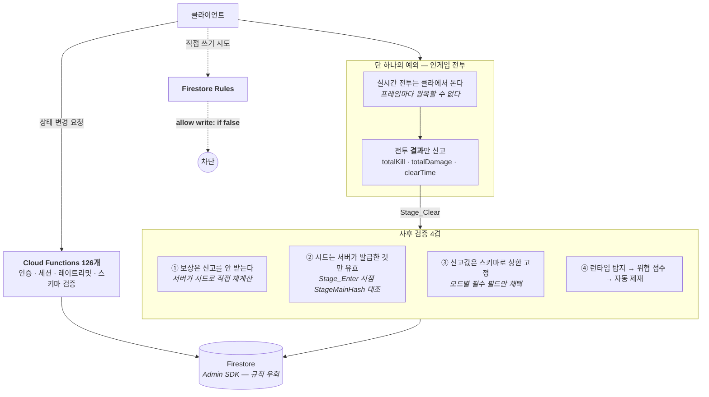

# F-51. 서버 권위 아키텍처 — 클라이언트 무결성을 기본값으로

> 소스 발췌: `src/` — 3개 파일

**구간** Phase 0~3 (전 구간) | **포지션** 서버·클라 | **AI** 협업

### 구조 — 쓰기 경로를 하나로 좁히고, 남은 하나를 사후 검증한다



- **문제**: 모바일 클라이언트는 **전부 적의 손 안에 있다.** 메모리도 읽히고 패킷도 뜯기고 APK도 리패키징된다. 그런데 1인 개발이라 전담 보안 인력이 없고, 치팅 대응에 쓸 수 있는 시간도 한정적이다. **"어디까지 막을 것인가"보다 "무엇을 애초에 못 하게 만들 것인가"를 먼저 정해야 했다.**
- **해결**: 개별 치팅을 잡으러 다니는 대신 **쓰기 경로 자체를 하나로 좁혔다.**
  - 상태를 바꾸는 모든 행위는 **Cloud Functions 126개 엔드포인트를 통해서만** 일어난다. 함수는 Admin SDK로 동작하므로 보안 규칙을 우회하고, **클라이언트는 우회할 방법이 없다.**
  - Firestore 규칙은 **읽기만 열고 쓰기는 닫는다.** 랭킹·공지·우편함·시스템 메시지 전부 `allow write: if false`. 마지막에 `match /{document=**} { allow read, write: if false }` 캐치올을 둬서 **새 컬렉션이 생겨도 기본값이 차단**이다.
  - Storage도 같다 — `databundle/` 만 공개 읽기, 그 외 전 경로 `read, write: if false`.
  - 그 결과 **"클라이언트 보안"이라는 별도 과제가 사라진다.** 클라가 가진 값은 전부 **서버 값의 사본**이고, 사본을 조작해도 다음 API 응답에서 덮어써진다.
- **기술**: Firebase Auth Custom Claims 세션 검증, Firestore/Storage 보안 규칙 최소 권한 설계, 서버 권위 상태 머신, 결정론 시드 기반 보상 재계산, 요청 스키마 화이트리스트 검증
- **정량**: 쓰기 가능 엔드포인트 **126개**(전부 인증·세션·레이트리밋 통과 필수) / 클라이언트 직접 쓰기 허용 경로 **채팅 메시지 1종뿐** / 보상 산출에 클라 신고값이 개입하는 지점 **`totalKill`·`totalDamage` 2개**
- **근거**:
  - `FirebaseCLI/firestore.rules` (144줄) — 경로별 권한 + `isValidSession()`
  - `FirebaseCLI/storage.rules` (15줄)
  - `FirebaseCLI/functions/src/API/CoreData/Stage.ts` (1,355줄) — 전투 결과 수용부, 스테이지 점핑 차단, 보상 재계산
  - `FirebaseCLI/functions/src/API/Base/RequestBase.ts` — 공통 검증 파이프라인 ([F-06](../F-06_서버3계층요청템플릿/))
  - `Assets/Source/Logic/Manager/GameManager/GameSecurityManager.cs` — 런타임 탐지 ([F-22](../F-22_안드로이드다층보안/))

---

### 판단 ① — 세션은 "로그인했는가"가 아니라 "지금도 유효한가"를 묻는다

규칙에서 유저 자기 문서에 접근할 때조차 조건이 셋이다.

```
allow read, write: if request.auth != null &&
                    request.auth.uid == userId &&
                    isValidSession();
```

```
function isValidSession() {
  let customClaims = request.auth.token;
  return ('sessionKey' in customClaims) &&
         ('sessionExpiry' in customClaims) &&
         (customClaims.sessionKey is string) &&
         (customClaims.sessionKey != "") &&
         (request.time.seconds() <= customClaims.sessionExpiry);
}
```

Firebase Auth 토큰만 확인하면 **로그아웃·기기 변경·강제 종료 이후에도** 토큰 만료 전까지는 통과한다.
그래서 세션키와 만료 시각을 **Custom Claims**에 실어 규칙 레벨에서 직접 검사한다.
`request.time.seconds()` 는 **서버 시계**이므로 기기 시간 조작으로는 늘릴 수 없다.

세션 만료 판정을 함수 안이 아니라 **규칙 안**에 둔 게 요점이다. 함수 쪽 검사는 그 함수를 통과할 때만 도는데,
규칙은 **경로에 닿는 모든 접근**에 무조건 적용된다. 새 읽기 경로를 추가하면서 검사를 빠뜨릴 여지가 없다.

### 판단 ② — 클라가 유일하게 직접 쓰는 곳, 그리고 그 조건

전 경로를 막았지만 예외를 하나 뒀다. **채팅 메시지**다.

```
allow create: if request.auth != null &&
              request.auth.uid != null &&
              request.resource.data.uuid == request.auth.uid;
allow update, delete: if request.auth != null &&
                       resource.data.uuid == request.auth.uid;
```

채팅은 게임 상태가 아니라 **휘발성 텍스트**다. 여기까지 함수를 태우면 메시지 한 줄마다
콜드스타트 위험이 있는 서버리스 호출이 붙는데, 얻는 게 없다.
대신 **작성자 위조만은 규칙으로 막았다** — `request.resource.data.uuid == request.auth.uid`.
남의 이름으로 쓰는 건 불가능하고, 남의 메시지를 지우는 것도 불가능하다.

**전부 막는 것과 아무거나 여는 것 사이에서, 무엇이 게임 상태인지로 선을 그었다.**

### 판단 ③ — 예외는 하나뿐이다: 인게임 전투

방치형이라도 전투는 **실시간으로 클라에서 돈다.** 몬스터 위치, 히트 판정, 스킬 쿨다운을
프레임마다 서버와 맞출 수는 없다. 그래서 전투만은 클라가 굴리고, **결과만 신고**한다.

```ts
clearTime:       { type: "number", min: 0, max: 86400 },     // 24시간
totalKill:       { type: "number", min: 0, max: 1000000 },
strTotalDamage:  { type: "string", maxLength: 50 },
stage_level:     { type: "number", min: 1, max: 100000 },
```

**여기가 이 아키텍처에서 유일하게 남은 공격면이고, 숨기지 않고 다루는 게 이 카드의 요점이다.**

먼저 **보상은 신고를 받지 않는다.** 클라가 "이거 먹었다"고 보내는 게 아니라,
서버가 `createStageMainPRNG(stage, stageMainHash)` 로 **같은 시드에서 보상을 직접 굴린다**([F-07](../F-07_HashPRNG최적화/)).
게다가 그 시드는 아무거나 못 쓴다 — `Stage_Enter` 시점에 서버가 저장해 둔 값과 대조한다.

```ts
if (this.coreData.datas.account.HashInfo.StageMainHash !== stageMainHash) {
    throwLogicError("executeStageEnter(): stageMainHash is invalid or mismatched Hash", ...);
}
```

같은 자리에서 **스테이지 점핑도 막는다** — 클리어한 적 없는 구간으로는 입장 자체가 안 된다.

```ts
if (stage_level > bestStage) {
    throwLogicError("executeStageEnter(): 스테이지 점핑 불가. 클리어한 스테이지만 이동 가능", ...);
}
```

그러면 남는 건 하나다. **`totalKill` 과 `totalDamage` 는 보상 계산식에 실제로 들어간다.**

```ts
// createRewards() — 몬스터 수(기본 or totalKill)
if (totalKill > 0) {
    num_monster = totalKill;
}
```

즉 "많이 죽였다"고 부풀리면 드랍이 늘어난다. 이걸 **없앤 게 아니라 좁혔다.**

| 겹 | 무엇을 하나 |
|---|---|
| **스키마 상한** | `totalKill ≤ 1,000,000`, `clearTime ≤ 86,400초`. 무한대가 아니라 **한 판의 상식 범위**로 잘라 둔다 |
| **모드별 필수 필드** | `verifyRequestParameter()` 가 스테이지 모드마다 **채택할 필드를 다르게** 한다 — 보스 1마리 모드는 `clearTime`, 무한 증강 모드는 `totalKill`, 불사 보스 모드는 `strTotalDamage`. 해당 모드가 안 쓰는 값은 **부풀려도 아무 효과가 없다** |
| **런타임 탐지** | 클라 `SpeedHackDetector` / 시간 조작 탐지 → 즉시 정지 + 타이틀 강제 이동 ([F-22](../F-22_안드로이드다층보안/)) |
| **누적 제재** | 탐지 신호를 가중치로 누적해 `Monitoring → FeatureRestricted → Suspended` 자동 판정 ([F-23](../F-23_점수기반자동제재/)) |

**완전 차단이 아니라는 걸 분명히 해 두는 게 맞다.** 전투를 서버에서 재시뮬레이션하면 막을 수 있지만,
그건 방치형 싱글 플레이 게임에 **전투 서버를 한 벌 더 만드는** 비용이다.
PvP도 없고 유저 간 거래도 없어서 **부풀린 이득이 남에게 옮겨가지 않으므로**,
"상한 + 모드별 채택 + 탐지 + 누적 제재"로 기대 이득을 깎는 쪽이 이 게임에서는 합리적인 균형이었다.

### 판단 ④ — 대신 개발 중에는 클라·서버 보상을 파일로 맞춰 본다

런타임에 못 막는 대신, **개발 단계에서 어긋남을 잡는 장치**를 따로 뒀다.
`DumpCoreDatas` 는 에디터 디버그일 때만 동작해서(`if (!this.isEditorDebug) return`)
서버가 산출한 스테이지 보상 합계를 `{해시8자}_server_coredata.json` 으로 떨군다.
클라가 같은 시드로 만든 결과와 **파일 대 파일로 대조**하기 위한 것이다.

전체 CoreData가 아니라 **스테이지 보상만** 덤프하는 것도 의도적이다 —
가챠 등 다른 API가 같은 CoreData를 건드리면 비교가 오염되기 때문이다.

이 대조가 나중에 상시 자동화된 게 `randomhash` / `gachahash` 골든 테스트([F-35](../F-35_동등성골든테스트/))다.
**수동 파일 diff → 야간 무인 검증**으로 승격된 경로.

---

- **면접 포인트**: **"보안을 기능으로 만들지 않고 아키텍처의 부산물로 만들었다."** 치팅 대응을 항목별로 쌓는 대신 쓰기 경로를 Cloud Functions 하나로 좁히고, Firestore/Storage 규칙의 **기본값을 차단**으로 뒀다. 그 결과 대부분의 클라이언트 조작은 "막았다"가 아니라 **애초에 반영될 곳이 없다.** 더 설명할 만한 건 예외 처리 방식이다 — 실시간 전투는 구조적으로 클라에서 돌 수밖에 없다는 걸 인정하고, 그 잔여 공격면을 **숨기지 않고 4겹으로 좁혔다**. 보상은 신고를 안 받고 서버가 시드로 재계산하며, 시드조차 서버가 발급한 것만 유효하고, 클라 신고값은 스키마 상한과 **모드별 채택 규칙**으로 효과 범위가 잘린다. 완전 차단이 가능한데 안 한 게 아니라, **PvP도 거래도 없는 싱글 방치형에서 전투 서버를 한 벌 더 만드는 비용과 기대 이득을 저울질한 결과**라는 점까지 말할 수 있는 것이 이 카드의 값어치다.
- **슬라이드 자료**: 쓰기 경로 단일화 다이어그램 + 사후 검증 4겹 표 — **다이어그램 필요**

## 수록 파일

- `FirebaseCLI/firestore.rules`
- `FirebaseCLI/storage.rules`
- `FirebaseCLI/functions/src/API/CoreData/Stage.ts`
</content>
