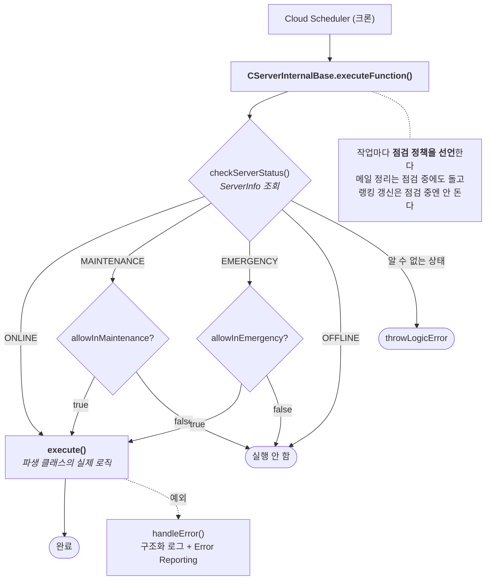

# F-52. 서버 스케줄러 자동화 — 정기점검 · 랭킹 · 만료 정리

> 소스 발췌: `src/` — 7개 파일

**구간** Phase 1~3 | **포지션** 서버 | **AI** 협업

### 구조 — 크론이 클래스를 직접 부르지 않는다



- **문제**: 서버 배치 작업은 **아무도 안 볼 때 돈다.** 새벽 4시에 점검이 걸리고 5시에 풀리는데, 그 사이 아무도 화면을 보고 있지 않다. 그래서 배치는 (1) 실패해도 조용하고, (2) **점검 중에 돌면 안 되는 것과 점검 중에도 돌아야 하는 것이 섞여 있고**, (3) 크론은 서버 상태와 무관하게 정시에 발화하므로 **이미 긴급 점검 중인 서버를 자동으로 열어 버릴** 수 있다.
- **해결**: 스케줄 함수를 크론에 직접 붙이지 않고 **`CServerInternalBase` 라는 실행 껍데기를 하나 통과**하게 했다. 크론이 부르는 건 언제나 이 껍데기고, 실제 로직은 `execute()` 안에만 있다.
  - 껍데기가 하는 일: **서버 상태 조회 → 실행 여부 판정 → 로직 실행 → 예외 포착 → 구조화 로깅**
  - 각 작업은 생성자에서 **`setMaintenancePolicy(점검중 허용, 긴급점검중 허용)`** 를 선언한다. 정책이 코드 옆에 붙어 있어서 "이건 점검 때 돌아도 되나?"를 배포 설정 뒤져서 찾을 필요가 없다.
  - `index.ts` 는 클래스만 넘긴다 — `CServerInternalBase.createInternalFunction(CRefreshAllRanks)`.
- **기술**: 템플릿 메서드 패턴(추상 `execute()`), Cloud Scheduler 크론(KST/UTC 변환), Firestore 트랜잭션 없는 멱등 가드, `FieldValue.increment` 기반 캐시 무효화, Firebase Error Reporting 구조화 전송
- **정량**: 스케줄 작업 **13종** / 정기점검 파이프라인 **5단계**(예고 10분 → 예고 5분 → 시작 → 일일 종료 → 주간 종료) / 긴급점검 Admin API 3종
- **근거**:
  - `FirebaseCLI/functions/src/API/Base/ServerInternalBase.ts` (148줄)
  - `FirebaseCLI/functions/src/API/Schedule/` — `DailyMaintenance.ts`(471줄) · `RankingReward.ts`(400줄) · `ScheduleFunction.ts`(227줄) · `RankingSeasonReset.ts`(184줄) · `DataCleanup.ts`(130줄) · `DataBackup.ts`(110줄)
  - `FirebaseCLI/functions/src/index.ts` 154~301행 — 스케줄 등록부(현재 전면 비활성 + 사유 주석)

---

### 판단 ① — 점검 정책을 배포 설정이 아니라 생성자에 뒀다

```ts
export class CServerMailboxDeleteExpired extends CServerInternalBase {
    constructor() {
        super("ServerMailbox_DeleteExpired");
        // 점검 중에도 실행 허용 (메일박스 정리는 중요한 시스템 유지보수)
        this.setMaintenancePolicy(true, false);
    }
}

export class CRefreshAllRanks extends CServerInternalBase {
    constructor() {
        super("RefreshAllRanks");
        // 점검 중에는 실행하지 않음 (사용자 데이터 관련)
        this.setMaintenancePolicy(false, false);
    }
}
```

두 작업의 차이는 **유저 데이터를 건드리는가**다. 만료 메일 정리는 유지보수라서 점검 중에 하는 게 오히려 낫고,
랭킹 갱신은 유저 데이터를 다시 쓰므로 점검 중에 돌면 안 된다.

이걸 배포 설정이나 환경변수로 관리하면 **코드를 읽어도 알 수 없다.** 생성자 한 줄로 옮기니
클래스를 여는 순간 정책이 보이고, 새 배치를 만들 때 **정책을 정하지 않고는 넘어갈 수 없다**(기본값은 둘 다 `false` — 안전한 쪽).

점검 관련 스케줄만 예외다 — 자기들끼리 중간 베이스를 하나 더 파서 정책을 공유한다.

```ts
abstract class CMaintenanceScheduleBase extends CServerInternalBase {
    constructor(functionName: string) {
        super(functionName);
        // 점검 관련 스케줄은 점검 중에도 실행 허용
        this.setMaintenancePolicy(true, true);
    }
}
```

**점검을 끝내는 작업이 "점검 중이라 실행 안 함"으로 막히면 서버가 영영 안 열린다.** 이건 정책이 아니라 필수 조건이다.

### 판단 ② — 크론은 상태를 모른다. 그래서 종료 작업이 세 번 되묻는다

정기점검은 다섯 단계로 자동 진행된다.

| 시각(KST) | 작업 | 하는 일 |
|---|---|---|
| 03:50 | `PreAlert10Min` | 10분 전 예고 브로드캐스트 |
| 03:55 | `PreAlert5Min` | 5분 전 예고 |
| 04:00 | `Start` | **수요일이면 WEEKLY, 아니면 DAILY** 로 판정 → `ServerInfo` 를 MAINTENANCE 로 |
| 04:30 | `DataCleanup` | 만료 데이터 삭제 |
| 05:00 / 07:00(수) | `End_Daily` / `End_Weekly` | ONLINE 복귀 + **캐시 버전 증가** + 종료 알림 |

문제는 **종료 작업이 정시에 무조건 발화한다**는 것이다. 그 시각의 서버가 어떤 상태인지 크론은 모른다.
그래서 `End_Daily` 는 실제 종료 전에 세 번 되묻는다.

```ts
// 주간 점검 중이면 일일 종료 건너뜀
if (serverInfo.maintenanceInfo?.maintenanceType === EMaintenanceType.WEEKLY) return;
// 긴급 점검 중이면 종료하지 않음
if (serverInfo.status === EServerStatusInfo.EMERGENCY) return;
// 이미 온라인이면 건너뜀
if (serverInfo.status === EServerStatusInfo.ONLINE) return;
```

두 번째 가드가 핵심이다. **운영자가 긴급 점검을 걸어 둔 서버를 05:00 크론이 자동으로 열어 버리는 사고**를 막는다.
스케줄 자동화의 위험은 "안 도는 것"보다 **"엉뚱한 때 도는 것"** 이라, 종료 계열 작업은 전부 이 형태로 짰다.

종료 시 `cacheVersion` 을 `FieldValue.increment(1)` 로 올리는 것도 같은 맥락이다 —
점검 중에 GameDB를 고쳤을 수 있으므로, 서버를 여는 것과 **클라 캐시를 무효화하는 것을 한 트랜잭션 흐름에 묶었다.**

### 판단 ③ — 에뮬레이터에서 못 돌리는 코드는 다른 입구를 만든다

Cloud Scheduler는 로컬 에뮬레이터에서 발화하지 않는다. 즉 **스케줄 함수는 로컬에서 실행 자체가 안 된다.**

그래서 같은 클래스를 부르는 HTTP 진입점을 따로 뒀다.

```ts
export const Test_ScheduledFunction_ServerMailbox_DeleteExpired =
    https.onRequest({ timeoutSeconds: 360 }, async (_req, res) => {
        await new CServerMailboxDeleteExpired().executeFunction();
        res.send("...");
    });
```

**로직이 크론이 아니라 클래스에 들어 있어서 가능한 일이다.** 크론 핸들러 안에 로직을 직접 썼다면
테스트용 복제본을 따로 만들어야 했고, 그 복제본은 반드시 원본과 어긋난다.
`executeFunction()` 이라는 단일 진입점 덕분에 **테스트 경로도 서버 상태 체크와 에러 처리를 똑같이 통과한다.**

### 판단 ④ — 전부 껐다. 그리고 끈 이유와 되살리는 법을 코드에 남겼다

**현재 스케줄 함수는 13종 전부 비활성이다.** 이게 이 카드에서 제일 이야기할 만한 부분이다.

```ts
// [비활성화] 스케줄 함수를 전면 중단했다.
// 이 프로젝트는 1~2분짜리 데모 시연 용도로만 쓰고 출시하지 않으므로,
// 만료 데이터가 쌓일 일이 없어 주기적 정리가 필요 없다.
// Cloud Scheduler는 작업이 존재하기만 해도 과금(무료 3개 초과분 $0.10/작업/월)되므로 전부 제거한다.
// 실서비스로 전환할 때 이 파일의 [비활성화] 주석들을 되살릴 것.
```

**Cloud Scheduler는 실행 횟수가 아니라 작업의 존재 자체로 과금된다.** 무료 3개를 넘는 순간
안 도는 크론도 매달 돈을 낸다. 데모 단계에서 13개를 유지할 이유가 없었다.

지우지 않고 **주석 + 사유**로 남긴 것도 의도적이다. 항목마다 사유가 다르고, 되살릴 때 필요한 선행 조건도 다르다.

| 대상 | 끈 이유 | 되살릴 때 필요한 것 |
|---|---|---|
| 랭킹 갱신 / 일일 랭킹 보상 | 시연 버전에서 랭킹 미사용 | `Floor_N` 컬렉션 그룹 **복합 인덱스**(`bestStageMain DESC` + `timestamp`) 선생성 |
| 정기점검 5종 | 실유저가 없어 불필요. **오히려 매일 04:00에 잠기고 종료가 실패하면 그대로 막히는 리스크만 남음** | 5개를 **세트로** 주석 해제(하나만 살리면 잠긴 채 방치됨) |
| 일일 백업 | 아래 참조 | 서비스 계정에 `roles/datastore.importExportAdmin` + 백업 버킷 선생성 |
| 랭킹 시즌 리셋 | 누적 데이터라 리셋 대상이 아님 | 재설계 필요 |

정기점검 항목의 사유가 특히 실무적이다 — **끄는 게 비용 절감이 아니라 리스크 제거**였다.
유저가 없는데 매일 서버를 잠그면, 종료 스케줄이 한 번 실패하는 순간 아무도 모르게 서버가 닫혀 있게 된다.

그리고 백업 항목에는 **실패 부검이 그대로 적혀 있다.**

```ts
// [비활성화] Firestore 일일 백업 (매일 새벽 4:05 KST = UTC 19:05)
// 시연 버전에서는 백업이 불필요하다. 게다가 이 함수는 실제로 동작한 적이 없다 -
// 함수 서비스 계정에 datastore.databases.export 권한이 없어 "The caller does not have
// permission"으로 매일 실패했다. 되살릴 때는 서비스 계정에 roles/datastore.importExportAdmin을
// 부여하고 백업 버킷(PROJECTID-backups)을 먼저 만들어야 한다.
```

**"한 번도 성공한 적 없는 백업"** 은 배치 작업의 전형적 실패 양상이다 — 아무도 안 볼 때 돌고,
실패해도 조용하고, 필요할 때 없다는 걸 알게 된다. 원인(IAM 권한 누락)을 밝혀 놓고
**복구 절차까지 두 줄로 적어 둔 것**이 이 주석의 값어치다.

---

- **면접 포인트**: **"배치 자동화의 진짜 위험은 안 도는 게 아니라 엉뚱한 때 도는 것이다."** 크론에 로직을 직접 붙이지 않고 `CServerInternalBase` 라는 단일 진입점을 통과시켜, 서버 상태 판정·점검 정책·예외 로깅을 **모든 배치가 똑같이** 통과하게 만들었다. 그 위에 세 가지가 얹힌다 — ① 점검 허용 여부를 배포 설정이 아니라 **생성자 한 줄**로 선언해 정책이 코드와 함께 읽히게 한 것, ② 종료 작업에 **긴급점검 가드**를 넣어 운영자가 잠근 서버를 크론이 자동으로 여는 사고를 막은 것, ③ 로컬에서 발화하지 않는 스케줄을 위해 **같은 클래스를 부르는 HTTP 진입점**을 둬서 테스트 복제본이 원본과 어긋나는 문제를 없앤 것. 그리고 마지막이 가장 실무적이다 — **13종을 전부 껐고, 끈 이유와 되살리는 선행 조건을 항목별로 코드에 남겼다.** Cloud Scheduler가 실행이 아니라 존재로 과금된다는 것, 유저 없는 서버에 정기점검은 안전장치가 아니라 리스크라는 것, 그리고 **한 번도 성공한 적 없던 백업의 IAM 권한 부검**까지 — 만든 것만이 아니라 **끄는 판단과 되살리는 경로**를 함께 남겼다.
- **슬라이드 자료**: 정기점검 5단계 타임라인(03:50→07:00) + 종료 가드 3중 분기 — **다이어그램 필요**

## 수록 파일

- `FirebaseCLI/functions/src/API/Base/ServerInternalBase.ts`
- `FirebaseCLI/functions/src/API/Schedule/DailyMaintenance.ts`
- `FirebaseCLI/functions/src/API/Schedule/DataBackup.ts`
- `FirebaseCLI/functions/src/API/Schedule/DataCleanup.ts`
- `FirebaseCLI/functions/src/API/Schedule/RankingReward.ts`
- `FirebaseCLI/functions/src/API/Schedule/RankingSeasonReset.ts`
- `FirebaseCLI/functions/src/API/Schedule/ScheduleFunction.ts`

> `SecuritySchedule.ts` 는 같은 `Schedule/` 폴더에 있지만 [F-23](../F-23_점수기반자동제재/) 의 제재 파이프라인에 속해 그쪽에 수록했습니다.
</content>
