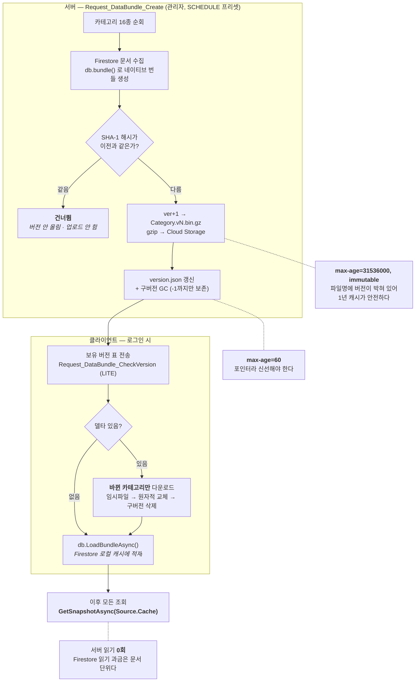

# F-53. DataBundle — 게임 DB 배포·동기화 최적화

> 소스 발췌: `src/` — 2개 파일 (서버 생성기 + 클라 동기화 매니저)

**구간** Phase 0~1 | **포지션** 서버·클라 | **AI** 미사용

### 구조 — 로그인마다 DB를 읽지 않고, 바뀐 카테고리만 CDN에서 받는다



- **문제**: 게임 DB(장비·스킬·몬스터·스테이지·가챠 확률·성장 공식…)는 **73개 컬렉션 경로**에 흩어져 있고, 클라는 **로그인할 때마다 이걸 전부 알아야** 한다. 그런데 Firestore는 **문서 단위로 과금**한다. 유저 한 명이 접속할 때마다 수천 건을 읽으면 그 비용은 DAU에 정비례해 영구히 늘어난다. 게다가 그 데이터는 **패치 때만 바뀌고 평소엔 그대로**다 — 매번 읽는 것 자체가 낭비다.
- **해결**: 게임 DB를 **카테고리 16종 단위의 Firestore 네이티브 번들**로 미리 구워 Cloud Storage에 올리고, 클라는 **바뀐 카테고리만** 받아 로컬 Firestore 캐시에 적재한다. 적재 후 모든 조회는 `Source.Cache` 로만 나가므로 **서버 읽기가 0회**가 된다.
  - 서버 생성은 관리자 API 한 번(`Request_DataBundle_Create`, SCHEDULE 프리셋 — 360초·인스턴스 1개)
  - 클라 동기화는 로그인 시 버전 체크 한 번(`Request_DataBundle_CheckVersion`, LITE)
- **기술**: Firestore Bundle(`db.bundle()` / `LoadBundleAsync`), SHA-1 콘텐츠 해시 기반 변경 감지, 버전 파일명 + `immutable` 캐시 제어, gzip, 델타 동기화, 원자적 파일 교체, GCS 업로드 경합 재시도
- **정량**: 카테고리 **16종** / GameDB 경로 **73개** / 클라 로그인 시 Firestore 읽기 **0회**(캐시 적중 시) / 번들 크기 상한 50MB
- **근거**:
  - `FirebaseCLI/functions/src/API/DataBundle/DataBundle.ts` (480줄) — 번들 생성·해시·버전·GC
  - `Assets/Source/Logic/Manager/GameAPIManager/GameAPIDataBundleManager.cs` (934줄) — 버전 체크·델타 다운로드·로컬 적재
  - `Assets/Source/Logic/Manager/GameDBManager/GameDBClientManager.cs` 184행 — `GetSnapshotAsync(Source.Cache)`
  - `FirebaseCLI/storage.rules` — `databundle/` 만 공개 읽기, 쓰기 전면 차단 ([F-51](../F-51_서버권위아키텍처/))

---

### 판단 ① — 캐시 TTL이 두 개인 게 설계의 전부다

```ts
const TTL_BIN_YEAR   = "public,max-age=31536000,immutable";  // 번들 .bin.gz
const TTL_JSON_60SEC = "public,max-age=60";                  // version.json
```

번들 파일은 **1년 immutable**, 매니페스트는 **60초**. 정반대 값이고, 둘 다 옳다.

번들 파일명에 버전이 박혀 있기 때문이다 — `Equipment.v15.bin.gz`.
**내용이 바뀌면 파일명이 바뀌므로 같은 이름의 파일은 영원히 같은 내용이다.**
그러면 CDN이 아무리 오래 붙들고 있어도 틀릴 수가 없고, 재다운로드도 안 일어난다.

바뀌는 건 **어느 버전을 봐야 하는지**뿐이고, 그 정보만 `version.json` 에 있다.
포인터 하나만 짧게 캐싱하고 나머지 전부를 영구 캐싱하는 구조다.
데이터를 갱신하면 **60초 안에** 전 클라이언트가 새 버전을 인지한다.

### 판단 ② — 해시가 같으면 버전을 올리지 않는다

```ts
const hash = this.calcDataHash(snaps);
// 변경이 없으면 Skip
if (manifest[categoryName]?.hash === hash) {
    continue;
}
```

`calcDataHash()` 는 문서를 **경로 기준으로 정렬한 뒤** 해시한다 — Firestore가 돌려주는 순서에 의존하면
내용이 같아도 해시가 흔들리기 때문이다. 그래서 **같은 데이터 → 항상 같은 해시**가 보장된다.

효과는 운영 절차 쪽에서 나온다. **번들 생성을 아무 때나 몇 번을 돌려도 안전하다.**
스킬 테이블 하나만 고치고 생성을 돌리면 `Skill` 만 v8→v9가 되고 나머지 15개는 그대로다.
클라는 델타로 `Skill` 하나만 받는다.

해시 없이 매번 버전을 올리면 **한 줄 고칠 때마다 전 카테고리를 전 유저가 재다운로드**한다.
"빌드를 다시 돌렸다"가 곧 "전원 재다운로드"가 되는 걸 막는 장치다.

### 판단 ③ — 서버리스에서 방금 올린 파일은 아직 없을 수 있다

업로드 직후 다음 단계로 넘어가는 코드에 재시도 루프가 두 개 붙어 있다.

```ts
async waitForFileExists(file: GCSFile, maxRetries = 10, delayMs = 100): Promise<boolean>
async getFilesWithRetry(bucket: Bucket, options: any, maxRetries = 5, delayMs = 200)
```

Cloud Storage는 업로드 응답을 받아도 목록 조회에 **즉시 보이지 않을 수 있다.**
번들 16개를 연속으로 올리고 마지막에 구버전 GC를 도는 흐름에서 이게 문제가 된다 —
방금 올린 파일이 목록에 안 잡히면 최신 버전을 **지워 버릴** 수 있다.

그래서 업로드마다 존재를 확인하고 넘어가고, `version.json` 도 똑같이 확인한다.
확인에 실패하면 조용히 넘어가지 않고 `throwSystemError` 로 **번들 생성 전체를 실패시킨다.**
반쯤 갱신된 매니페스트를 남기는 것보다 통째로 실패하는 쪽이 복구가 쉽기 때문이다.

이 파일에는 프로젝트 규칙(파생 클래스 `try/catch` 금지, [F-06](../F-06_서버3계층요청템플릿/))의 **명시적 예외**도 하나 있다.

```ts
// GCS 재시도 로직: try/catch가 재시도 흐름 제어에 필수이므로 유지
```

규칙을 어긴 자리에 **왜 어겼는지**를 남겨 둔 것 — 규칙이 목적이 아니라 수단이라는 표시다.

### 판단 ④ — 클라 쪽 위험은 네트워크가 아니라 저장소다

클라 매니저 934줄 중 상당 부분이 다운로드가 아니라 **파일을 안전하게 바꿔치기하는** 데 쓰인다.

| 장치 | 이유 |
|---|---|
| `MAX_BUNDLE_SIZE_BYTES = 50MB` | 응답이 오염됐을 때 단말 저장소를 채우지 않도록 상한 |
| `CheckAvailableStorage(required × 2)` | 필요 용량의 **2배** 여유 확인 — 임시 파일과 최종 파일이 동시에 존재하는 순간이 있다 |
| 임시 파일 → 삭제 → 이동 | 쓰다 만 파일이 최종 경로에 남지 않게. **적재 시점에 반쯤 쓴 번들을 읽으면 게임 DB가 깨진 채로 뜬다** |
| `CleanupOldVersionFiles()` | 버전이 파일명에 있으므로 안 지우면 무한히 쌓인다 |
| 폴더 생성 실패 시 throw 제거 | 안드로이드에서 저장소 접근 실패로 **앱이 죽는 것보다** 진행시키는 쪽이 낫다 |

마지막 항목이 모바일다운 판단이다. 데스크톱이라면 예외를 던지는 게 맞지만,
단말 저장소 상태는 통제 불가라 **크래시 대신 열화된 동작**을 택했다.

---

- **면접 포인트**: **"매 로그인 DB 읽기"를 "패치 때 한 번 CDN 다운로드"로 바꾼 작업이다.** Firestore가 문서 단위로 과금한다는 성질 때문에, 이 항목은 성능이 아니라 **유저 수에 정비례해 영구히 늘어나는 고정비를 0으로 만드는** 문제였다. 설계의 핵심은 두 가지다 — ① **파일명에 버전을 박아 넣어** 번들은 1년 immutable, 매니페스트만 60초로 두는 이중 TTL. 캐시를 공격적으로 쓰면서도 갱신은 1분 안에 전파된다. ② **SHA-1 콘텐츠 해시로 변경 감지**를 붙여 번들 생성을 멱등하게 만든 것. 정렬 후 해시라 결과가 결정론적이고, 그래서 "한 줄 고쳤는데 전 유저가 전체 재다운로드"가 구조적으로 일어나지 않는다. 여기에 서버리스/모바일 각각의 현실 대응이 붙는다 — GCS 업로드 직후의 목록 지연을 재시도로 감싸고 실패 시 **부분 갱신 대신 전체 실패**를 택한 것, 그리고 클라에서는 네트워크보다 **저장소 사고**(반쯤 쓰인 파일 적재, 용량 부족, 안드로이드 권한 실패)를 주 위험으로 보고 원자적 교체와 열화 동작으로 처리한 것.
- **슬라이드 자료**: 이중 TTL 구조 + 델타 동기화 흐름 / 로그인 시 Firestore 읽기 수 전후 비교 — **다이어그램 필요**

## 수록 파일

- `FirebaseCLI/functions/src/API/DataBundle/DataBundle.ts`
- `Assets/Source/Logic/Manager/GameAPIManager/GameAPIDataBundleManager.cs`
</content>
