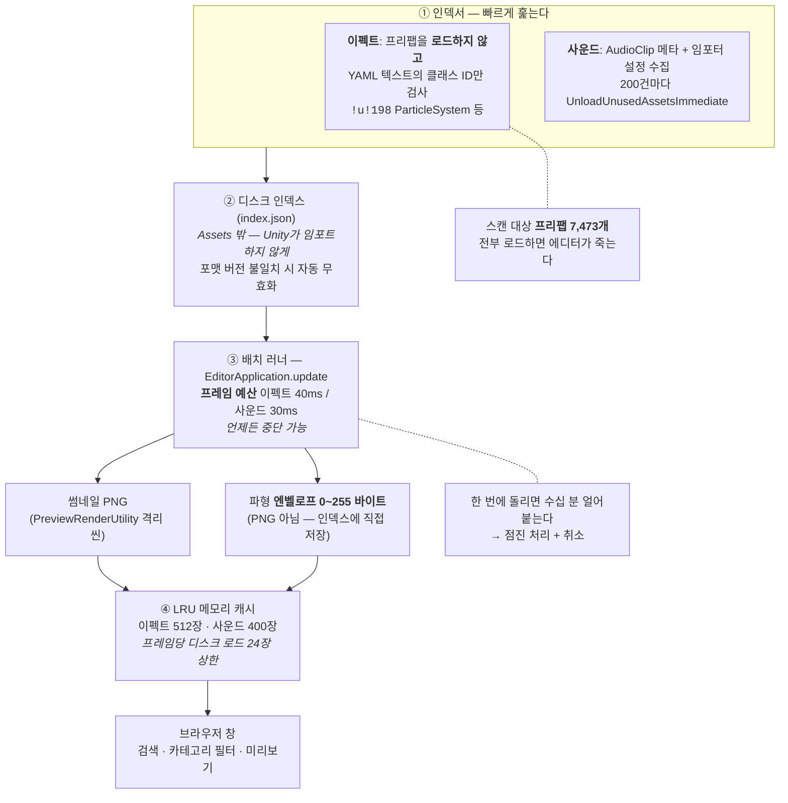
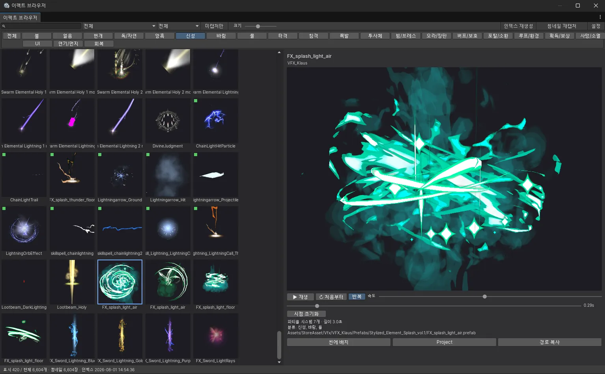
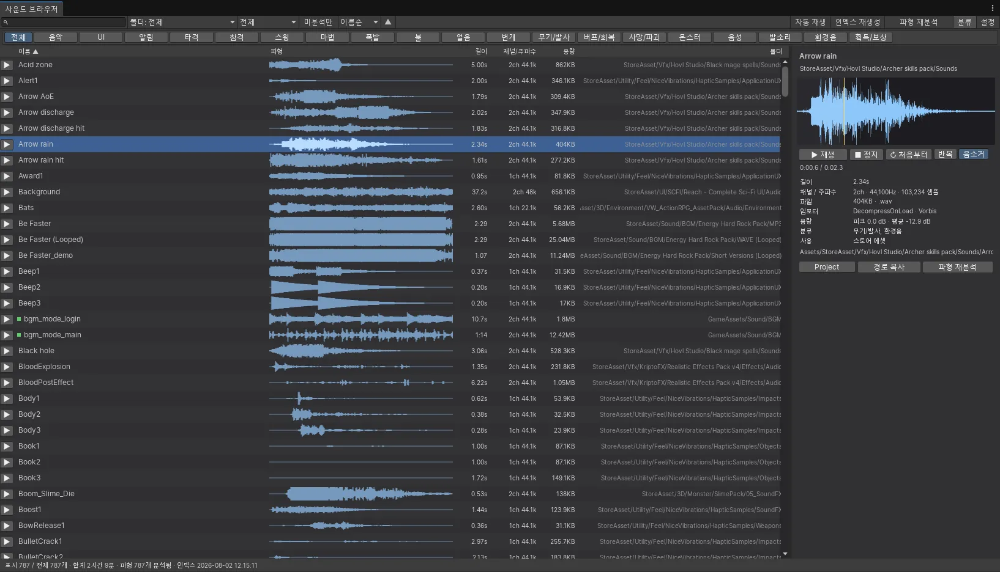

# F-54. 자체 제작 이펙트 · 사운드 브라우저 (인덱스 + 배치 캡처)

> 소스 발췌: `src/` — 17개 파일

**구간** Phase 3 | **포지션** 툴·TA | **AI** 협업

### 구조 — 두 도구가 같은 4단 뼈대를 공유한다



- **문제**: 스토어 에셋을 대량으로 사 모으면 **쓸 수 있는 게 있는지조차 알 수 없게 된다.** 이 프로젝트의 스캔 대상만 **프리팹 7,473개**(그중 이펙트로 인덱싱된 것이 **6,604개**), **오디오 클립 787개**다. Unity 기본 Project 창은 (1) 이름으로만 찾을 수 있고, (2) **파티클은 클릭해도 안 움직여서** 뭔지 알 수 없고, (3) 오디오는 하나씩 눌러 들어야 하며, (4) **무엇이 실제로 쓰이고 있는지** 알 방법이 없다. 결과적으로 "쓸 만한 이펙트를 고르는" 작업이 매번 수십 분짜리 삽질이 된다.
- **해결**: 이펙트와 사운드 각각에 **자체 브라우저**를 만들었다. 둘은 **같은 4단 뼈대**(빠른 인덱서 → 디스크 인덱스 → 프레임 예산 배치 러너 → LRU 메모리 캐시)를 공유하고, 매체 특성에 따라 3·4단만 다르다.
  - **이펙트**: 격리된 프리뷰 씬에서 파티클을 실제로 시뮬레이션해 **썸네일을 굽고**, 그리드에서 한눈에 훑는다.
  - **사운드**: 파형을 **엔벨로프로 뽑아** 리스트 행에 그리고, 고른 것을 그 자리에서 재생한다.
  - **사용처 분석**: 게임 에셋이 실제로 참조하는 이펙트를 표시해 **6,604개 중 쓰이는 것만** 골라낸다.
- **기술**: Unity YAML 클래스 ID 텍스트 스캔, `PreviewRenderUtility` 오프스크린 렌더, `EditorApplication.update` 프레임 예산 점진 처리, LRU 텍스처 캐시, `AssetDatabase.GetDependencies` 역참조 집계, 파형 엔벨로프 → 알파 마스크 텍스처, `[Flags]` 기반 카테고리 자동 분류
- **정량**: **17파일 5,376줄** / 인덱싱된 이펙트 **6,604개**(기본 스캔 루트의 프리팹 총수 7,473개) · 오디오 클립 **787개**(합계 2시간 9분) / 썸네일 **6,604장 전량 캡처** / 프레임 예산 40ms·30ms / LRU 상한 512장·400장
- **근거**:
  - `Assets/Editor/EffectBrowser/` — 8파일 (`EffectPreviewRenderer.cs` 807줄 최대)
  - `Assets/Editor/SoundBrowser/` — 9파일 (`SoundBrowserWindow.cs` 799줄 최대)
  - `Docs/리소스/사운드/사운드_시스템_현황.md` — 임포트 설정 권장값의 근거

---

### 판단 ① — 7,473개를 로드하지 않고 이펙트인지 판정한다

인덱싱의 첫 관문은 "이 프리팹이 이펙트인가"다. 정직한 방법은 로드해서 `GetComponentInChildren<ParticleSystem>()` 이다.
**7,473번 하면 에디터가 몇 분 멈추고 메모리가 GB로 간다.**

그래서 파일을 **텍스트로 읽고 Unity YAML의 클래스 ID만 찾는다.**

```csharp
/// <summary>Unity YAML 클래스 ID — 이 중 하나라도 있으면 이펙트 후보로 본다.</summary>
private static readonly string[] EffectClassMarkers =
{
    "!u!198 ", // ParticleSystem
    "!u!96 ",  // TrailRenderer
    "!u!120 ", // LineRenderer
};
```

프리팹을 **AssetDatabase에 올리지 않고** `File.ReadAllText` + `IndexOf` 로 끝낸다.
다만 이건 **Force Text 직렬화일 때만** 성립하므로, `%YAML` 로 시작하지 않으면 원래 방식으로 폴백한다.

```csharp
// 바이너리 직렬화 프로젝트 대비 폴백 — 느리지만 정확하다
var prefab = AssetDatabase.LoadAssetAtPath<GameObject>(assetPath);
```

**빠른 길을 기본으로 두고, 성립하지 않는 경우에만 느린 길로 떨어진다.** 빠른 길이 틀릴 수 있는 조건을
알고 그 자리에 폴백을 붙여 둔 것이 요점이다 — 최적화가 정확성을 갉아먹지 않게 하는 형태.

캐시를 `Assets` 밖(`<프로젝트루트>/EffectBrowserCache/`)에 두는 것도 같은 종류의 판단이다.
썸네일 수천 장을 `Assets` 안에 만들면 **Unity가 전부 임포트하면서 .meta를 생성**한다.
도구가 만든 파일이 프로젝트 자산으로 둔갑하고 버전 관리까지 오염된다.

### 판단 ② — 오래 걸리는 작업은 "빠르게"가 아니라 "끊기게" 만든다

썸네일 6,604장, 파형 787개. 어떻게 최적화해도 한 번에 끝날 양이 아니다.
그래서 **빨리 끝내는 대신 에디터를 안 멈추게** 만들었다. 두 배처 모두 같은 형태다.

```csharp
// EffectThumbnailBatcher.cs
// EditorApplication.update에 얹어 프레임 예산 안에서 조금씩 처리한다.
// 수천 건을 한 번에 돌리면 에디터가 수십 분 얼어붙으므로, 중단 가능한 점진 처리로 만든다.
private const double FrameBudgetMs = 40.0;

// SoundAnalysisBatcher.cs — 같은 형태, 예산만 다르다
private const double FrameBudgetMs = 30.0;
```

예산이 다른 이유가 있다. 파티클 썸네일은 **한 장이 통째로 무거운** 작업이라 40ms를 줘도 한두 건이 들어가고,
파형 분석은 **클립 길이에 비례**해서 짧은 SFX는 수십 개가 한 프레임에 들어가지만 74초짜리 BGM은 혼자 예산을 다 쓴다.
후자는 "평균"이 의미가 없어 예산을 더 좁게 잡았다.

인덱싱 루프의 진행률 표시도 비트 마스크로 솎아낸다.

```csharp
// 진행률 갱신은 비용이 있어 32건마다만 수행한다
if ((i & 31) == 0) { ... EditorUtility.DisplayCancelableProgressBar(...) }
```

`DisplayCancelableProgressBar` 는 매 호출이 공짜가 아니다. 7,473번 부르면 **진행률 표시가 본작업보다 비싸진다.**
그리고 전부 `Cancelable` 이다 — 취소하면 `null` 을 반환하고 인덱스를 갱신하지 않는다.
**중간 상태를 남기지 않는 것**이 재시작 가능한 도구의 조건이다.

### 판단 ③ — 프리뷰가 열려 있는 씬을 건드리면 안 된다

파티클은 정지 화면으로는 아무것도 알 수 없다. 실제로 시뮬레이션해야 한다.
그런데 씬에 올려서 돌리면 **씬이 dirty가 되고**, 작업 중이던 내용과 섞인다.

```csharp
// PreviewRenderUtility의 격리된 프리뷰 씬에서 파티클을 시뮬레이션하고 렌더한다.
// 현재 열려 있는 씬을 전혀 건드리지 않으므로 씬이 dirty 상태가 되지 않는다.
```

시뮬레이션 스텝도 상한을 둔다.

```csharp
/// <summary>시뮬레이션 1스텝의 최대 크기(초). 너무 크면 파티클 궤적이 끊겨 보인다.</summary>
private const float MaxSimulationStep = 1f / 30f;
```

썸네일을 뽑으려면 "적당히 터진 시점"까지 시간을 감아야 하는데, 한 번에 크게 감으면
**궤적이 점선처럼 끊긴 그림**이 나온다. 파티클은 스텝 사이를 보간하지 않기 때문이다.
그래서 목표 시각까지 30fps 상당으로 잘게 나눠 감는다.

같은 렌더러를 **배치 캡처와 실시간 프리뷰가 각각 독립 인스턴스로** 쓴다 — 배치가 도는 중에도
사용자가 다른 이펙트를 미리 볼 수 있어야 하기 때문이다.

### 판단 ④ — 파형은 이미지가 아니라 데이터로 저장한다

이펙트 썸네일은 PNG로 굽는데, 파형은 굽지 않는다. **매체가 달라서가 아니라 쓰이는 방식이 달라서다.**

```csharp
// 파형은 PNG로 굽지 않고 0~255 바이트 엔벨로프로 인덱스에 담는다.
// 리스트 한 행에 수백 개의 사각형을 그리면 스크롤이 멈추므로,
// 엔벨로프를 알파 마스크 텍스처로 구워 한 번에 그린다.
public const int ListResolution = 192;
```

파형은 리스트의 **모든 행에 동시에** 보인다. 행마다 사각형 수백 개를 그리면 스크롤이 죽고,
그렇다고 PNG로 구우면 787장을 디스크에서 읽어야 한다.
**192바이트짜리 엔벨로프**는 인덱스 JSON에 통째로 들어갈 만큼 작고, 필요할 때 알파 마스크 텍스처 한 장으로 구워
**드로우콜 하나로** 그릴 수 있다. 그래서 사운드 쪽에는 디스크 캐시가 아예 없다.

```csharp
// 엔벨로프는 인덱스에 들어 있으므로 디스크 캐시는 필요 없다.
// 다만 매 프레임 텍스처를 새로 구우면 GC가 튀므로 최근 사용분만 LRU로 들고 있는다.
private const int MaxCachedTextures = 400;
```

이펙트 쪽은 반대다. 썸네일은 되돌릴 수 없이 비싼 산출물(파티클 시뮬레이션 결과)이라 **디스크에 남기고**,
메모리에는 512장만 LRU로 둔다. 그리고 스크롤 중 끊김을 막으려고 **프레임당 새로 읽는 장수까지** 제한한다.

```csharp
/// <summary>한 프레임에 새로 디스크에서 읽을 최대 장수. 스크롤 중 끊김을 막는다.</summary>
private const int MaxLoadsPerFrame = 24;
```

**같은 4단 뼈대 위에서 3·4단만 매체 특성에 맞게 갈아 끼운 것**이 두 도구의 관계다.

### 판단 ⑤ — "고르는 도구"에서 "지우는 근거"가 나왔다

인덱서에 기능이 하나 더 있다. 게임 에셋(`GameAssets` / `Resources` / `Scenes`)이 **실제로 참조하는** 이펙트를 표시한다.

```csharp
foreach (var dependency in AssetDatabase.GetDependencies(consumerPath, true))
{
    // GetDependencies는 대상 자신도 포함한다.
    // 그대로 담으면 GameAssets 하위 이펙트가 전부 "참조됨"으로 잡혀 의미가 없어진다.
    if (string.Equals(dependency, consumerPath, StringComparison.OrdinalIgnoreCase)) continue;
    referenced.Add(dependency);
}
```

주석의 함정이 실제로 밟은 것이다 — `GetDependencies` 는 **자기 자신을 포함**하므로,
`GameAssets` 하위 이펙트를 소비자 목록에 넣고 그대로 집계하면 **전부 "쓰이는 중"으로 나온다.**
자기 참조를 빼야 비로소 "아무도 안 쓰는 이펙트"가 보인다.

의존성 조회는 무거워서 **사용자가 명시적으로 실행할 때만** 돌린다. 인덱싱에 끼워 넣지 않았다.

그리고 이 결과가 다른 작업의 입력이 됐다. 6,604개 중 실제 참조가 극소수라는 게 눈으로 확인되면서,
**APK 용량 감축**([F-45](../F-45_APK용량65퍼감축/))에서 무엇을 들어낼지 판단할 근거가 됐다.
고르려고 만든 도구가 **지울 것을 찾는 도구로도 쓰인** 셈이다.

---

- **면접 포인트**: **"에셋이 7,473개면 그건 자산이 아니라 탐색 문제다."** 스토어 에셋을 대량 확보한 뒤 "쓸 게 없다"가 되는 흔한 상황을, 에셋을 더 사는 대신 **탐색 도구를 만들어** 풀었다. 설계에서 볼 만한 건 세 가지다 — ① 7,473개를 판정하기 위해 프리팹을 로드하지 않고 **YAML 클래스 ID 텍스트 스캔**을 쓰되, 그 방법이 성립하지 않는 바이너리 직렬화에는 **폴백을 붙여 정확성을 지킨** 것. ② 오래 걸리는 작업을 빠르게 만드는 대신 **프레임 예산 + 취소 가능**으로 만들어 에디터가 멈추지 않게 한 것 — 그리고 이펙트 40ms / 사운드 30ms로 **예산을 다르게 준 이유**(길이 비례 작업은 평균이 의미 없다)까지 설명 가능한 것. ③ 이펙트는 썸네일을 **디스크 PNG + LRU 512**, 사운드는 파형을 **192바이트 엔벨로프로 인덱스에 인라인 + LRU 400** 으로 갈랐다는 것 — 같은 문제처럼 보이지만 "리스트 전 행에 동시에 보이는가"가 달라서 저장 전략이 반대가 된다. 마지막으로, 고르려고 만든 도구의 **사용처 역참조 기능이 APK 감축의 근거 데이터**가 됐다는 점이 도구를 만든 값어치를 보여준다.
- **슬라이드 자료**: 이펙트 그리드(썸네일 벽) + 사운드 리스트(파형 행) — 아래 캡처 사용

<!-- IMAGES:START -->
## 화면



<sub><b>상태바가 이 도구의 요약이다 — <code>표시 420 / 전체 6,604개 · 썸네일 6,604장 · 인덱스 2026-08-01</code>.</b>
전체와 썸네일 수가 같다는 건 <b>6,604개를 하나도 빠뜨리지 않고 다 구웠다</b>는 뜻이고,
그게 프레임 예산 배치 러너를 만든 이유다. 한 번에 돌렸으면 에디터가 수십 분 얼어붙었을 작업을
<b>40ms씩 잘라 백그라운드로</b> 흘려보낸 결과다. 인덱스 날짜가 캡처일보다 열흘 이상 앞선 것도 의도된 결과다 —
인덱스와 썸네일은 <b>디스크에 남아</b> 에디터를 껐다 켜도 재사용된다.<br>
좌측 필터 칩이 <b>22종</b>인데 우측 선택 항목의 분류는 <code>신성, 바람, 물</code> <b>세 개</b>다.
카테고리가 <code>[Flags]</code> 비트마스크라 <b>한 이펙트가 여러 갈래에 동시에 걸린다</b> —
"물 속성 이펙트"를 찾을 때 물 전용으로 만들어진 것만 나오면 쓸모가 없기 때문이다.
분류는 이름과 경로에서 규칙으로 자동 부여되므로, 6,604개에 사람이 태그를 달지 않았다.<br>
우측은 정지 이미지가 아니라 <b>실제 파티클 시뮬레이션</b>이다(<code>▶재생 · 처음부터 · 반복 · 속도</code>,
스크러버 <code>0.29s</code>). <code>PreviewRenderUtility</code>의 격리 씬에서 돌기 때문에
<b>열려 있는 씬은 dirty가 되지 않는다.</b> <code>파티클 시스템 7개 · 길이 3.0초</code> 같은 메타가 함께 뜨고,
마음에 들면 <code>씬에 배치</code> 로 바로 꽂는다.<br>
썸네일 좌상단의 <b>초록 점</b>은 <code>IsGameAsset</code> — <code>Assets/GameAssets/</code> 하위,
즉 <b>이미 게임에 편입된 것</b>이라는 표식이다. 스토어 에셋 더미 속에서 "우리가 쓰기로 한 것"이 한눈에 구분된다.</sub>

<br>



<sub><b>모든 행에 파형이 그려져 있다는 것 자체가 설계 판단의 결과다.</b> 파형을 PNG로 구웠다면 787장을
디스크에서 읽어야 하고, 행마다 사각형 수백 개로 그렸다면 스크롤이 멈춘다. 그래서 파형을
<b>192바이트 엔벨로프</b>로 인덱스에 인라인해 두고, 그릴 때만 알파 마스크 텍스처 한 장으로 구워
<b>드로우콜 하나</b>로 찍는다. 상태바 <code>전체 787개 · 합계 2시간 9분 · 파형 787개 분석됨</code>.<br>
<b>우측 메타 두 줄이 이 도구의 실무 값어치다.</b><br>
<code>임포터: DecompressOnLoad · Vorbis</code> — 이 필드를 <b>길이·용량과 같은 화면에</b> 띄우는 게 핵심이다.
<code>DecompressOnLoad</code>는 PCM으로 통째 상주하므로 긴 클립에 걸리면 메모리가 폭발한다
(218초 스테레오 기준 약 37MB). "긴데 <code>DecompressOnLoad</code>인 클립"을 <b>목록에서 바로 집어낼 수</b> 있다.<br>
<code>음량: 피크 0.0 dB · 평균 -12.9 dB</code> — SFX는 개별로 들으면 다 괜찮은데 섞으면 어떤 건 묻히고
어떤 건 튄다. 787개를 하나씩 들어서 맞출 수 없으므로 <b>수치로 비교</b>한다.<br>
용량 컬럼도 그냥 정보가 아니다. 목록의 <code>Be Faster</code>(2:29 · <b>5.68MB</b> · MP3 폴더)와
<code>Be Faster (Looped)</code>(2:29 · <b>25.04MB</b> · WAVE 폴더)가 나란히 있다 —
<b>같은 길이인데 4.4배</b>. 이런 건 찾으려고 들면 안 보이고, 한 목록에 놓으면 저절로 보인다.<br>
초록 점이 <code>bgm_mode_login</code> / <code>bgm_mode_main</code> <b>둘뿐</b>인 것도 사실 그대로다 —
787개 중 실제로 게임에 편입된 BGM은 이 두 개다.</sub>

<!-- IMAGES:END -->

## 수록 파일

**이펙트 브라우저** (`Assets/Editor/EffectBrowser/`)

- `EffectBrowserWindow.cs` · `EffectBrowserWindow.Grid.cs` · `EffectBrowserWindow.Preview.cs`
- `EffectIndexer.cs` · `EffectEntry.cs`
- `EffectPreviewRenderer.cs` · `EffectThumbnailBatcher.cs` · `EffectThumbnailCache.cs`

**사운드 브라우저** (`Assets/Editor/SoundBrowser/`)

- `SoundBrowserWindow.cs` · `SoundBrowserWindow.List.cs` · `SoundBrowserWindow.Preview.cs`
- `SoundIndexer.cs` · `SoundEntry.cs`
- `SoundWaveform.cs` · `SoundWaveformCache.cs` · `SoundAnalysisBatcher.cs` · `SoundPreviewPlayer.cs`
</content>
