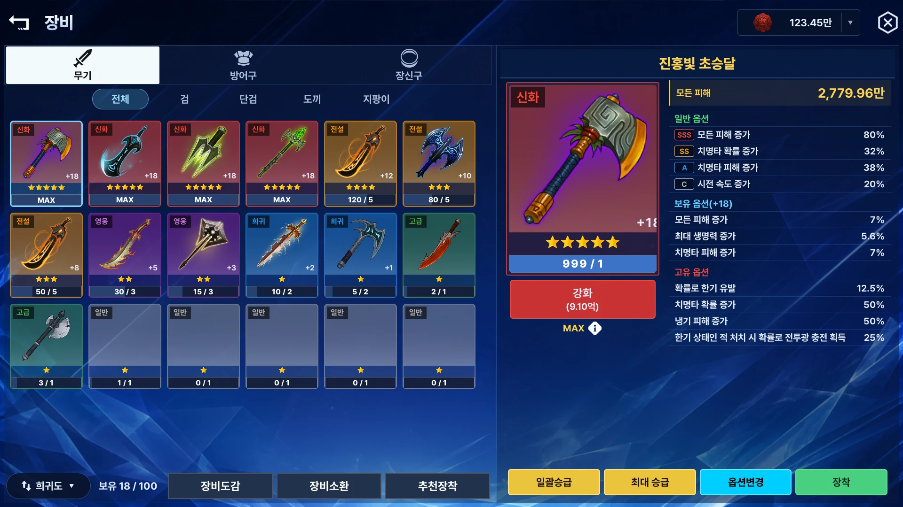

# ExodusP1 — 코드 포트폴리오

Unity 6 + Firebase 기반 모바일 방치형 RPG를 **1인으로 설계·구현**한 프로젝트의 코드 발췌본입니다.
클라이언트 · 서버 · 에디터 툴체인 · 데이터 파이프라인 전 영역을 직접 만들었고, 2025년 하반기부터는
AI를 설계·구현·검증 파트너로 편입해 **AI 오케스트레이션 개발 체계**를 자체 구축했습니다.

> **이 리포는 발췌본입니다.** 원본 프로젝트에서 피처 단위로 잘라낸 코드라 그대로는 빌드되지 않습니다.
> 각 디렉토리의 `README.md`가 그 피처의 **문제 → 해결 → 기술 → 정량 → 근거**를 설명합니다.

이 스크린샷은 게임을 실행해서 찍은 것이 아니라, 직접 만든
<b><a href="F-31_Headless렌더캡처/">headless UXML 렌더 캡처 도구</a></b>가
UI Builder도 플레이 모드도 없이 스크립트 호출 한 번으로 뽑은 것입니다.
다른 화면은 <a href="F-29_UIToolkit전면전환/">F-29</a>, <a href="F-05_자체UI프레임워크/">F-05</a> 에 있습니다.

---

## 규모

| | |
|---|---|
| 수기 코드 (원본 프로젝트 전체) | **약 300,900줄** / 1,112파일 |
| 자동생성 코드 | **134,348줄** |
| 이 리포 수록 분량 | **82,491줄** / 265파일 / 34개 피처 (코드 73,124줄 + 실행 리포트·설정 9,367줄) |
| 등록 Manager | 65개 |
| Cloud Functions 엔드포인트 | 153개 |
| 서버 테스트 | 1,408 pass / 47 fail → **1,793 pass / 6 fail** · 파일별 평균 Lines 커버리지 **89.53%** |
| 기술 문서 | 765개 |

---

## 진입 경로 3개

전부 볼 필요 없습니다. 목적에 맞는 하나만 따라가세요.

### ① 5분 — 딱 두 개만 본다면

| | 왜 |
|---|---|
| **[F-48 메쉬 파쇄 연출](F-48_메쉬파쇄연출/)** | 클라이언트 대표. SkinnedMesh를 런타임에 삼각형 단위로 분해하고 `MaterialPropertyBlock`으로 **드로우콜 증가 없이** GPU 파쇄를 구동합니다. `MonsterShatterPart.cs`의 주석에 에셋 4계열의 본 네이밍이 제각각인 현실과, `forearm`에서 `ear`가 걸리는 부분 문자열 충돌을 어떻게 처리했는지가 그대로 남아 있습니다. |
| **[F-34 야간 무인 감사 파이프라인](F-34_야간무인감사파이프라인/)** | 서버/TD 대표. "코드가 규칙을 지키는가"가 아니라 **"로직 자체가 옳은가"**를 매일 무인으로 감사합니다. 자동 수정은 화이트리스트 한정 + `git stash` → 빌드 → 테스트 green → 실패 시 즉시 롤백. |

### ② 클라이언트 트랙

[F-48 메쉬 파쇄](F-48_메쉬파쇄연출/) → [F-01 계층형 싱글톤 컨텍스트](F-01_계층형싱글톤컨텍스트/) → [F-02 MOD 전투 수식 엔진](F-02_MOD전투수식엔진/) → [F-05 자체 UI 프레임워크](F-05_자체UI프레임워크/) → [F-08 오브젝트 풀링](F-08_오브젝트풀링Addressables/) → [F-22 안드로이드 다층 보안](F-22_안드로이드다층보안/)

아키텍처 골격부터 성능·보안까지. F-01은 **MonoBehaviour 하나로 65개 매니저의 생명주기를 제어**하고 초기화 순서 의존성을 커스텀 훅으로 구조화한 코드입니다.

### ③ 서버 · TD 트랙

[F-34 무인 감사](F-34_야간무인감사파이프라인/) → [F-35 동등성 골든 테스트](F-35_동등성골든테스트/) → [F-04 코드 생성 파이프라인](F-04_코드생성파이프라인/) → [F-06 서버 3계층 요청 템플릿](F-06_서버3계층요청템플릿/) → [F-07 결정론 난수 가챠](F-07_결정론난수가챠/)

이 프로젝트 아키텍처의 핵심 서사가 여기 있습니다 — 동일 게임 로직이 C#과 TS에 이중 존재하는 구조에서,
**타입 드리프트는 코드 생성(F-04)으로, 동작 드리프트는 골든 테스트(F-35)로 막는 2중 방어선**을 설계했습니다.

---

## 전체 인덱스

`P0`은 AI를 쓰지 않고 수작업으로 만든 구간, `P1`~`P3`은 AI 활용도가 단계적으로 올라간 구간입니다.
자세한 구간 정의는 각 카드의 **구간** 항목을 보세요.

| # | 피처 | 구간 | 포지션 | 수록 |
|---|---|---|---|---|
| [F-01](F-01_계층형싱글톤컨텍스트/) | 계층형 싱글톤 컨텍스트 아키텍처 | P0 | 클라·TD | 5파일 / 641줄 |
| [F-02](F-02_MOD전투수식엔진/) | PoE식 MOD 전투 수식 엔진 | P0 | 클라·TD | 3파일 / 3,862줄 |
| [F-03](F-03_CoreData서버클라동기화/) | CoreData 서버-클라 동기화 계층 | P0 | 클라·서버 | 3파일 / 981줄 |
| [F-04](F-04_코드생성파이프라인/) | 코드 생성 파이프라인 (CodeGen) | P0 | TD·툴 | 13파일 / 4,810줄 |
| [F-05](F-05_자체UI프레임워크/) | 자체 UI 프레임워크 3층 구조 | P0 | 클라 | 33파일 / 4,573줄 |
| [F-06](F-06_서버3계층요청템플릿/) | Firebase 서버 3계층 요청 템플릿 | P0 | 서버·TD | 2파일 / 973줄 |
| [F-07](F-07_결정론난수가챠/) | HashPRNG 결정론적 클라 가챠 + 서버 검증 | P0 | 클라·서버 | 7파일 / 2,418줄 |
| [F-08](F-08_오브젝트풀링Addressables/) | 오브젝트 풀링 + Addressables 무중단 마이그레이션 | P0 | 클라 | 3파일 / 1,033줄 |
| [F-09](F-09_부가자체시스템군/) | 부가 자체 시스템군 | P0 | 클라 | 5파일 / 4,016줄 |
| [F-10](F-10_서버보안성능감사/) | Firebase Functions 보안·성능 감사 | P1 | 서버 | — |
| [F-11](F-11_명예의전당/) | 명예의 전당(HallOfFame) 시스템 | P1 | 서버 | 3파일 / 2,409줄 |
| [F-12](F-12_전투메커니즘위키화/) | 전투 메커니즘 위키화 착수 | P1 | TD | — |
| [F-13](F-13_배틀시뮬레이터/) | 배틀 시뮬레이터 | P2 | 툴·TD | 15파일 / 9,936줄 |
| [F-14](F-14_전빌드순회분석/) | 전 빌드 순회 자동 분석 | P2 | 툴 | 3파일 / 1,026줄 |
| [F-15](F-15_최적장비룬탐색기/) | 최적 장비/룬 조합 탐색기 | P2 | 툴 | 3파일 / 1,962줄 |
| [F-16](F-16_MOD체계정립/) | MOD 체계 정립 | P2 | TD | 5파일 / 3,590줄 |
| [F-17](F-17_성장공식다항식전환/) | 성장 공식 지수 → 다항식(POLY) 전환 | P2 | TD | 4파일 / 2,073줄 |
| [F-18](F-18_인게임실시간측정/) | 인게임 전투 실시간 측정 시스템 | P2 | 툴·TD | 10파일 / 5,555줄 |
| [F-19](F-19_CoreData마이그레이션자동화/) | CoreData 마이그레이션 자동화 | P2 | TD·툴 | 23파일 / 1,712줄 |
| [F-20](F-20_동시성멱등성버그/) | 동시성/멱등성 버그 3종 해결 | P2 | 서버 | — |
| [F-21](F-21_UGUI자동화캡처/) | Unity UGUI AI 편집 자동화 | P2 | 툴 | 28파일 / 8,066줄 |
| [F-22](F-22_안드로이드다층보안/) | Unity Android 다층 보안 시스템 | P2 | 클라·TD | 9파일 / 1,510줄 |
| [F-23](F-23_점수기반자동제재/) | 점수 기반 자동 계정 제재 | P2 | 서버 | 2파일 / 759줄 |
| [F-24](F-24_VIP상품노출제어/) | VIP 등급 기반 상품 노출 제어 + 트리거/기간한정 시스템 | P2 | 서버 | 1파일 / 1,277줄 |
| [F-25](F-25_시트자동화도구/) | StringKey 자동 생성 + Google Sheets 자동 입력 도구 | P2 | 툴 | 7파일 / 1,997줄 |
| [F-26](F-26_소수점Floor통일/) | 클라-서버 소수점 Floor 전면 통일 | P2 | 서버·TD | — |
| [F-27](F-27_AI협업인프라구축/) | AI 협업 인프라 자체 구축 | P2 | TD | — |
| [F-28](F-28_PerforceGit전환/) | Perforce → Git 마이그레이션 | P3 | TD | — |
| [F-29](F-29_UIToolkit전면전환/) | UGUI → UI Toolkit 전면 전환 | P3 | 클라 | 9파일 / 1,225줄 |
| [F-30](F-30_UI성능최적화/) | UI 성능 최적화 | P3 | 클라 | — |
| [F-31](F-31_Headless렌더캡처/) | Headless UXML 렌더 캡처 인프라 | P3 | 툴 | 2파일 / 477줄 |
| [F-32](F-32_UGUItoUXML변환스킬/) | UGUI→UXML 원클릭 변환 스킬 + 자동 검증 루프 | P3 | 툴·TD | 3파일 / 860줄 |
| [F-33](F-33_서버테스트커버리지/) | 서버 테스트 커버리지 확보 | P3 | 서버 | — |
| [F-34](F-34_야간무인감사파이프라인/) | 야간 무인 로직/메커니즘 감사 파이프라인 | P3 | TD·서버 | 29파일 / 3,695줄 |
| [F-35](F-35_동등성골든테스트/) | 클라-서버 동등성 골든 테스트 | P3 | 서버·TD | 3파일 / 873줄 |
| [F-36](F-36_확률경제로직검증/) | 확률/경제 로직 사전 검증 | P3 | 서버 | 3파일 / 393줄 |
| [F-37](F-37_가챠확률전수감사/) | 가챠 확률 데이터 전수 감사 | P3 | 서버 | 3파일 / 411줄 |
| [F-38](F-38_CloudFunctions라운드트립감축/) | Cloud Functions 라운드트립 감축 | P3 | 서버 | — |
| [F-39](F-39_전투력통합공식/) | 전투력(CombatPower) 통합 공식 재설계 | P3 | TD | 1파일 / 96줄 |
| [F-40](F-40_UnityEditorMCP통합/) | Unity Editor MCP 통합 | P3 | TD·툴 | — |
| [F-41](F-41_플레이모드진입최적화/) | 플레이 모드 진입 최적화 | P3 | 클라·TD | — |
| [F-42](F-42_아키텍처점진개선설계/) | 아키텍처 점진 개선 설계 | P3 | TD | — |
| [F-43](F-43_SteamPC포팅마스터플랜/) | Steam PC 포팅 마스터플랜 | P3 | TD | — |
| [F-44](F-44_Steam통계분석도구/) | Steam 통계 분석 도구 자체 제작 | P3 | 툴 | — |
| [F-45](F-45_APK용량65퍼감축/) | Android 빌드 복구 + APK 65% 감축 | P3 | 클라·TD | — |
| [F-46](F-46_대량몬스터스폰최적화/) | 대량 몬스터 스폰 최적화 (20 → 60) | P3 | 클라 | 1파일 / 228줄 |
| [F-47](F-47_전투이펙트풀링복구/) | 전투 이펙트 풀링 정합성 복구 | P3 | 클라 | 2파일 / 447줄 |
| [F-48](F-48_메쉬파쇄연출/) | 메쉬 파쇄(Shatter) 연출 시스템 | P3 | 클라·TA | 5파일 / 3,086줄 |
| [F-49](F-49_AI워크플로우자산/) | AI 워크플로우 엔지니어링 자산 | P3 | TD | 14파일 / 2,372줄 |

`수록`이 `—`인 항목은 전역 정책 변경·조사·설계 문서 형태의 작업이라 특정 파일로 잘라낼 수 없는 것들입니다.
README 카드의 **근거** 항목에 실제 산출물 경로가 적혀 있습니다.

---

## 읽는 법

각 피처 README는 동일한 포맷입니다.

- **문제** — 무엇이 막혀 있었나
- **해결** — 어떤 구조로 풀었나
- **기술** — 사용한 기술·기법
- **정량** — 검증 가능한 수치
- **근거** — 원본 프로젝트의 실제 경로
- **면접 포인트** — 이 항목으로 무엇을 증명하는가

## 고지

- 원본 프로젝트에서 **피처 단위로 발췌**한 코드입니다. 의존성이 잘려 있어 단독 빌드되지 않습니다.
- 로컬 절대경로(`E:\Work\...`)는 `<project-root>`로 치환했습니다. 그 외 코드는 원본 그대로입니다.
- 서드파티 의존: Unity 6, Firebase Functions v2, Odin Inspector(에디터 툴), SimpleJSON, Newtonsoft.Json, UniTask
- 자격증명·서비스 계정 키·프로젝트 설정 파일은 포함하지 않았습니다.
- **저작권**: 상용 프로젝트에서 발췌한 코드라 **열람용**으로만 공개합니다. 복제·배포·2차적 저작물 작성은 허용하지 않습니다. → [LICENSE](LICENSE)
